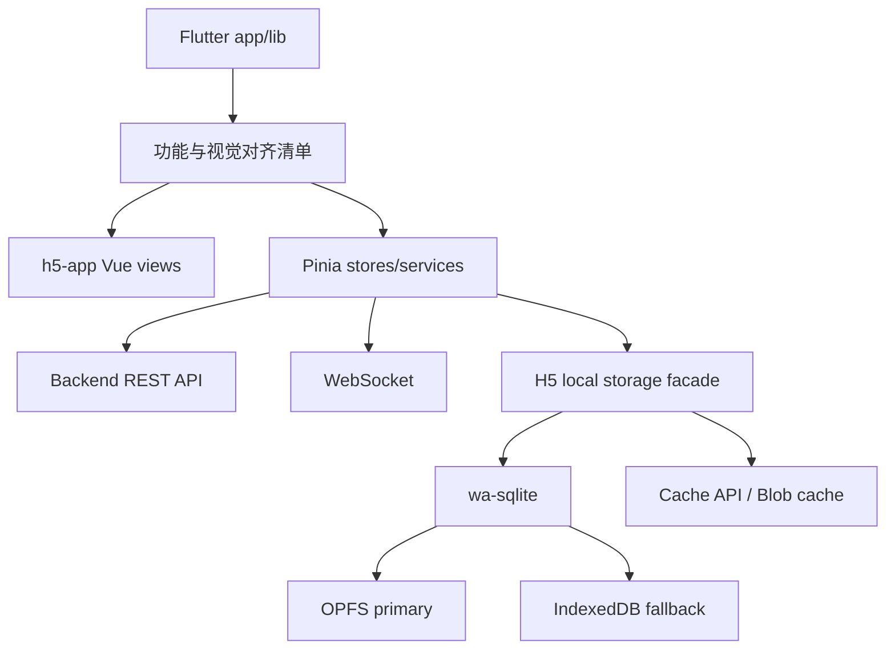

# feat: 完整迁移 Flutter App 到 H5 App

## Overview

将 `h5-app/` 从当前登录和 App Shell 骨架扩展为 Flutter `app/` 的 Web 等价实现。H5 App 应复用 Flutter 端的产品流程、接口契约、视觉 token 与本地缓存语义，同时把手机 SQLite / 文件路径相关能力替换为浏览器可用的 SQLite WASM、OPFS/IndexedDB、Cache API 与 Blob URL。

## Problem Frame

后续前端联调希望优先使用 `h5-app`，但当前 H5 只覆盖账号登录、注册和静态首页，无法承担完整聊天、联系人、群聊、设置、WebSocket、附件和本地搜索验收。Flutter App 已经沉淀了完整功能和本地 SQLite 存储模式，H5 App 需要按其行为迁移，而不是另起一套简化实现。

## Requirements Trace

- R1. H5 App 功能逻辑对齐 Flutter `app/`，优先覆盖登录注册、聊天列表、聊天详情、联系人、好友申请、群聊设置、消息搜索、设置页、附件/头像/表情缓存。
- R2. 样式复用 Flutter 视觉语言，继续以 `app/lib/core/constants/app_colors.dart` 和 `app/lib/core/theme/app_theme.dart` 为基线维护 H5 token。
- R3. H5 本地消息、联系人和配置缓存使用浏览器数据库，不使用手机文件路径；Flutter 的 SQLite 语义迁移为 SQLite WASM。
- R4. H5 优先作为 backend + frontend 联调入口，真实后端 smoke 和浏览器验收要覆盖关键用户流。
- R5. 普通账号密码注册/登录为主流程，不引入 Google/Apple 登录；邮箱注册/登录仅作为后台开关启用的兼容能力。
- R6. 不改变 backend API 契约，除非迁移中发现 Flutter 当前依赖的端点缺失或 contract 不一致，再单独提出后端修复计划。

## Scope Boundaries

- 不迁移 Flutter 原生能力本身：推送通知、系统文件选择器、相机、语音录制等在 H5 采用浏览器能力替代或降级。
- 不把 H5 的本地数据库与 Flutter 手机数据库做跨设备同步；同步来源仍是后端 API/WebSocket。
- 不在本计划中重构 backend 架构；backend 只作为 H5 迁移的既有契约目标。
- 不把 PGlite 作为 H5 主存储；IM 本地缓存不需要在浏览器内运行 Postgres。

## Context & Research

### Relevant Code and Patterns

- Flutter 本地 SQLite 消息缓存：`app/lib/core/storage/message_storage.dart`
- Flutter 本地 FTS5 搜索：`app/lib/core/storage/message_search_storage.dart`
- Flutter 联系人 SQLite 缓存：`app/lib/core/storage/friend_storage.dart`
- Flutter 配置 SQLite 缓存：`app/lib/core/storage/app_config_storage.dart`
- Flutter session 缓存：`app/lib/core/storage/token_storage.dart`
- Flutter 会话列表缓存：`app/lib/core/storage/chat_cache.dart`
- Flutter WebSocket 连接入口：`app/lib/features/home/home_shell_page.dart`
- Flutter 消息服务主链路：`app/lib/core/services/message_service.dart`
- Flutter 聊天状态协调：`app/lib/features/chat/providers/chat_provider.dart`
- H5 当前骨架：`h5-app/src/main.ts`、`h5-app/src/stores/auth.ts`、`h5-app/src/views/HomeView.vue`
- API 路由注册：`api/src/routes.rs`

### Institutional Learnings

- 仓库采用 CE 工作流，计划和阶段性实施文档放在 `docs/plans/`，解决方案沉淀放在 `docs/solutions/`。
- 本地测试和验收优先 Compose-first，H5 联调应复用 `make api.up` / `make h5-app.up`。
- Git 规范要求每轮只 stage 本轮相关文件，避免把当前 backend/test infra 残留改动混入 H5 提交。

### External References

- Dexie 文档显示其 IndexedDB 封装支持事务和复合索引，适合普通对象缓存，但不直接提供 SQLite/FTS 语义。
- wa-sqlite 文档显示其是 SQLite WebAssembly build，可通过 IndexedDB VFS 或 OPFS VFS 在浏览器持久化 SQLite 数据库。
- PGlite 文档显示其可在浏览器以 IndexedDB/OPFS 持久化 Postgres，但对本项目 H5 IM 本地缓存过重。

## Key Technical Decisions

- 主本地数据库选 `wa-sqlite`：它最贴近 Flutter 当前 `sqflite` 表、索引和 FTS5 模型，迁移成本低于直接用 IndexedDB 重写查询和搜索。
- 持久化目标为 OPFS + IndexedDB fallback：OPFS 更接近数据库文件存储，但 wa-sqlite 的 OPFS 示例要求 Worker；Unit 1 先落 IndexedDB VFS 作为真实浏览器持久化，后续 worker 化再切 OPFS 优先。
- H5 本地文件路径改为缓存键模型：Flutter 的 `localPath` / `localAvatarPath` / `localThumbnailPath` 在 H5 中改成 `cacheKey` / `blobUrl` / `objectUrl` / `cachedAt`，避免伪造不可用的本机路径。
- session 第一阶段继续用 localStorage，正式安全加固阶段再迁移到 httpOnly SameSite Cookie 或短生命周期 token 策略。
- 迁移按能力闭环分阶段落地：先存储和接口契约，再聊天核心，再联系人/群聊，再媒体缓存和搜索，最后补完整 E2E 验收。

## Open Questions

### Resolved During Planning

- H5 是否可以继续使用 SQLite：可以，使用 SQLite WASM；优先 `wa-sqlite`，不使用手机端 `sqflite`。
- 是否直接用 IndexedDB：不作为主消息库；可作为 SQLite VFS fallback 或 Blob/cache 辅助。

### Deferred to Implementation

- wa-sqlite OPFS worker bundling 方式：Unit 1 已验证 Vite 8/Bun 可构建 wa-sqlite + IndexedDB VFS；OPFS 仍需后续 worker 化。
- FTS5 在选定 wa-sqlite build 中是否默认可用：需要通过单测或运行时能力探测验证；如不可用，保留服务端搜索或轻量 LIKE fallback。
- H5 附件缓存的配额和清理策略：需要浏览器行为验证后确定默认阈值。

## High-Level Technical Design

> *This illustrates the intended approach and is directional guidance for review, not implementation specification. The implementing agent should treat it as context, not code to reproduce.*

## Implementation Units

- [x] **Unit 1: H5 本地存储底座**

**Goal:** 建立 H5 SQLite WASM / fallback 存储抽象，提供消息、搜索、联系人和配置缓存的底层能力。

**Requirements:** R1, R3, R4

**Dependencies:** None

**Files:**
- Create: `h5-app/src/storage/`
- Create: `h5-app/src/types/chat.ts`
- Modify: `h5-app/package.json`
- Test: `h5-app/test/storage-*.test.ts`

**Approach:**
- 引入 `wa-sqlite`，封装 `localDatabase`，业务层不直接依赖 VFS 细节。
- 第一阶段允许在测试环境使用内存/伪 SQL adapter，保证存储 API 可测；真实浏览器再启用 OPFS/IndexedDB。
- 对齐 Flutter `MessageStorage`：按 room 保存最多 200 条消息，按 timestamp 升序加载，支持清空房间和全量清空。
- 对齐 Flutter `MessageSearchStorage`：先定义接口和查询语义，再验证 FTS5 可用性。

**Execution note:** 存储接口先写测试，再补实现；底层 WASM 初始化属于集成点，允许用 adapter 注入隔离测试。

**Patterns to follow:**
- `app/lib/core/storage/message_storage.dart`
- `app/lib/core/storage/message_search_storage.dart`
- `app/lib/core/storage/friend_storage.dart`
- `h5-app/src/api/http.ts`

**Test scenarios:**
- Happy path: 保存同一 room 三条消息后加载，按 timestamp ASC 返回。
- Edge case: roomId 为空时 load 返回空数组，save/clear 不抛错。
- Edge case: 单 room 超过 200 条消息时只保留最新 200 条。
- Error path: payload 损坏或缺少必要字段时忽略坏记录，不影响其它消息。
- Integration: storage facade 使用测试 adapter 时，消息保存后搜索索引可被重建。

**Verification:**
- H5 类型检查和 storage 单测通过。
- 浏览器构建不因 WASM 依赖失败。

- [x] **Unit 2: H5 API/service parity 层**

**Goal:** 把 Flutter 的 Auth/Friend/Room/Message/User/Settings 服务迁移为 H5 TypeScript service 层。

**Requirements:** R1, R4, R5, R6

**Dependencies:** Unit 1

**Files:**
- Create: `h5-app/src/services/`
- Create: `h5-app/src/types/`
- Modify: `h5-app/src/api/`
- Test: `h5-app/test/*-service.test.ts`

**Approach:**
- 以 Flutter service 文件为清单，逐个映射 backend REST 端点。
- 保持 `requestJson` 统一处理 token、错误消息和 JSON parsing。
- 只迁移普通账号密码登录/注册；Google/Apple/SMS 只作为明确非目标保留空缺。

**Patterns to follow:**
- `app/lib/features/auth/data/auth_repository.dart`
- `app/lib/core/services/friend_service.dart`
- `app/lib/core/services/room_service.dart`
- `app/lib/core/services/message_service.dart`
- `api/src/routes.rs`

**Test scenarios:**
- Happy path: service 对正确输入发出 Flutter 等价端点请求并映射响应。
- Error path: backend 返回 `{error}` 或 `{message}` 时 UI store 能拿到可展示错误。
- Integration: 真实后端 smoke 覆盖普通账号注册、登录、获取 `/auth/me`、拉取聊天列表。

**Verification:**
- API contract 单测覆盖核心 service。
- `make h5-app.test.live` 扩展到登录后基础数据接口。

- [x] **Unit 3: Chat list 与 WebSocket 主链路**

**Goal:** H5 首页聊天 tab 从静态 mock 改为真实聊天列表、本地缓存、WebSocket 连接和未读数。

**Requirements:** R1, R2, R4

**Dependencies:** Unit 1, Unit 2

**Files:**
- Create: `h5-app/src/services/websocket.ts`
- Create: `h5-app/src/stores/chat.ts`
- Modify: `h5-app/src/views/HomeView.vue`
- Test: `h5-app/test/chat-store.test.ts`

**Approach:**
- 登录后自动连接 WebSocket，复刻 Flutter `HomeShellPage` 的初始化行为。
- 聊天列表优先展示本地缓存，再后台刷新服务端数据。
- 收到消息、room update、read update 后更新 Pinia store 和本地 SQLite 缓存。

**Patterns to follow:**
- `app/lib/features/home/home_shell_page.dart`
- `app/lib/core/services/websocket_service.dart`
- `app/lib/core/services/message_service.dart`
- `app/lib/features/chat/chat_list_page.dart`

**Test scenarios:**
- Happy path: 本地缓存存在时先渲染缓存聊天列表。
- Happy path: WebSocket message event 更新对应 room 最后一条消息和未读数。
- Error path: WebSocket 连接失败不阻塞页面，显示离线/重试状态。
- Integration: 登录后聊天 tab 能从真实后端加载会话列表。

**Verification:**
- H5 首页聊天列表可在浏览器真实展示并响应基本 WebSocket 事件。

- [x] **Unit 4: Chat detail、消息发送与本地缓存**

**Goal:** 实现聊天详情页，支持消息加载、发送文本/富文本、引用、重发、删除、置顶、已读状态和本地缓存。

**Requirements:** R1, R3, R4

**Dependencies:** Unit 1, Unit 2, Unit 3

**Files:**
- Create: `h5-app/src/views/ChatDetailView.vue`
- Create: `h5-app/src/stores/chat-detail.ts`
- Modify: `h5-app/src/router/index.ts`
- Test: `h5-app/test/chat-detail*.test.ts`

**Approach:**
- 对齐 Flutter `ChatProvider`，把 room 当前消息、发送队列、pending/resend 状态放进 store。
- 进入房间加载 SQLite 缓存，然后拉服务端历史；离开房间保持列表缓存。
- H5 文件/图片/语音能力按浏览器支持拆小步迁移。

**Patterns to follow:**
- `app/lib/features/chat/providers/chat_provider.dart`
- `app/lib/features/chat/chat_detail_page_v2.dart`
- `app/lib/features/chat/widgets/chat_message_bubble.dart`

**Test scenarios:**
- Happy path: 进入房间先展示本地缓存，再合并服务端新增消息。
- Happy path: 发送文本消息成功后 pending 变为 sent，并写入缓存。
- Error path: 发送失败保留 pending/failed 状态，可重发。
- Edge case: 重复 WebSocket message 不重复插入本地缓存。
- Integration: 真实后端创建房间后可发送并接收消息。

**Verification:**
- H5 可完成真实后端单聊/群聊基础收发。

- [x] **Unit 5: Contacts、好友申请与群聊设置**

**Goal:** 迁移联系人、好友申请、新建群聊、群设置和群管理流程。

**Requirements:** R1, R2, R4

**Dependencies:** Unit 2, Unit 3

**Files:**
- Create: `h5-app/src/views/ContactsView.vue`
- Create: `h5-app/src/views/AddFriendView.vue`
- Create: `h5-app/src/views/GroupSettingsView.vue`
- Create: `h5-app/src/stores/contacts.ts`
- Test: `h5-app/test/contacts*.test.ts`

**Approach:**
- 联系人列表优先读本地缓存，再调用 `/friends` 刷新。
- 好友请求数量沿用 WebSocket + 初始化拉取双路径。
- 群设置按 Flutter 页面能力分阶段迁移，先覆盖成员、改名、免打扰、置顶、退群/解散。

**Patterns to follow:**
- `app/lib/features/contacts/contacts_page.dart`
- `app/lib/features/contacts/add_friend_page.dart`
- `app/lib/features/chat/create_group_page.dart`
- `app/lib/features/chat/group_settings_page.dart`

**Test scenarios:**
- Happy path: 拉取好友后写入本地联系人缓存。
- Happy path: incoming pending 请求数展示在联系人 tab badge。
- Error path: 好友请求操作失败时恢复按钮状态并提示错误。
- Integration: 真实后端搜索用户、发送好友申请、同意申请后可创建私聊。

**Verification:**
- H5 完成好友添加到私聊创建闭环。

- [x] **Unit 6: 设置、账号安全与内容页面**

**Goal:** 迁移设置页、用户资料、头像、账号安全、隐私协议、用户协议、反馈、关于页面。

**Requirements:** R1, R2, R5

**Dependencies:** Unit 2

**Files:**
- Create: `h5-app/src/views/settings/`
- Create: `h5-app/src/stores/settings.ts`
- Test: `h5-app/test/settings*.test.ts`

**Approach:**
- 复用 Flutter Settings 页的信息架构。
- H5 头像上传走浏览器文件选择和现有 direct-upload/commit API。
- 登出时清理 session、WebSocket 和用户相关缓存。

**Patterns to follow:**
- `app/lib/features/settings/settings_page.dart`
- `app/lib/features/settings/account_security_page.dart`
- `app/lib/features/settings/about_page.dart`
- `app/lib/features/settings/privacy_policy_page.dart`

**Test scenarios:**
- Happy path: 设置页显示当前用户昵称、账号资料和头像缓存。
- Happy path: 登出清理 session 并回到登录页。
- Error path: 用户资料更新失败时不覆盖本地旧用户。
- Integration: 真实后端更新昵称后 `/auth/me` 返回新信息。

**Verification:**
- H5 设置核心流程对齐 Flutter。

- [x] **Unit 7: 媒体、头像、附件和表情缓存**

**Goal:** 把 Flutter 文件路径缓存迁移为浏览器 cacheKey/blobUrl/objectUrl 模型。

**Requirements:** R1, R3, R4

**Dependencies:** Unit 1, Unit 2, Unit 4

**Files:**
- Create: `h5-app/src/storage/blob-cache.ts`
- Create: `h5-app/src/services/avatar-cache.ts`
- Create: `h5-app/src/services/attachment-cache.ts`
- Create: `h5-app/src/services/emoji-cache.ts`
- Test: `h5-app/test/blob-cache.test.ts`

**Approach:**
- 头像、房间头像、附件缩略图、表情资源使用 objectKey 作为稳定缓存键。
- 优先 Cache API；需要元数据时配合 SQLite/IndexedDB 记录 cachedAt、mime、size。
- 页面只消费 `blobUrl`/`objectUrl`，组件销毁时释放临时 object URL。

**Patterns to follow:**
- `app/lib/core/storage/avatar_cache.dart`
- `app/lib/core/storage/attachment_cache.dart`
- `app/lib/core/storage/emoji_cache.dart`
- `app/lib/core/services/user_avatar_service.dart`
- `app/lib/core/services/room_avatar_service.dart`

**Test scenarios:**
- Happy path: 同一 objectKey 二次加载命中缓存。
- Edge case: 缓存过期后重新下载并替换 metadata。
- Error path: 下载失败时返回 null/占位，不污染缓存记录。
- Integration: 头像 URL 刷新后旧 objectKey 缓存被清理。

**Verification:**
- H5 头像和附件预览不依赖本机路径字段。

- [ ] **Unit 8: H5 全量验收与文档收口**

**Goal:** 建立 H5 完整功能验收入口和文档，确保后续优先用 h5-app 测试。

**Progress note (2026-07-05):** H5 文档入口、从零启动流程、Makefile 验收入口、live backend smoke 和浏览器 E2E smoke 已收口；搜索跳转和头像上传浏览器能力已拆到 `docs/reports/remaining-task-breakdown-2026-07-05.md` 的 `H5-P1-03`、`H5-P1-04` 继续执行，因此本 Unit 暂不整体勾选完成。

**Requirements:** R4, R6

**Dependencies:** Unit 1-7

**Files:**
- Modify: `h5-app/README.md`
- Modify: `docs/reference/testing/README.md`
- Modify: `Makefile`
- Create: `h5-app/test/e2e/`

**Approach:**
- 增加 h5-app live backend smoke 矩阵：auth、chat、contacts、settings。
- 浏览器验收用固定端口 `8016`，API 走 `8010`。
- 文档明确 H5 是 Flutter App 的 Web parity 模块，后续前端联调优先入口。

**Patterns to follow:**
- `h5-app/test/live-backend-smoke.test.ts`
- `admin/playwright-tests/`
- `docs/reference/testing/README.md`

**Test scenarios:**
- Integration: 注册登录后进入聊天 tab。
- Integration: 创建/进入房间，发送消息，刷新页面后从本地缓存恢复。
- Integration: 搜索本地消息并跳转到对应聊天。
- Integration: 好友申请闭环。

**Verification:**
- H5 文档、Makefile 和测试入口能支持从零启动到验收。

## System-Wide Impact

- **Interaction graph:** H5 页面、Pinia store、service、WebSocket、本地 SQLite、Cache API 和 backend API 都会进入同一交互链。
- **Error propagation:** 网络/API/SQLite/WASM 初始化失败需要收敛为 UI 可展示错误或降级状态，不能导致白屏。
- **State lifecycle risks:** 消息 pending、重发、WebSocket 重连、重复事件、本地缓存修剪和登出清理是主要一致性风险。
- **API surface parity:** H5 不应发明新 API；优先对齐 Flutter 已用 endpoint，发现缺口时单独记录 backend issue/plan。
- **Integration coverage:** 需要至少覆盖 auth、chat send/receive/cache、contacts、settings 的真实后端 smoke。
- **Unchanged invariants:** backend REST/WS contract、Compose-first API 启动策略、Flutter App 现有行为保持不变。

## Risks & Dependencies

| Risk | Mitigation |
|------|------------|
| SQLite WASM bundling 与 Vite 8/Bun 不兼容 | Unit 1 先独立接入并构建验证，业务层使用 adapter 隔离 |
| FTS5 不可用或行为差异 | 搜索接口保留 local FTS / fallback / server search 分层 |
| 浏览器缓存配额导致附件缓存失败 | 附件缓存失败不影响消息主流程，增加 metadata 和清理策略 |
| localStorage token 有 XSS 风险 | 第一阶段保留，后续安全加固迁移到 httpOnly Cookie 或短 token |
| H5 与 Flutter 行为漂移 | 每个 unit 都引用 Flutter 对应文件，测试按用户流验收 |
| 当前仓库有大量未提交 backend/test infra 改动 | H5 每阶段只 stage `h5-app/` 和明确文档入口，避免混入无关变更 |

## Documentation / Operational Notes

- `h5-app/README.md` 需要随着能力迁移持续更新当前范围和测试入口。
- `docs/reference/testing/README.md` 最终需要把 h5-app 纳入全栈验收矩阵。
- 若引入 WASM worker 或 OPFS 限制，需要在 README 写明浏览器支持与 fallback。

## Sources & References

- Related code: `app/lib/core/storage/message_storage.dart`
- Related code: `app/lib/core/storage/message_search_storage.dart`
- Related code: `app/lib/core/services/message_service.dart`
- Related code: `app/lib/features/chat/providers/chat_provider.dart`
- Related code: `app/lib/features/home/home_shell_page.dart`
- Related code: `api/src/routes.rs`
- External docs: Context7 `/rhashimoto/wa-sqlite`
- External docs: Context7 `/websites/dexie`
- External docs: Context7 `/electric-sql/pglite`
