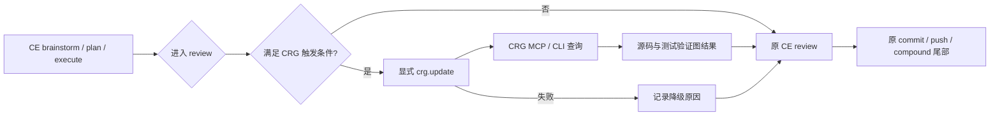

# chore: 受控接入 code-review-graph 增强 Codex CE 审查

## Goal Capsule

- **Objective:** 在不改变 `brainstorm -> plan -> execute -> review -> compound` 主工作流的前提下，为 Codex CLI 增加可显式调用的代码图、影响范围和相关测试证据。
- **Authority:** 运行时行为、测试结果、当前源码和项目计划高于 CRG 图结果；CRG 只提供结构化检索证据。
- **Execution profile:** 采用显式命令和条件触发，不安装自动 hooks，不启动 daemon，不自动注入上游规则。
- **Stop conditions:** 如果接入修改 CE 阶段顺序、增加默认提交门禁、在普通 Bash/Edit 后自动运行、明显增加日常延迟，或无法无损移除，则停止接入并回滚对应单元。
- **Tail ownership:** `ce:work` 负责实现和本地验证，`ce:review` 负责对照本计划复核；只有形成稳定复用经验时才进入 `ce:compound`。

---

## Product Contract

### Summary

本计划把 [code-review-graph](https://github.com/tirth8205/code-review-graph) 作为 Codex CLI 的可选结构化证据源接入 RedCode IM。接入只增强跨模块计划和代码审查，不接管 CE 阶段、Git 提交、测试选择或最终判断。

### Problem Frame

RedCode IM 当前有约 1,670 个 tracked 文件，核心代码横跨 Rust、TypeScript、Vue、Dart、Kotlin 和 Swift。Codex 在大型改动中需要重复搜索调用关系、受影响文件和相关测试。CRG 可以减少这部分重复探索，但其静态图无法可靠覆盖动态路由、宏展开、跨端 API 语义、CSS 视觉和运行时状态，因此不能成为新的工作流控制器或质量门禁。

### Requirements

**CE 工作流不变**

- R1. 保留现有五阶段顺序和 CE 技能映射；CRG 不新增阶段，不替代 `ce:plan`、`ce:work`、`ce:review` 或 `ce:compound`。
- R2. CRG 输出只作为候选影响范围、调用关系和测试关联证据；计划、源码、运行时行为、测试结果和人工审查结论具有更高优先级。
- R3. 接入不得安装或修改 Codex `PostToolUse`、`SessionStart` hooks，不得安装 Git hooks，不得把 CRG 加入 `test.all`、提交门禁或默认 push 流程。
- R4. 不运行 `code-review-graph install --platform codex`，避免其自动修改 `AGENTS.md`、`~/.codex/hooks.json` 和 Git hooks。

**受控调用**

- R5. 只有满足明确触发条件的 `plan` 或 `review` 才默认使用 CRG；文档、文案、注释、单文件局部 CSS 和小型静态 UI 调整默认跳过。
- R6. 触发条件至少包括以下任一项：修改 5 个及以上源码文件、跨两个及以上业务模块、公共符号重构、API/认证/数据库/WebSocket/Redis 变更，或有效代码 diff 达到约 300 行。
- R7. 图更新必须由显式命令触发。进入符合条件的 review 时先增量更新，再查询变更、影响范围和相关测试；图不可用或更新失败时，CE 按原流程继续并记录降级原因。
- R8. CRG 不决定测试命令。执行者仍按 `AGENTS.md`、计划和 `docs/reference/testing/README.md` 选择实际测试、浏览器或设备验收。

**可复现和可回滚**

- R9. 首次接入固定使用已评估的 `code-review-graph==2.3.7`；升级必须作为独立依赖治理任务重新验证语言覆盖、MCP 工具和输出契约。
- R10. 仓库提供显式、可发现的构建、更新、状态和审查入口，并忽略本地 SQLite 图数据，禁止提交约 128MB 的 `.code-review-graph/` 生成物。
- R11. Codex MCP 只通过官方 `codex mcp add` 注册项目专属的 `code-review-graph-redcode-im` stdio server，不写入项目级密钥，不启用 embeddings，不向外部服务传输源码派生文本。
- R12. 接入必须提供对称移除步骤，并能证明移除后 CE、Git hooks、Codex hooks、测试和提交行为回到接入前状态。

**效果评估**

- R13. 试点必须记录构建耗时、增量更新时间、图覆盖、审查上下文、额外发现、误报和降级次数，不能只引用 CRG 官方 token 宣传数据。
- R14. 只有在跨模块 review 中出现可复现净收益，且普通任务没有持续额外延迟时，CRG 才保留为推荐工具；否则降级为手工按需工具或移除。

### Actors

- A1. **Codex 主线程:** 维护 CE 主流程，决定是否触发 CRG，校验图结果并执行最终 review。
- A2. **项目维护者:** 审核本机 MCP 注册、版本升级、试点指标和是否长期保留。
- A3. **CRG MCP server:** 提供代码图查询，不写业务代码，不拥有阶段流转、测试选择或 Git 操作权限。

### Key Flows

- F1. **符合条件的 review**
  - **Trigger:** 改动满足 R6 任一条件并进入 `review`。
  - **Actors:** A1、A3。
  - **Steps:** 显式增量更新图；查询变更风险、影响范围、调用者和相关测试；主线程用源码和测试验证结果；继续原有 CE review。
  - **Outcome:** CRG 证据被合并进 review，但不改变 review 的结论权限和交付尾部。
  - **Covered by:** R1、R2、R6、R7、R8。
- F2. **小型任务跳过**
  - **Trigger:** 改动只涉及文档、文案、单文件局部 CSS 或其他未满足 R6 的小型变更。
  - **Actors:** A1。
  - **Steps:** 不更新图，不查询 CRG，按现有 CE 和 Git 规范完成任务。
  - **Outcome:** 小任务没有 CRG 启动成本和误报噪声。
  - **Covered by:** R3、R5、R14。
- F3. **CRG 不可用时降级**
  - **Trigger:** `uvx`、图数据库、MCP server 或查询失败。
  - **Actors:** A1。
  - **Steps:** 记录失败原因；回退到 `rg`、定向文件读取、测试和运行时验证；不得阻塞 commit/push。
  - **Outcome:** CE 工作流继续完成，CRG 故障不成为交付故障。
  - **Covered by:** R1、R3、R7、R12。
- F4. **版本升级或移除**
  - **Trigger:** 计划升级 CRG，或试点未达到 R14 的保留条件。
  - **Actors:** A1、A2。
  - **Steps:** 升级走独立计划；移除使用官方 `codex mcp remove`，删除本地图数据和仓库入口；复核 hooks 与 CE 规则没有残留。
  - **Outcome:** 工具生命周期可审计、可逆。
  - **Covered by:** R9、R12、R14。

### Acceptance Examples

- AE1. **跨模块 API 改动使用图证据**
  - **Covers:** R2、R6、R7、R8。
  - **Given:** 一个提交同时修改 API handler、服务逻辑和 Flutter/H5 客户端契约。
  - **When:** 主线程进入 `review`。
  - **Then:** 先显式更新图并查询影响范围，再运行项目规定的 API 与客户端验证；CRG 没有找到的动态调用仍由源码和运行时检查补齐。
- AE2. **纯文档提交不触发 CRG**
  - **Covers:** R3、R5。
  - **Given:** diff 仅包含 `docs/` 下 Markdown。
  - **When:** 主线程提交文档。
  - **Then:** 不启动 CRG，不修改图，不增加 pre-commit 步骤，只执行文档范围的 Git 检查。
- AE3. **MCP 故障不阻塞 CE**
  - **Covers:** R1、R7、R12。
  - **Given:** MCP server 无法启动或本地图损坏。
  - **When:** review 请求图查询。
  - **Then:** 主线程明确记录降级，继续使用现有 CE review、`rg`、测试和运行时证据，并正常完成允许的 commit/push。
- AE4. **静态 UI 误报被约束**
  - **Covers:** R2、R8、R13。
  - **Given:** CRG 对 `im-ui-html` 报告所有变更函数均无测试且受影响 flow 为零。
  - **When:** 主线程审查页面改动。
  - **Then:** 该输出只记为静态图局限，最终结论由 JavaScript 检查、浏览器交互、Console 和多设备视觉验收决定。

### Success Criteria

- 首次完整构建在当前仓库开发机上不超过 30 秒；基线实测约 11.1 秒。
- 常规增量更新目标不超过 5 秒，且只在显式入口中发生。
- `code-review-graph status` 能稳定报告约 1,100 个源码文件、14,000 个节点和 100,000 条边；版本或源码变化允许合理浮动。
- 接入前后 `~/.codex/hooks.json` 和 `git rev-parse --git-path hooks` 中现有 hook 内容保持不变。
- `AGENTS.md` 不出现上游自动注入标记 `<!-- code-review-graph MCP tools -->`，也不出现“CRG 始终优先于源码工具”的绝对规则。
- 至少完成 5 次符合触发条件的真实 review 试点；其中至少 3 次为跨模块或公共契约改动。
- 试点期间，小型任务 CRG 调用次数为零；CRG 故障导致 CE 任务阻塞次数为零。
- 试点中至少 3/5 次由 CRG 提前找到一个经源码确认且不在主线程首轮候选集中的相关文件、调用者或测试，或者使首轮人工读取文件数下降至少 20%。
- 试点结束后按固定阈值决策：达到上一条且增量更新中位数不超过 5 秒时保留；只有 1-2 次有效帮助时降级为完全手工调用；零次有效帮助、产生 CE 阻塞或出现隐藏自动触发时移除。

### Scope Boundaries

**本计划覆盖**

- 固定 CRG 版本并提供显式 Make 入口。
- 忽略本地图数据库并记录本地存储边界。
- 使用 Codex 官方 MCP 命令做单一 server 注册。
- 在项目规则和 `plan/review` 提示词中增加条件触发、证据优先级、失败降级和禁止事项。
- 增加仓库级守护测试、试点记录模板和对称卸载说明。

**本计划不覆盖**

- 不安装 CRG Codex hooks、Git hooks、watch daemon 或 VS Code 扩展。
- 不启用本地或云 embeddings。
- 不引入 CRG GitHub Action，不把 risk score 设为 merge gate。
- 不让 CRG 自动修改 `AGENTS.md` 或生成 wiki、architecture 文档、memory 文件。
- 不替换现有测试、浏览器、真机、Docker Compose 或 CE 多维 review。
- 不在本轮升级 Python、uv、Codex CLI 或 CE plugin。

### Dependencies

- 本机已安装 `uv` 和支持 `codex mcp add/remove/list` 的 Codex CLI。
- CRG 2.3.7 需要 Python 3.10+；`uvx` 负责隔离依赖。
- 图数据库默认位于仓库 `.code-review-graph/`，必须由 `.gitignore` 排除。
- MCP 注册属于本机配置，不作为仓库 tracked 文件提交。

### Sources

- CRG 上游：`https://github.com/tirth8205/code-review-graph`，评估版本 `2.3.7`。
- 当前工作流约束：`AGENTS.md`、`docs/index.md`、`docs/prompts/plan.md`、`docs/prompts/review.md`。
- Git 与测试约束：`docs/standards/git-workflow.md`、`docs/reference/testing/README.md`。
- 仓库工具入口模式：`Makefile`、`tests/go/tooling/workflow_targets_test.go`。

---

## Planning Contract

### Product Contract Preservation

Product Contract 由本次 `ce-plan` bootstrap 创建；用户已明确选择受控接入并要求不得影响 CE 工作流。

### Key Technical Decisions

- KTD1. **CRG 是 CE 的旁路证据源。** (session-settled: user-directed — chosen over full automatic integration: automatic hooks and rule injection could alter CE timing, tool priority, and commit behavior.) CRG 查询嵌入现有 `plan/review`，不形成第六阶段。
- KTD2. **禁止使用上游自动安装命令。** (session-settled: user-directed — chosen over `code-review-graph install --platform codex`: controlled integration must not modify Codex hooks, Git hooks, or overwrite project workflow guidance.) MCP 使用 `codex mcp add` 单独注册，仓库规则由本计划控制。
- KTD3. **通过 `uvx` 固定 2.3.7。** 仓库不新增 Python virtualenv 或 lockfile；显式入口使用 `uvx --from code-review-graph==2.3.7`，确保本机和 CI-like 验证使用同一版本。
- KTD4. **图数据保留在标准本地目录并 gitignore。** `.code-review-graph/` 便于 CRG 自动发现和 MCP 查询；约 128MB SQLite 数据不进入 Git，也不进入文档产物。
- KTD5. **Makefile 只提供手工入口。** 新增 `crg.build`、`crg.update`、`crg.status` 和 `crg.review` 命令，但不把它们挂到 `test.all`、`test.live`、commit 或 push 依赖链。数据清理由上游受约束的 uninstall 流程承接，不新增自定义递归删除命令。
- KTD6. **条件由项目规则定义，工具不自行决定。** `AGENTS.md` 只加入精简的可选证据规则；`docs/prompts/plan.md` 和 `docs/prompts/review.md` 记录触发阈值与降级行为。禁止注入上游“ALWAYS use graph first”段落。
- KTD7. **风险分数不作为质量门禁。** CRG 的 flow recall、搜索排序和静态测试关联存在已知局限。Review 必须核查具体边、源码与实际测试，不能按 `0.0-1.0` 分数自动通过或阻塞。
- KTD8. **先本地试点，暂不接 CI。** GitHub Action、daemon 和 embeddings 会扩大维护面，只有试点证明稳定收益后才能进入新计划。

### High-Level Technical Design

### Trigger Matrix

| 改动类型 | 默认动作 | CRG 作用 |
| --- | --- | --- |
| 纯文档、文案、注释 | 跳过 | 无 |
| 单文件局部 CSS、静态 mock | 跳过 | 需要时手工查询 |
| 5 个及以上源码文件 | 触发 | 变更风险、影响范围、测试关联 |
| 跨两个及以上模块 | 触发 | 模块依赖和公共契约关联 |
| API、认证、数据库、WS、Redis | 触发 | 调用者、相关测试和潜在影响面 |
| 公共符号重命名或结构重构 | 触发 | callers、references、imports、tests |
| 有效代码 diff 约 300 行及以上 | 触发 | 缩小 CE review 的首轮读取范围 |

### Evidence Order

当证据冲突时按以下顺序处理：

1. 真实运行时行为和捕获到的请求/日志。
2. 与改动范围匹配的自动化测试、浏览器或设备验收。
3. 当前源码、配置和依赖定义。
4. CRG 高置信度调用、导入和测试边。
5. CRG 推断边、flow、community、风险分数和 token savings 估算。

### Rollout and Rollback

- 先提交仓库内入口、文档和守护测试，再进行本机 MCP 注册，避免本地配置先于项目契约。
- MCP 注册后重启 Codex CLI，验证工具列表和只读查询。
- 试点期不启用 hooks。每次符合条件的 review 由主线程显式调用更新。
- 回滚时先执行 `codex mcp remove code-review-graph-redcode-im`，再预览 `uvx --from code-review-graph==2.3.7 code-review-graph uninstall --repo . --keep-user-configs --dry-run`；确认范围只属于当前仓库后，去掉 `--dry-run` 交互执行。不得使用 `--all-repos`，不得删除通用 CRG server 或其他仓库的数据。仓库入口和文档通过独立 commit 回滚。
- 回滚验收必须比较 Codex hooks、Git hooks、`test.all` 和 CE 提示词，确认没有隐藏触发器。

### Risks and Mitigations

| 风险 | 影响 | 缓解措施 |
| --- | --- | --- |
| 静态图对动态框架调用识别不足 | 漏报影响范围 | CRG 只做首轮候选集，继续执行源码、测试和运行时验证 |
| 大依赖图产生假阳性 | review 噪声增加 | 限制两跳上下文，核查边置信度，不按风险分数直接决策 |
| 图未更新或数据库损坏 | 查询结果过期 | review 前显式 `crg.update`；失败时记录并降级 |
| `uvx` 首次下载或网络失败 | 首次启动延迟 | 首次 build 单独完成；失败不阻塞 CE |
| 上游版本快速变化 | MCP 或输出契约漂移 | 固定 2.3.7，升级单独评估 |
| 本地 SQLite 占用约 128MB | 工作区膨胀 | gitignore，文档化受约束 uninstall 命令，不提交数据库 |
| 规则与 CE review 重复 | 审查步骤冗余 | CRG 只提供影响面，不重复 correctness/security/testing 结论 |

### Sequencing

U1 建立仓库入口和不可侵入守护，U2 在其基础上注册本机 MCP，U3 才把条件触发写入 CE 文档。U4 完成实际试点和保留决策。任何单元失败都不能改变原 CE 工作流。

---

## Implementation Units

### U1. 建立显式 CRG 命令与不可侵入守护

- **Goal:** 提供固定版本、可发现、仅手工调用的 CRG 生命周期入口，并从机制上防止图数据和自动触发器进入仓库。
- **Requirements:** R3、R4、R7、R9、R10、R12。
- **Files:** `Makefile`、`.gitignore`、`tests/go/tooling/workflow_targets_test.go`。
- **Approach:** 在 Makefile 增加 `CRG_VERSION ?= 2.3.7` 和 namespaced 目标。目标只封装 `build/update/status/detect-changes`。`crg.review` 接受显式 `BASE`，缺失时使用可见默认值并在输出中说明。所有目标保持在 `test.all`、`test.live` 和现有模块目标依赖图之外。将 `.code-review-graph/` 加入 `.gitignore`。守护测试验证目标存在、版本固定、生成目录被忽略，并断言 CRG 没有出现在自动测试和提交链。
- **Test Scenarios:**
  1. `make help` 显示 CRG 手工入口，但 `make test.all -n` 和 `make test.live -n` 不包含 CRG。
  2. `make crg.status` 在图不存在时给出明确状态，不修改 Git tracked 文件。
  3. `make crg.build` 在当前仓库生成本地图；`git status --short` 不显示数据库。
  4. `make crg.update` 在无源码变化时可重复执行，并保持图可查询。
- **Verification:** `make tests.tooling`、`make help`、`make test.all -n`、`git check-ignore .code-review-graph/graph.db`、`git diff --check`。
- **Done:** 手工入口可用，自动任务图没有 CRG，生成数据不进入 Git，上游卸载边界已文档化。

### U2. 仅注册 Codex MCP server

- **Goal:** 让 Codex CLI 能调用 CRG MCP 工具，同时保持 Codex hooks、Git hooks和仓库规则不变。
- **Requirements:** R3、R4、R9、R11、R12。
- **Files:** 本机 `~/.codex/config.toml`（不提交）、`.code-review-graph/`（不提交）。
- **Approach:** 先记录 `codex mcp list`、`~/.codex/hooks.json` 是否存在及 Git hooks 内容摘要，并确认 `code-review-graph-redcode-im` 尚未被其他配置占用。使用官方 `codex mcp add code-review-graph-redcode-im -- uvx --from code-review-graph==2.3.7 code-review-graph serve` 注册项目专属 stdio server，不运行 CRG install。重启 Codex 后调用 status、architecture 和指定符号查询。不得启用 embeddings、daemon 或网络 transport。
- **Test Scenarios:**
  1. `codex mcp get code-review-graph-redcode-im` 显示命令固定为 2.3.7 的 stdio server；已有同名配置时停止，不覆盖。
  2. 新 Codex 会话能列出 CRG 工具，并针对当前仓库返回 graph stats。
  3. 查询 Rust、Vue、Dart 各一个已知符号时返回 repo-relative 可核查结果。
  4. `~/.codex/hooks.json` 和 Git hooks 在注册前后内容一致。
  5. 执行 `codex mcp remove code-review-graph-redcode-im` 后只有项目专属 server 消失；CRG uninstall dry run 只列出当前仓库数据；其他 MCP、CE 和 Git 命令仍可正常运行。随后可按同一注册命令恢复试点配置。
- **Verification:** `codex mcp list`、`codex mcp get code-review-graph-redcode-im`、CRG `list_graph_stats`/`query_graph` MCP 查询、hooks 前后摘要比较、`git status --short`。
- **Done:** MCP 可用且版本固定，没有任何自动 hook、tracked 配置或外部数据传输。

### U3. 将 CRG 作为 CE 条件证据源写入项目契约

- **Goal:** 让未来 Codex 会话在正确场景调用 CRG，并在小任务、失败和证据冲突时保持原 CE 行为。
- **Requirements:** R1、R2、R5、R6、R7、R8。
- **Files:** `AGENTS.md`、`docs/prompts/plan.md`、`docs/prompts/review.md`、`docs/reference/tooling/code-review-graph.md`、`docs/index.md`。
- **Approach:** 在 `AGENTS.md` 的 CE 章节增加一段项目自有规则，明确 CRG 不构成新阶段、不具有证据优先权、不可用时静默降级。更新 plan/review 提示词以引用触发矩阵，但不要求每个任务运行。新增工具参考文档，记录安装、显式命令、MCP 注册、查询顺序、已知局限、数据边界和卸载方式。文案禁止使用上游绝对指令和自动注入 marker。
- **Test Scenarios:**
  1. 纯文档、小型 CSS 请求按文档规则跳过 CRG。
  2. 跨 API/App 改动在 plan/review 中触发 CRG，但 execute 阶段不因每次编辑自动更新。
  3. CRG 命令不可用时，提示词要求记录降级并继续原 CE review。
  4. CRG 与运行时证据冲突时，文档明确采用本计划的 Evidence Order。
  5. 搜索仓库不存在上游自动注入 marker、“ALWAYS use graph first”或新增第六阶段。
- **Verification:** `rg -n "code-review-graph|CRG" AGENTS.md docs/prompts docs/reference/tooling docs/index.md`、`rg -n "code-review-graph MCP tools|ALWAYS use.*graph" AGENTS.md`（预期无结果）、`git diff --check`。
- **Done:** 条件触发、跳过、降级和证据优先级可被未来执行者直接遵循，五阶段骨架未改变。

### U4. 执行五次真实 review 试点并作保留决策

- **Goal:** 用本项目真实任务判断净收益，而不是依据官方基准长期保留工具。
- **Requirements:** R13、R14。
- **Files:** `docs/reviews/YYYY-MM-DD-code-review-graph-pilot.md`，必要时更新 `docs/reference/tooling/code-review-graph.md`。
- **Approach:** 使用统一记录表覆盖至少五次符合条件的 review，其中至少三次跨模块或公共契约改动。每次在 CRG 查询前冻结主线程首轮候选文件清单，再记录 changed files、图更新时间、CRG 候选、CE 实际读取、额外发现、误报、漏报、降级和首轮读取文件数变化。试点结束后严格使用 Success Criteria 的阈值给出保留、降级或移除结论。不得为了凑指标扩大 CRG 使用范围。
- **Test Scenarios:**
  1. 至少一个 Rust API 改动，核对 handler/service/test 关系。
  2. 至少一个 Flutter 与 H5/Desktop 跨端契约改动，核对跨语言导入和相关文件。
  3. 至少一个共享组件或公共符号重构，核对 callers/references/tests。
  4. 至少一个静态 UI 改动，验证 test-gap/flow 输出的误报处理。
  5. 至少一次模拟 MCP 或图更新失败，验证 CE 降级不阻塞交付。
- **Verification:** 审阅 `docs/reviews/YYYY-MM-DD-code-review-graph-pilot.md` 的五条完整记录；对每条记录抽查 Git diff、CE review 结论和实际测试证据。
- **Done:** 五次试点证据完整，形成明确保留决策；如果不保留，完成 U2 的移除和 U1/U3 的相应回滚。

---

## Verification Contract

| Gate | Command / Evidence | Applies to | Pass condition |
| --- | --- | --- | --- |
| 工作区边界 | `git status --short` | 每个单元 | 仅出现当前单元相关 tracked 改动；CRG 数据不出现 |
| 文档与 diff | `git diff --check`、`git diff --cached --check` | U1-U4 | 无空白错误，staged diff 只含当前闭环 |
| 工具守护测试 | `make tests.tooling` | U1 | Make 入口、版本、ignore 和非自动触发断言通过 |
| 自动链隔离 | `make test.all -n`、`make test.live -n` | U1、U3 | 输出不包含 `crg.*` 或 `code-review-graph` |
| 本地图 | `make crg.build`、`make crg.status` | U1 | 完整构建 <=30 秒，约 1,100 文件可解析，Git 保持干净 |
| 增量更新 | `time make crg.update` | U1、U4 | 常规增量目标 <=5 秒；超限记录原因但不阻塞 CE |
| MCP 注册 | `codex mcp list`、`codex mcp get code-review-graph-redcode-im` | U2 | 仅一个项目专属 CRG stdio server，命令固定 2.3.7 |
| Hook 不变量 | 注册前后比较 `~/.codex/hooks.json` 和 `git rev-parse --git-path hooks` | U2 | 内容一致，无 CRG hook |
| 规则不变量 | `rg -n "code-review-graph MCP tools|ALWAYS use.*graph" AGENTS.md` | U3 | 无上游 marker 或绝对优先规则 |
| CE 骨架 | 检查 `AGENTS.md`、`docs/index.md` | U3 | 仍为五阶段且映射不变 |
| 失败降级 | 临时移除 MCP 后执行一次符合条件的 review dry run | U2、U4 | 明确记录降级，原 review 和 Git 尾部继续 |
| 试点收益 | `docs/reviews/YYYY-MM-DD-code-review-graph-pilot.md` | U4 | 五次记录完整并给出保留、降级或移除结论 |

CRG 自身不是测试 gate。任何业务代码改动仍必须执行其模块对应的现有测试命令，不能用 graph status、risk score 或 test-gap 列表替代。

---

## Definition of Done

- R1-R14 均有实现和验证证据，没有通过缩小“不得影响 CE”的含义来宣称完成。
- `brainstorm -> plan -> execute -> review -> compound` 及其 CE 映射保持不变。
- 没有 Codex/Git 自动 hook、daemon、embeddings、GitHub Action 或 CRG 自动规则注入。
- CRG 2.3.7 可通过显式 Make 命令构建、更新、查询状态和审查；本地图数据可通过文档化的受约束 uninstall 流程清理。
- Codex MCP 可以查询当前仓库，并能通过官方命令只移除 `code-review-graph-redcode-im` 项目专属配置。
- 小型任务默认不触发 CRG；符合条件的 review 在 CRG 故障时能无阻塞降级。
- `.code-review-graph/` 及其 SQLite 数据未进入 Git。
- 仓库级守护测试、静态检查和适用的业务测试全部通过。
- 五次真实 review 试点完成并形成长期保留决策。
- 所有实验性配置、临时数据库和不采用的接入尝试已清理，没有遗留死入口或重复规则。
- 改动按最小可解释闭环完成 review、commit 并立即 push 当前分支。

### Suggested Commit Boundaries

1. `chore(tooling): 增加 CRG 显式本地入口`
2. `docs(workflow): 约束 CRG 受控审查边界`
3. `docs(review): 记录 CRG 试点评估结论`

本机 MCP 注册不进入 Git commit；它必须在第 1 个仓库闭环验证后单独执行，并在最终验收中报告当前状态。

### Compound Follow-up

只有试点证明以下内容具有稳定复用价值时，才新增 `docs/solutions/`：

- 多语言 monorepo 中如何把静态代码图作为 CE review 的旁路证据源。
- 如何识别 CRG 在动态路由、静态 UI 和跨端契约中的典型误报与漏报。

安装过程和五次试点流水账保留在计划、review 文档和 Git 历史中，不复制到 solution。
