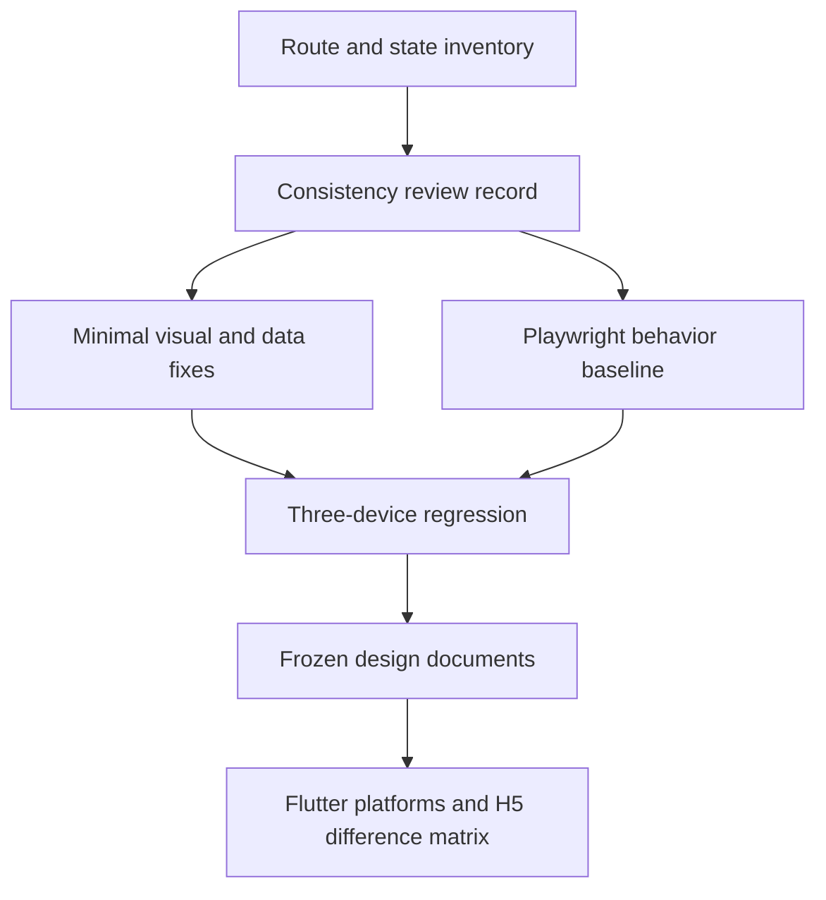

# refactor: IM UI 预览稳定收尾与多端交付

## Goal Capsule

- **目标：** 将 `im-ui-html/` 从高保真可操作原型收敛为可稳定评审、可重复回归、可直接指导多端实现的冻结设计基线。
- **范围：** 只处理设计一致性、极端数据与设备适配、交互稳定性、预览自动化和交付文档；不继续扩展业务功能。
- **事实来源：** 当前运行态与截图优先于文档，视觉规范以 `im-ui-html/assets/styles.css`、`im-ui-html/docs/design-tokens.md` 和已通过评审的朋友圈列表、会话列表等页面为准。
- **执行方式：** 先审查并固化问题清单，再进行最小修复；自动化先覆盖高风险路由和关键交互，不建立全量像素截图债务。
- **停止条件：** 发现需要新增业务能力、调整 API 契约或重构多端正式实现时，记录到交付差异清单并转入独立计划，不扩大本计划范围。
- **后续归属：** `app/` Flutter 多平台主线和 `h5-app/` 依据冻结文档分别排期；`ios-app/`、`android-app/` 仅作为历史实现差异参考，不作为 2.0 主线 UI 交付目标。本计划只交付可执行映射，不直接修改这些模块。

---

## Product Contract

### Summary

`im-ui-html/` 已覆盖主要移动端页面、API 对齐能力和近期审定的会话长按悬浮菜单等交互，当前重点已从持续重设计转为稳定收尾。需要通过一致性审查、极端状态回归、关键交互自动化和多端差异映射，避免设计源在正式实现期间继续漂移。

### Problem Frame

当前预览仍主要依赖人工逐页检查，长文本、边界触点、不同设备安全区和同页重渲染等问题容易在局部调整后复发。现有设计文档能够说明 token、组件和 Flutter 映射，但缺少明确的冻结版本、跨端差异矩阵以及可重复执行的预览验收入口。

### Requirements

**设计一致性**

- R1. 全部正式移动端路由必须按同一基线检查顶部导航、页面背景过渡、内容左右线、Surface、圆角、间距、图标尺寸与文字对齐。
- R2. 页面不得保留面向设计评审者的功能说明文案，不得出现无业务必要的卡片套卡片、重复入口或仅用于展示能力的装饰区域。
- R3. 已通过审查的页面只修明确缺陷，不因本轮巡检重新改变信息架构或视觉方向。

**设备与数据韧性**

- R4. `iPhone 12 Pro`、`iPhone 16 Pro Max` 和 `Pixel 8 Pro` 三种预览必须覆盖安全区、输入聚焦、composer/viewport 变化、底部导航和内容裁切检查；真实系统软键盘行为由正式端设备验收承担。
- R5. 长用户名、长群名、长摘要、长评论、三位数未读、大成员数、空数据、加载态和错误态不得产生文本遮挡、横向溢出或布局跳动。
- R6. 图片内容必须覆盖 1、2、3、4、5、6、7、8、9 张的既定排版规则，不得只验证九宫格。

**交互稳定性**

- R7. 同页状态操作不得重放整屏入场动画；真实路由切换仍保留页面入场反馈。
- R8. 长按菜单、Sheet、Popover、Toast、表情面板和功能面板切换时不得闪屏、错误遮挡底部导航或发生明显高度跳变。
- R9. 会话短按和长按必须互斥，长按不得触发系统原生菜单；悬浮菜单在四边触点附近必须保持可见和可操作。
- R10. Overlay 必须具备一致的遮罩关闭、`Escape`、焦点恢复和滚动保持行为；关键控件同时满足 accessible name、dialog semantics、键盘导航、至少 `44px` 触摸热区和 `prefers-reduced-motion`；仅在现有全量渲染造成可复现问题时才局部更新 DOM。

**回归与交付**

- R11. 建立不依赖业务后端的轻量 Playwright 回归入口，至少验证全路由可打开、Console 无 error、关键布局不溢出以及高风险交互行为。
- R12. 自动化截图只覆盖三种目标设备和高风险代表页面，截图用于人工差异审查，不把全部页面锁定为脆弱的像素级断言。
- R13. 设计文档必须记录冻结基线、页面/组件/状态矩阵、多端差异、实施优先级和后续 UI 变更准入规则。

### Acceptance Examples

- AE1. 给定任一正式移动端深链，刷新后页面可加载，Console 无 error，顶部导航、主体内容和底部安全区均未越出设备画布。
- AE2. 给定三位数未读、最长用户名和长消息摘要的会话列表，各字段按规范截断或换行，头像、时间和状态 icon 不被挤压。
- AE3. 给定用户短按会话 item，应进入聊天；长按同一 item，应只在触点附近打开悬浮菜单且底部导航保持可见。
- AE4. 给定表情面板已打开，再切换到功能面板，容器高度平滑过渡并由内容撑开，不出现固定高度裁切。
- AE5. 给定朋友圈 1 至 9 张图片的确定性数据，每种数量都匹配 `im-ui-html/docs/moments-media-layout.md`，宽度填充和间距一致。
- AE6. 给定多端实现人员阅读交付文档，可明确找到页面、组件、状态、交互及 iOS/Android/H5 的差异和实施顺序。

### Scope Boundaries

**本计划内**

- `im-ui-html/` 的静态页面、样式、mock 数据、预览测试与附属文档。
- `docs/reviews/` 中的全路由一致性和回归记录。
- `docs/reference/testing/` 中与 UI 预览相关的测试入口说明。

**明确排除**

- 新增业务页面、重新设计已通过评审的页面或继续扩展实验模块。
- 接入真实 API、WebSocket、上传、音视频通话后端或鉴权。
- 直接修改 `ios-app/`、`android-app/`、`app/`、`h5-app/`、`desktop/` 或 `admin/`。
- 重写 hash router、引入前端框架或预先拆除现有 `root.innerHTML` 渲染方式。
- 全路由像素级 golden screenshot 和跨浏览器矩阵。

---

## Planning Contract

### Key Technical Decisions

- KTD1. **本轮从持续设计切换为冻结收尾。** (session-settled: user-approved — chosen over continuing open-ended redesign: the prototype has reached a sufficiently complete state and remaining value is stability, regression coverage, and handoff.) 已通过评审的页面不再因个人偏好重做，只修有复现证据的规范或交互缺陷。
- KTD2. **问题清单先于代码修复。** U1 只输出带路由、设备、状态和截图证据的审查记录，不修改运行时代码；U2/U3 只处理具备固定深链、确定性状态、目标设备和截图证据的问题，防止巡检演变成无边界改版。
- KTD3. **Playwright 作为预览模块的开发期依赖。** 在 `im-ui-html/` 内建立独立测试入口和静态服务配置，避免借用 `h5-app/` 或 `admin/` 的模块依赖；生产预览仍是无框架、无构建步骤的纯静态资源。
- KTD4. **行为断言优先于像素锁定。** 路由、Console、溢出、动画状态和 Overlay 层级使用稳定断言；截图只保留失败证据和代表性人工基线，降低视觉微调造成的测试噪声。
- KTD5. **保留现有渲染架构，按证据局部修复。** 先通过回归确认 `root.innerHTML` 是否仍导致滚动、焦点或闪烁问题；只有存在稳定复现时才为 Overlay 或局部状态增加 patch/update 路径。
- KTD6. **多端交付采用主线差异矩阵，不假设一比一复制。** 设计语义和状态契约保持一致，正式映射对象为 `app/` Flutter 多平台主线和 `h5-app/`；安全区、系统导航、键盘、触觉反馈和平台控件按 Flutter 目标平台与 H5 分别标注，原生模块只记录历史差异。

### High-Level Technical Design

### Sequence

1. 冻结路由、状态和既有规范事实，输出一致性审查记录。
2. 补齐极端 mock 数据并修复审查确认的布局问题。
3. 收敛 Overlay、动画、长按和滚动/焦点行为。
4. 建立 Playwright 冒烟与三设备回归入口，反向验证前述修复。
5. 更新设计文档、测试索引和多端差异矩阵，宣布设计基线冻结。

### Risks and Dependencies

- 静态原型使用全量字符串渲染，局部状态修复可能引入事件绑定或焦点恢复回归；以行为测试约束，不提前做架构重写。
- Chrome 的设备模拟不能替代系统软键盘、真实安全区和触觉反馈；本轮只验证输入聚焦、composer/viewport 和预览安全区，正式端仍需按目标平台执行设备验收。
- 页面数量较多，若直接建立全量截图会造成维护成本；先按风险分层，代表页面覆盖公共结构，其余路由只做加载和溢出检查。

---

## Implementation Units

### U1. 全路由设计一致性审查

- **Goal:** 冻结正式页面清单并形成可追踪的问题基线。
- **Requirements:** R1-R3、R13。
- **Files:** `im-ui-html/docs/page-map.md`、`docs/reviews/2026-08-01-im-ui-preview-consistency-review.md`。
- **Approach:** 对照 `page-map.md` 和实际路由注册生成审查矩阵；逐页检查导航、背景过渡、左右线、Surface、间距、圆角、icon、文字对齐、空/错/加载态及设计说明文案；记录严重度、固定深链、确定性状态、目标设备和截图证据，本单元不修改运行时代码。
- **Test Scenarios:** 一级页、二级页、全屏工具页、Overlay 页面、demo/empty 状态和无效 ID fallback。
- **Verification:** 审查记录覆盖全部正式路由，每个问题可由固定深链和状态复现，`page-map.md` 与运行态无遗漏或幽灵路由。

### U2. 极端数据与三设备布局回归

- **Goal:** 让公共布局和内容组件在目标设备及边界数据下保持稳定。
- **Requirements:** R4-R6。
- **Dependencies:** U1。
- **Files:** `im-ui-html/assets/mock-data.js`、`im-ui-html/assets/app.js`、`im-ui-html/assets/styles.css`、`im-ui-html/docs/moments-media-layout.md`、`docs/reviews/2026-08-01-im-ui-preview-device-regression.md`。
- **Approach:** 增加确定性的长文本、三位数计数、大成员数、空/错/加载和 1 至 9 张图片场景；仅通过公共 token、约束和组件规则修复，不为单条 mock 数据写页面特例。
- **Test Scenarios:** 三种设备上的会话、聊天、联系人、群成员、搜索、朋友圈、设置表单；输入聚焦、composer/viewport 和预览安全区；横竖边缘内容；长中文、长英文连续串和混合内容。真实系统软键盘不在本单元模拟。
- **Verification:** 三设备代表截图无横向滚动、遮挡、越界或不可点击区域，图片数量规则与文档逐项对应。

### U3. Overlay、动效与输入交互稳定化

- **Goal:** 消除同页操作闪烁、层级错误、长按冲突和面板切换跳变。
- **Requirements:** R7-R10。
- **Dependencies:** U1。
- **Files:** `im-ui-html/assets/app.js`、`im-ui-html/assets/styles.css`、`im-ui-html/docs/component-inventory.md`。
- **Approach:** 统一页面切换与同页 render 的动画判定；核对 Overlay stacking context、定位边界和底部导航层级；完善短按/长按取消条件、原生 callout 抑制、遮罩/`Escape`/焦点恢复；核验 accessible name、dialog semantics、键盘导航、`44px` 热区和 reduced motion；先保留全量 render，仅对可复现的滚动或焦点问题做局部 DOM 更新。
- **Test Scenarios:** 会话四边触点长按、长按后取消、短按进入详情、菜单动作；Sheet/Popover/Toast 连续切换；表情与功能面板不同高度切换；同页状态操作和真实路由跳转；滚动后打开/关闭 Overlay；仅键盘完成打开、操作和关闭；减少动效模式。
- **Verification:** 同页操作 `.screen` 不重放 `screen-enter`，路由变化会播放；Overlay 下底部导航按交互契约可见；面板高度由内容撑开且过渡连续。

### U4. 轻量 Playwright 回归基线

- **Goal:** 为预览模块建立独立、可重复、无业务后端依赖的关键回归入口。
- **Requirements:** R7-R12。
- **Dependencies:** U1-U3。
- **Files:** `im-ui-html/package.json`、`im-ui-html/bun.lock`、`im-ui-html/playwright.config.ts`、`im-ui-html/tests/routes.ts`、`im-ui-html/tests/ui-preview-smoke.spec.ts`、`im-ui-html/tests/ui-preview-interactions.spec.ts`、`im-ui-html/README.md`、`docs/reference/testing/README.md`、`Makefile`。
- **Approach:** 使用 `@playwright/test` 启动固定 `8020` 静态服务；配置 iPhone 12 Pro、iPhone 16 Pro Max、Pixel 8 Pro 三个项目；以 `im-ui-html/tests/routes.ts` 作为自动化唯一机器可读 route manifest，测试检查它与 `page-map.md` 和运行态一致，禁止解析 Markdown 驱动测试或在多个 spec 复制路由。`make im-ui.test` 负责端口 preflight、停止既有占用并调用 Playwright，Playwright 只回收自身启动的服务；失败时保留截图和 trace。
- **Test Scenarios:** 全路由 HTTP/渲染成功、Console error、文档宽度与设备画布溢出、会话短按/长按、动画类切换、底部导航可见、面板高度过渡、朋友圈多图布局、accessible name、dialog semantics、键盘导航、`44px` 热区和 reduced motion。
- **Verification:** `cd im-ui-html && bun install --frozen-lockfile` 可复现依赖；`make im-ui.test` 可在干净环境完成端口 preflight、启动静态服务并完成测试；重复执行结果确定；测试结束不残留 `8020` 服务进程。

### U5. 设计基线冻结与多端 handoff

- **Goal:** 将最终页面、组件、状态和平台差异整理为正式实现可消费的交付契约。
- **Requirements:** R13。
- **Dependencies:** U2-U4。
- **Files:** `im-ui-html/README.md`、`im-ui-html/docs/design-tokens.md`、`im-ui-html/docs/component-inventory.md`、`im-ui-html/docs/page-map.md`、`im-ui-html/docs/flutter-handoff.md`、`im-ui-html/docs/platform-handoff.md`、`docs/index.md`。
- **Approach:** 标注冻结日期和设计源版本；统一页面、组件、状态、深链和测试覆盖矩阵；在 `platform-handoff.md` 分别记录 `app/` Flutter 目标平台、`h5-app/` 的已有实现、缺失能力、平台差异和建议优先级，并将 `ios-app/`、`android-app/` 明确标为非 2.0 主线的历史参考；规定后续新增页面或修改 token 必须更新的文档与回归项。
- **Test Scenarios:** 从任一正式路由能追踪到组件/状态规则和平台映射；文档中的路由、文件与命令均真实存在；不把 lab 或未来能力列为已交付。
- **Verification:** 文档交叉链接无断链，`page-map.md`、测试路由清单和运行态一致，多端实现人员无需依赖聊天上下文即可拆分后续计划。

---

## Verification Contract

| Gate | Command / Method | Applies to | Done signal |
| --- | --- | --- | --- |
| 静态差异检查 | `git diff --check` | U1-U5 | 无空白错误 |
| JavaScript 语法 | `node --check im-ui-html/assets/app.js`、`node --check im-ui-html/assets/mock-data.js` | U2-U3 | 两个文件均退出 0 |
| 测试依赖复现 | `cd im-ui-html && bun install --frozen-lockfile` | U4 | 严格使用已提交的 `bun.lock` 完成安装 |
| UI 预览回归 | `make im-ui.test` | U4-U5 | 三设备项目全部通过，无 Console error 或布局溢出 |
| 人工视觉审查 | `http://127.0.0.1:8020/#/mobile-design/chats` 及审查记录中的高风险深链 | U1-U3 | 三设备截图与问题清单逐项关闭或明确延期 |
| 文档一致性 | 对照 `im-ui-html/docs/page-map.md`、测试路由清单和实际 router | U1、U5 | 三者页面集合一致，所有 repo-relative 链接有效 |

`make im-ui.test` 必须按仓库端口规则完成 `8020` preflight 并停止既有占用；Playwright 配置只负责启动和回收本次测试服务。人工视觉检查复用同一浏览器会话，按“定位一次、连续检查、统一验证”执行。

---

## Definition of Done

- U1 完成时，全路由一致性审查记录已覆盖正式页面、状态和设备，问题均有可复现证据与明确处理结论。
- U2 完成时，三种目标设备和极端 mock 数据均通过布局审查，1 至 9 张图片排版与文档一致。
- U3 完成时，同页操作、路由动画、长按、Overlay、面板切换、滚动和焦点行为满足 R7-R10。
- U4 完成时，`make im-ui.test` 在无业务后端条件下稳定通过，失败证据可定位到路由、设备和交互步骤。
- U5 完成时，设计基线、测试入口、多端差异和变更准入规则已写入正式文档并完成交叉校验。
- 本计划不包含临时调试样式、失效截图、重复路由清单、废弃实验代码或未使用测试依赖。
- 所有改动按最小可解释闭环提交并推送，提交前通过适用的语法、测试、文档和 diff 检查。
