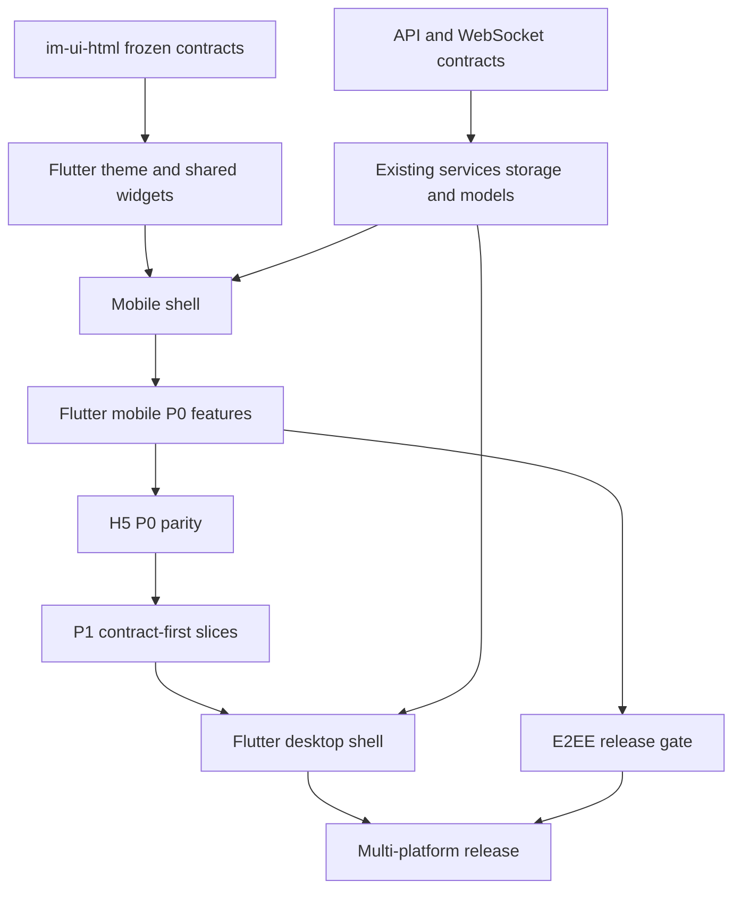

# feat: RedCode IM 2.0 正式开发执行计划

## Goal Capsule

- **目标：** 以冻结的 `im-ui-html/` 设计源为唯一视觉和交互基线，在保留现有 API、WebSocket、存储和测试能力的前提下，将 `app/` 重构为 RedCode IM 2.0 Flutter 多平台正式主线，并依次完成 H5 parity、P1 产品能力、桌面壳层和正式发布链路。
- **权威顺序：** 运行时与 API 合同 > 自动化和设备验收 > 当前源码 > `im-ui-html/` 冻结文档 > 本计划 > 历史原生客户端与旧桌面实现。
- **首个里程碑：** Flutter 移动端 P0，覆盖登录、四 Tab App Shell、会话、聊天、搜索、联系人、群治理、我的和设置，并按 Pixel 8 Pro 优先、iOS Simulator 回退的设备策略完成真实 API 验收。
- **执行策略：** 按纵向业务闭环迁移，不推倒重写服务层，不长期维护两套业务状态，不在首个里程碑并行展开 H5、P1 和桌面实现。
- **停止条件：** 发现设计能力缺少 API 契约、需要修改消息加密协议、需要新增数据库模型或平台插件不支持目标平台时，停止对应单元并转入其已有专项计划或新建子计划，不在 UI 单元中临时发明协议。
- **尾部归属：** Flutter 移动 P0 完成后依次进入 H5 P0、E2EE 发布门禁、P1 能力、Flutter 桌面和发布切换；`ios-app/`、`android-app/`、`desktop/` 只保留为迁移期行为参考和回归对照。

---

## Product Contract

### Summary

RedCode IM 2.0 已完成 HTML 设计源冻结，当前开发任务从“继续设计”切换为“正式实现”。`app/` 是唯一 Flutter 主线，先交付移动端核心 IM 闭环，再让 `h5-app/` 对齐同一产品契约，随后补齐需要新后端能力的 P1 页面、桌面形态和多平台发布。

### Problem Frame

当前 Flutter `app/` 已具备认证、聊天、联系人、群治理、设置、上传、Push、热更新和大量测试，但仍采用三 Tab 旧壳层，页面视觉、导航和状态表达与冻结设计不一致。H5 只有 11 条具名路由，缺少联系人、群治理和发现等完整链路。朋友圈、附近的人、游戏和完整音视频通话在设计源中已有界面，但后端契约尚不完整，不能把 mock 页面直接视为可交付功能。现有发布工作流只启用 Flutter Android 构建，iOS 和桌面产物仍未进入正式矩阵。

### Requirements

**设计与架构**

- R1. `im-ui-html/docs/design-tokens.md`、`component-inventory.md`、`page-map.md` 和 `platform-handoff.md` 是 2.0 UI 实现基线；正式端不得从 `ios-app/`、`android-app/` 或 `desktop/` 反向覆盖已冻结设计。
- R2. `app/` 必须保留单 Flutter 工程，移动端和桌面端通过 shell、布局和平台能力适配共享业务层，不拆成两个业务工程。
- R3. 2.0 UI 基础能力先落在 `app/lib/core/theme/`、`app/lib/core/widgets/` 和 shell 目录；只有出现稳定的第二个 Dart 消费者时才评估抽取 `packages/im_ui_kit/`。
- R4. 页面迁移必须复用现有 service、storage、model、WebSocket 和 API contract，不允许为了 UI 重构复制第二套网络层或持久化层。

**Flutter 移动 P0**

- R5. 移动 App Shell 必须提供聊天、联系人、发现、我的四个一级入口；设置下沉到“我的”，所有二级页面保留统一返回、SafeArea、系统返回和可访问性行为。
- R6. 登录与启动链路必须保留协议门禁、会话恢复、版本检查、Push 初始化、错误/加载状态和普通账号密码认证；SMS 登录与短信重置密码不进入 2.0 客户端。
- R7. 会话与聊天必须覆盖长按会话菜单、短按进入、文本与附件、语音消息、引用、转发、编辑/删除、reaction、已读详情、搜索、贴纸、输入面板和失败恢复，不得回退现有 API 能力。
- R8. 联系人与群组必须覆盖联系人目录、好友申请、添加好友、资料与备注、删除/举报、群目录、建群、成员、管理员、申请、邀请、规则、禁言、日志、退出和解散，并按 API 权限隐藏或禁用操作。
- R9. 我的与设置必须覆盖个人资料、账号安全、聊天设置、隐私协议、反馈、关于、密码、注销和版本状态；未完成 API 接入的页面不得只做无效按钮。
- R10. 所有 P0 页面必须覆盖加载、空数据、错误、权限不足、长文本、大计数和离线/重试状态，并满足 accessible name、至少 `44dp` 热区、键盘/系统返回、焦点和 reduced-motion 等价行为。

**跨端、扩展与发布**

- R11. `h5-app/` 在 Flutter P0 稳定后对齐相同的页面语义、API 合同和状态矩阵，但采用 Web 导航、存储和权限实现，不复制 Flutter Widget 结构。
- R12. 消息加密发送必须由后台配置和服务端约束共同裁决；完整 E2EE 继续执行 `docs/plans/2026-07-31-003-feat-api-ui-capability-parity-plan.md`，未通过协议、密钥和互操作验收前不得宣告 2.0 安全能力完成。
- R13. 朋友圈、扫一扫、附近的人、游戏和完整音视频通话按 P1 独立纵向切片实施；缺少 API 的能力先冻结合同和数据模型，再开发正式客户端，不允许用设计源 mock 代替后端。
- R14. Flutter 桌面端必须使用独立四栏/分栏 shell、窗口与快捷键语义，不能把移动页面按宽度直接拉伸；业务 service 和 domain model 与移动端共享。
- R15. 正式发布必须覆盖 Android、iOS、Windows 10+、macOS 和 Linux 的可重复构建、产物命名、签名边界、版本检查和升级路径；Win7 不属于 2.0 主线。
- R16. 每个迁移单元都必须保留或提高现有测试覆盖，并通过与改动范围匹配的 widget、unit、integration、浏览器、设备或构建验收。

### Acceptance Examples

- AE1. 给定已登录用户启动 Flutter 2.0，进入四 Tab 壳层后可在聊天、联系人、发现和我的之间切换；重复点击当前 Tab 执行该页面定义的回顶或刷新行为，底栏不覆盖内容。
- AE2. 给定 Pixel 8 Pro 上的真实 API 会话，用户可发送文本和附件、长按会话、搜索消息、查看已读、执行消息操作；页面重建、断网重试和 WebSocket 重连后状态不重复、不丢草稿。
- AE3. 给定普通成员、管理员和群主三种身份，群设置只显示各自可执行的治理动作；服务端拒绝后保留页面状态并显示可恢复错误。
- AE4. 给定 H5 与 Flutter 登录同一测试环境，两端可读取同一会话、发送消息、更新已读、查看联系人和群设置；平台存储实现不同但 API 结果一致。
- AE5. 给定设计源已有但 API 缺失的朋友圈或通话入口，正式客户端在对应 P1 合同完成前不显示伪可用流程；进入开发后必须由 API、客户端和端到端测试共同证明。
- AE6. 给定 Windows、macOS 或 Linux 宽屏窗口，用户看到桌面导航、会话列、聊天区和上下文侧栏；调整窗口尺寸时按断点重排，不出现移动底栏拉伸版。
- AE7. 给定 `v2.0.0` 发布标签，CI 对启用的平台执行检查和构建，产物名称、版本和校验信息确定；任一必需平台失败时不发布不完整版本。

### Scope Boundaries

**本计划覆盖**

- `app/` Flutter 2.0 移动与桌面主线。
- `h5-app/` P0 parity 和后续 P1 Web 映射。
- 与 P1 页面直接相关的 API 合同、测试和最小 Admin 配置入口。
- 2.0 多平台构建、设备验收、发布切换和迁移文档。

**明确排除**

- 不继续重设计已冻结的 `im-ui-html/` 页面；只允许修复有运行证据的设计缺陷并同步冻结文档与回归。
- 不恢复 SMS 登录、短信重置密码、Google/Apple 登录作为 2.0 首发客户端能力。
- 不在本计划内创建 Win7 Flutter 工程。
- 不把 `ios-app/`、`android-app/` 或 `desktop/` 继续开发成并行正式主线。
- 不在 UI 重构中自行设计密码协议、媒体传输协议或新的消息格式。

### Dependencies

- 设计冻结与测试基线：`docs/plans/2026-08-01-002-refactor-im-ui-preview-stabilization-and-handoff-plan.md`。
- Flutter 多平台总体决策：`docs/plans/2026-07-26-001-feat-im-2-0-flutter-multiplatform-rebuild-plan.md`。
- API/UI 能力与 E2EE：`docs/plans/2026-07-31-003-feat-api-ui-capability-parity-plan.md`。
- H5 既有迁移资产：`docs/plans/2026-07-02-001-feat-h5-app-flutter-parity-plan.md`。
- API 测试与设备策略：`docs/reference/testing/README.md`。

---

## Planning Contract

### Key Technical Decisions

- KTD1. **先移动 P0，后 H5、P1 和桌面。** 首个闭环只改 Flutter 移动端核心路径，避免多端同时迁移导致状态和 API 问题无法归因。
- KTD2. **纵向替换页面，不长期双轨。** 每个业务单元在新页面通过测试和设备验收后替换旧入口；允许短期编译期开关或测试注入，但不维护两套可独立演进的 repository/store。
- KTD3. **不预先创建 `packages/im_ui_kit/`。** 当前只有一个正式 Dart 工程，先在 `app/lib/core/` 内稳定 token 和组件；桌面 shell 形成真实复用后再以独立计划评估抽包。
- KTD4. **服务层保持行为兼容。** 现有 `MessageService`、`FriendService`、`RoomService`、WebSocket、缓存和上传能力是迁移资产，UI 单元通过 adapter/controller 消费，不复制协议实现。
- KTD5. **路由先统一，再迁移页面。** 在不强制引入新路由库的前提下建立集中 route contract、来源感知返回和平台 shell 分发；具体库只在现有 Navigator 无法满足深链与桌面状态恢复时再评估。
- KTD6. **设计语义跨端共享，代码不跨框架共享。** Flutter 与 H5 共用 token 名称、页面/状态矩阵和 API contract，各自保留平台原生组件、导航和存储实现。
- KTD7. **P1 使用合同先行门禁。** 朋友圈、附近、游戏和通话必须先确认 API、权限、数据生命周期和失败语义；扫一扫等本地能力也必须先定义权限与结果边界。
- KTD8. **E2EE 是独立发布门禁。** UI 可先对齐加密状态，但协议选型、密钥生命周期、多设备和群聊由 E2EE 专项计划交付；禁止把“能提交密文”当作完整 E2EE。
- KTD9. **桌面端复用业务控制器，不复用移动壳层。** 桌面使用独立导航、分栏和窗口能力；现有 `desktop/` 只用于行为和互操作对照。
- KTD10. **设备验收是合并门禁。** Flutter 移动默认先验证 Pixel 8 Pro，缺席时回退 iOS Simulator；iOS 原生能力、相机、麦克风、Push 和后台行为按真实设备边界补验。

### High-Level Technical Design



### Target Structure

```text
app/lib/
  bootstrap/                 # 启动装配和环境初始化
  shell/
    mobile/                  # 四 Tab、移动导航与 SafeArea
    desktop/                 # 导航列、会话列、主区和侧栏
  core/
    theme/                   # 2.0 tokens、主题、密度和断点
    widgets/                 # 稳定产品组件
    routing/                 # route contract、深链与返回来源
    services/                # 保留既有 API/WS 服务
    storage/                 # 保留既有缓存和本地状态
  features/                  # 按纵向业务单元迁移
  platform/                  # 文件、通知、窗口、权限和快捷键适配
```

### Sequencing

1. M0 建立 2.0 实现基线、token 和 shell，不迁移全部业务页。
2. M1 按聊天 -> 联系人/群 -> 我的/设置顺序完成 Flutter 移动 P0，并执行设备验收。
3. M2 在 Flutter P0 稳定后完成 H5 P0 parity，同时独立关闭 E2EE 发布门禁。
4. M3 按合同先行方式交付发现、账号扩展和音视频等 P1 纵向切片。
5. M4 建立 Flutter 桌面 shell，再迁移已稳定的共享业务能力。
6. M5 扩展 CI 构建矩阵、完成升级验证并切换 2.0 正式发布。

### Risks and Mitigations

- **现有 `chat_detail_page_v2.dart` 体积大且状态集中。** 先用测试刻画服务交互和用户行为，再按 composer、message list、overlay 等边界拆 Widget；不同时重写网络状态。
- **旧三 Tab 与新四 Tab 信息架构不同。** 先建立 shell 和 route contract，再迁移设置入口，避免页面返回栈混乱。
- **HTML 设备模拟与 Flutter 真机行为不同。** 设计源用于视觉契约，键盘、安全区、权限和后台行为只以正式端设备验收为准。
- **H5 与 Flutter 同时操作本地缓存可能产生语义差异。** API/WS contract 是跨端事实源；本地数据库实现只保证可观察行为一致。
- **P1 能力缺少后端。** 每个 P1 单元先完成 contract review 和 API 测试，未通过时不开始正式 UI 接入。
- **多平台插件支持不一致。** 平台能力必须经过 capability adapter；不支持的平台提供明确禁用或替代路径，不在页面散落平台判断。

---

## Implementation Units

| Unit | 目标 | 关键文件 | 依赖 |
| --- | --- | --- | --- |
| U1 | 建立 2.0 迁移与回归基线 | `app/test/`、`docs/reviews/` | 无 |
| U2 | 落地 2.0 token 与共享组件 | `app/lib/core/theme/`、`app/lib/core/widgets/` | U1 |
| U3 | 建立 mobile/desktop shell 与路由合同 | `app/lib/bootstrap/`、`app/lib/shell/`、`app/lib/core/routing/` | U2 |
| U4 | 重构启动、认证与版本门禁 | `app/lib/features/startup/`、`app/lib/features/auth/` | U3 |
| U5 | 重构会话、聊天、搜索与 composer | `app/lib/features/chat/` | U3、U4 |
| U6 | 重构联系人、群目录与群治理 | `app/lib/features/contacts/`、`app/lib/features/chat/group_*` | U3、U4 |
| U7 | 重构我的、资料与设置 | `app/lib/features/settings/`、`app/lib/features/home/` | U3、U4 |
| U8 | 完成 Flutter 移动 P0 设备验收 | `app/integration_test/`、`app/patrol_test/` | U5-U7 |
| U9 | 完成 H5 P0 parity | `h5-app/src/`、`h5-app/test/` | U8 |
| U10 | 关闭 E2EE 2.0 发布门禁 | `api/`、`admin/`、`app/`、`h5-app/` | U8、专项计划 |
| U11 | 交付 P1 纵向能力切片 | `api/`、`app/`、`h5-app/` | U9、各切片合同 |
| U12 | 建立 Flutter 桌面体验 | `app/lib/shell/desktop/`、平台目录 | U11、稳定业务控制器 |
| U13 | 切换多平台构建与 2.0 发布 | `.github/workflows/`、`app/scripts/`、发布文档 | U9-U12 |

### U1. 建立 2.0 迁移与回归基线

- **Goal:** 在修改 UI 前冻结当前 Flutter 核心行为、API 路径和目标页面映射，为纵向替换提供可比较基线。
- **Requirements:** R1、R4、R16。
- **Files:** 修改 `app/test/smoke_test.dart`、`app/integration_test/smoke_test.dart`、`app/integration_test/api_contract_flow_test.dart`；新增 `app/test/contracts/im_ui_route_contract_test.dart`、`docs/reviews/2026-08-02-im-2-0-implementation-baseline.md`。
- **Approach:** 将 43 条设计源业务路由映射为 Flutter P0、P1、设计源专用或不适用四类；记录现有 service、store、缓存和入口测试，不按文件名推断能力完成度。
- **Test Scenarios:** 启动到登录/首页；普通账号登录；聊天、联系人、群设置、搜索和设置入口；API path 与 `api/src/routes.rs` 对照；旧页面行为快照。
- **Verification:** `make app.check`、`make app.test`、`make app.test.api-paths`、`make app.test.integration.smoke` 通过，基线文档不存在未分类路由。

### U2. 落地 2.0 token 与共享组件

- **Goal:** 将冻结 token 和组件语义变成 Flutter 可测试的主题与产品组件，不继续使用页面私有颜色和尺寸补丁。
- **Requirements:** R1、R3、R10、R16。
- **Files:** 修改 `app/lib/core/theme/app_theme.dart`、`phone_density.dart`、`screen_adaptation.dart`、`app/lib/core/constants/app_colors.dart`；新增或重构 `app/lib/core/widgets/` 中 App Bar、Quiet Icon、Surface、List Row、Search Field、State Panel、Overlay 和 Tab Bar 组件。
- **Approach:** 先映射颜色、间距、圆角、字体、控件高度和断点，再迁移组件；保持语义 token，禁止页面直接依赖 HTML class 名或设备型号。
- **Test Scenarios:** light/dark token；1K/1.5K/2K 密度；44dp 热区；长中文/英文；大字号；SafeArea；reduced motion；Overlay dialog semantics 和焦点恢复。
- **Verification:** 新增 `app/test/core/design_token_contract_test.dart`、`app/test/widgets/im_2_0_component_contract_test.dart`，并保持现有 `phone_density_test.dart`、`screen_adaptation_test.dart` 通过。

### U3. 建立 mobile/desktop shell 与路由合同

- **Goal:** 把应用启动装配、移动四 Tab、桌面 shell 和业务 route 分离，为后续页面迁移提供稳定导航边界。
- **Requirements:** R2、R5、R14、R16。
- **Files:** 修改 `app/lib/main.dart`、`app/lib/app.dart`、`app/lib/features/home/home_shell_page.dart`；新增 `app/lib/bootstrap/`、`app/lib/shell/mobile/`、`app/lib/shell/desktop/`、`app/lib/core/routing/`、`app/lib/platform/platform_capabilities.dart`。
- **Approach:** 保留单一初始化流程；通过平台和窗口断点选择 shell；移动端固定四 Tab，设置从“我的”进入；所有业务页使用集中 route contract 和来源感知返回。
- **Test Scenarios:** 登录前后 shell；四 Tab 状态保持；重复点击当前 Tab；Android/iOS 系统返回；直接深链；无来源深链 fallback；桌面窄窗/宽窗 shell 选择；Push 导航进入目标页。
- **Verification:** 新增 `app/test/shell/mobile_app_shell_test.dart`、`desktop_app_shell_test.dart`、`app/test/core/routing_contract_test.dart`，并保持 Push 导航和登录 smoke 通过。

### U4. 重构启动、认证与版本门禁

- **Goal:** 使用 2.0 视觉和状态契约重构启动与普通账号认证，同时保持版本、协议、Push 和会话恢复行为。
- **Requirements:** R6、R10、R16。
- **Files:** 修改 `app/lib/features/startup/splash_page.dart`、`app/lib/features/auth/login_page.dart`、`app/lib/core/auth/`、`app/lib/core/update/` 和协议 Widget；移除客户端可见的 SMS 重置入口。
- **Approach:** UI 与初始化状态分离；明确初始化、协议未同意、未登录、Token 失效、可选更新、强制更新和离线失败状态；不修改认证 API 语义。
- **Test Scenarios:** 首次协议门禁；登录成功/失败；会话恢复；Token 失效；强制更新不可绕过；可选更新跳过；离线重试；Push 初始化失败不阻塞基础登录。
- **Verification:** 修改 `app/test/features/login_page_test.dart`、`app/test/features/reset_password_page_test.dart`、`app/test/core/version_service_test.dart`，并执行 `make app.test.integration.auth`。

### U5. 重构会话、聊天、搜索与 composer

- **Goal:** 完成最核心的聊天闭环，并把大页面按稳定交互边界拆分而不复制消息状态层。
- **Requirements:** R7、R10、R12、R16。
- **Files:** 修改 `app/lib/features/chat/chat_list_page.dart`、`chat_detail_page_v2.dart`、`message_search_page.dart`、相关 Widget 与 models；复用 `app/lib/core/services/message_service.dart`、`websocket_service.dart`、上传与缓存服务。
- **Approach:** 先刻画现有状态，再拆分 Conversation Cell、Message List、Message Bubble、Composer、Composer Panel、Message Overlay 和 Search Result；会话长按使用触点附近菜单，短按与长按互斥。
- **Test Scenarios:** 会话长文本/大未读；短按/长按；文本、图片、文件、语音、贴纸；引用、转发、编辑、删除、reaction、已读；草稿；表情/更多面板高度；键盘遮挡；发送失败重试；WebSocket 重连去重；搜索定位原消息；E2EE 状态不静默降级。
- **Verification:** 扩充 `app/test/chat/`、`app/test/core/message_service_runtime_test.dart`、`app/integration_test/api_contract_flow_test.dart`；在默认设备执行聊天真实 API smoke。

### U6. 重构联系人、群目录与群治理

- **Goal:** 完成从关系建立到群治理的 P0 闭环，并让角色权限与 API 返回一致。
- **Requirements:** R8、R10、R16。
- **Files:** 修改 `app/lib/features/contacts/`、`app/lib/features/chat/group_chats_page.dart`、`create_group_page.dart`、`group_settings_page.dart`、`group_*_management_page.dart`、`group_rules_page.dart`、`group_operation_logs_page.dart`；复用 Friend/Room services 和 storage。
- **Approach:** 联系人目录、群目录和搜索结果共享信息层级；好友备注和危险操作由资料页承接；群设置按 owner/admin/member 权限渲染，服务端仍是最终授权者。
- **Test Scenarios:** 空联系人；申请收发与处理；添加好友；备注、删除、举报；建群；收藏群；成员搜索；管理员任免；入群申请；邀请；规则排序；定时禁言；日志分页；退出、转让和解散；权限变化后的页面刷新。
- **Verification:** 扩充 `app/test/features/` 与群页面测试，执行 `make app.test.integration.contract`，并对三种群角色做真实 API 验收。

### U7. 重构我的、资料与设置

- **Goal:** 完成四 Tab 信息架构中的“我的”及全部 P0 设置链路，消除无效入口和旧三 Tab 设置根页。
- **Requirements:** R5、R9、R10、R16。
- **Files:** 新增 `app/lib/features/mine/`；修改 `app/lib/features/settings/`、用户/设置/反馈/版本 services 和相关 storage。
- **Approach:** “我的”承载身份与设置入口；资料编辑只提交 API 支持字段；开关、静态信息、链接和危险操作使用不同组件语义；表单敏感草稿不持久化。
- **Test Scenarios:** 资料读取/编辑/上传失败；账号安全；聊天设置；隐私和协议；反馈成功/失败保留；修改密码；注销二次确认；版本 latest/optional/forced/error/hot applied；登出清理 Push 与本地会话。
- **Verification:** 扩充 `app/test/features/`、`app/test/core/settings_service_test.dart`、反馈与版本测试，执行真实 API settings contract。

### U8. 完成 Flutter 移动 P0 设备验收

- **Goal:** 证明 U4-U7 在正式设备环境构成稳定、无 1.x UI 回退的移动端 2.0 闭环。
- **Requirements:** R5-R10、R16。
- **Files:** 修改 `app/integration_test/`、`app/patrol_test/`、`app/scripts/`、`docs/reviews/` 和 `docs/reference/testing/README.md`。
- **Approach:** 默认先检测 Pixel 8 Pro；未连接则使用 iOS Simulator；真机每次重新解析 LAN IP。视觉审查按设计源代表路由映射，不建立脆弱的全页面 golden 测试。
- **Test Scenarios:** 冷启动、登录、四 Tab、聊天、附件、联系人、群治理、设置、离线重连、系统返回、系统键盘、前后台切换、权限拒绝/恢复、长内容和安全区。
- **Verification:** `make app.check`、`make app.test`、`make app.test.integration.device.auth`、`make app.test.integration.device.contract`、Patrol P0 流程通过；形成设备、版本、网络和跳过项明确的审查记录。

### U9. 完成 H5 P0 parity

- **Goal:** 让 H5 对齐 Flutter P0 的产品语义和 API 能力，补齐当前缺失路由而不复制 Flutter 平台实现。
- **Requirements:** R11、R16。
- **Files:** 修改 `h5-app/src/router/index.ts`、`views/`、`stores/`、`services/`、`styles/tokens.css`、测试与 `h5-app/README.md`。
- **Approach:** 先同步 token 和四入口信息架构，再按聊天、联系人/群、我的/设置顺序补路由；保留 wa-sqlite OPFS/IndexedDB 降级和 Web 浏览器权限边界。
- **Test Scenarios:** 刷新深链；认证守卫；聊天与搜索；联系人和申请；群目录和治理；我的与设置；附件缓存；多标签页/刷新恢复；OPFS 不可用降级；Flutter/H5 互发和已读一致。
- **Verification:** `make h5-app.check`、`make h5-app.test.unit`、`make h5-app.test.live`、`make h5-app.test.e2e` 通过，并更新 `im-ui-html/docs/platform-handoff.md` 的实证状态。

### U10. 关闭 E2EE 2.0 发布门禁

- **Goal:** 按既有专项计划完成后台开关、服务端强制、客户端密钥生命周期和跨端互操作，不让 UI 重构掩盖安全缺口。
- **Requirements:** R12、R16。
- **Files:** 以 `docs/plans/2026-07-31-003-feat-api-ui-capability-parity-plan.md` 的 U2-U5 为准，涉及 `api/`、`admin/`、`app/`、`h5-app/` 及安全参考文档。
- **Approach:** 先完成协议库 Go/No-Go，再做单聊、多设备和群聊；服务端是模式最终裁决者；失败禁止降级明文。
- **Test Scenarios:** plaintext/e2ee 模式互斥；历史明文共存；身份变化；设备撤销；多设备扇出；群成员变更和 sender-key 轮换；Push/日志/数据库无明文；H5/Flutter 互操作。
- **Verification:** 专项计划全部 DoD、API/客户端测试和安全审查通过；未通过时 2.0 可继续内部 UI 开发但不得正式发布宣称 E2EE 完成。

### U11. 交付 P1 纵向能力切片

- **Goal:** 将设计源已有但正式端/API 不完整的能力按独立合同逐项交付。
- **Requirements:** R13、R16。
- **Files:** 每项先在 `docs/plans/` 建立子计划，再修改对应 `api/src/`、`app/lib/features/`、`h5-app/src/`、Admin 配置与 API 文档；同步 `im-ui-html/docs/platform-handoff.md`。
- **Approach:** U11 是阶段门禁，不作为单次实现批次。拆为 U11a 朋友圈、U11b 扫一扫、U11c 附近的人、U11d 游戏、U11e 音视频通话；每个子单元单独计划、审查、提交和验收。默认按 a -> e 排序，但合同和资源允许时可独立推进；每项必须包含数据模型、权限、生命周期、API、客户端状态和运营/审核边界，本地扫一扫可跳过服务端但不能跳过权限合同。U10 E2EE 未关闭不阻断这些 UI/API 切片开发，但仍阻断 U13 正式发布。
- **Test Scenarios:** 朋友圈发布/列表/详情/0-9 图/点赞评论/删除权限；扫码权限与结果；附近位置拒绝和筛选；游戏可用/维护；音视频呼叫、接听、拒绝、超时、断线重连、麦克风/相机权限和后台切换。
- **Verification:** 每个 P1 子计划独立通过 API、Flutter、H5 和设备/E2E 门禁后更新能力矩阵；不要求等待全部 P1 才合并已完成切片。

### U12. 建立 Flutter 桌面体验

- **Goal:** 在同一 `app/` 工程中实现 Windows、macOS、Linux 的正式桌面 shell，并复用已稳定的业务控制器。
- **Requirements:** R2、R14、R16。
- **Files:** 修改 `app/lib/shell/desktop/`、`app/lib/platform/`、`app/windows/`、`app/macos/`、`app/linux/` 和桌面测试；参考 `im-ui-html/docs/flutter-handoff.md` 的桌面边界。
- **Approach:** 四区结构按窗口宽度渐进折叠；增加键盘导航、快捷键、窗口状态、拖放/文件选择和桌面通知 adapter；不依赖 `desktop/` 的 Vue 组件结构。
- **Test Scenarios:** 宽/中/窄窗口；会话选择和多栏状态；键盘导航；搜索快捷键；文件拖放；系统通知；窗口恢复；平台能力缺失；聊天与移动端互操作。
- **Verification:** 新增 desktop shell/widget 测试，分别完成 Windows、macOS、Linux debug/release 构建 smoke；记录无法在单一开发机验证的平台项并由 CI 补齐。

### U13. 切换多平台构建与 2.0 发布

- **Goal:** 将 2.0 主线接入完整构建矩阵、版本管理和正式发布，并明确旧客户端退出条件。
- **Requirements:** R15、R16。
- **Files:** 修改 `.github/workflows/release-artifacts.yml`、`app/scripts/`、根 `Makefile`、`docs/reference/operations/github-actions-build.md`、版本和升级文档；必要时调整 `website/` 下载映射。
- **Approach:** 先让各平台 check/build 独立通过，再组成发布门禁；产物包含平台、架构、版本和校验；iOS 签名与未签名产物明确分离；旧模块在真实使用迁移完成前不直接删除。
- **Test Scenarios:** 手工 dispatch；`v2.0.0` tag；Android APK/AAB；iOS unsigned/signed 边界；Windows/macOS/Linux 产物；失败平台阻断发布；版本 API 与官网下载；1.x 升级和缓存迁移；回滚到上一稳定版本。
- **Verification:** CI 全矩阵通过，发布说明和 checksum 完整，测试环境完成升级/回滚演练；`ios-app/`、`android-app/`、`desktop/` 的保留或归档进入独立清理计划。

---

## Verification Contract

| Gate | Command / Method | Applies to | Done signal |
| --- | --- | --- | --- |
| 静态差异 | `git diff --check`、`git diff --cached --check` | U1-U13 | 无空白错误，staged diff 仅含当前闭环 |
| Flutter 分析与单测 | `make app.check`、`make app.test` | U1-U8、U10-U13 | analyze 和全部 Flutter tests 通过 |
| Flutter API 路径 | `make app.test.api-paths` | U1、U4-U7、U10-U11 | 客户端 REST path 均有 API 注册证据 |
| Flutter integration | `make app.test.integration.smoke`、`make app.test.integration.device.auth`、`make app.test.integration.device.contract` | U4-U8、U10-U11 | mock 与真实 API 核心流程通过 |
| Flutter 设备 | Pixel 8 Pro 优先，缺席时 iOS Simulator；真机重新检测 LAN IP | U5-U8、U10-U11 | 键盘、安全区、权限、前后台和主流程通过 |
| H5 静态与单测 | `make h5-app.check`、`make h5-app.test.unit` | U9-U11 | 类型检查和 Vitest 通过 |
| H5 live/E2E | `make h5-app.test.live`、`make h5-app.test.e2e` | U9-U11 | Chrome 中真实 API 主流程与跨端互操作通过 |
| API 合同 | `make api.test` | U10-U11 | Rust 单元与集成测试通过 |
| UI 设计源守护 | `make im-ui.test`、`make im-ui.test.visual` | 设计契约发生修订时 | 177 条基线及代表截图回归通过或按新增路由同步更新 |
| 桌面构建 | Windows、macOS、Linux Flutter build smoke 和 CI matrix | U12-U13 | 三平台目标架构产物可启动 |
| 全仓回归 | `make test.all`、适用时 `make test.live` | 各里程碑尾部 | 自包含回归与真实后端 smoke 通过 |
| 质量审查 | correctness、API contract、security、data integrity、frontend races、testing、maintainability、project standards | 按改动触发 | 无未处理的阻断级发现 |

---

## Definition of Done

- U1-U3 完成时，2.0 token、组件、四 Tab mobile shell、desktop shell 边界和 route contract 已可独立测试，旧 service/storage 行为未复制。
- U4-U7 完成时，Flutter 移动 P0 页面全部替换旧入口，设计源 P0 路由均有正式页面或明确不适用结论，不存在无效 CTA。
- U8 完成时，Flutter 移动 P0 已在默认设备策略下通过真实 API、系统键盘、安全区、权限、前后台和离线恢复验收。
- U9 完成时，H5 的 P0 页面、状态和 API contract 与 Flutter 一致，Web 存储降级和刷新深链通过自动化。
- U10 完成时，E2EE 专项计划的协议、密钥、多设备、群聊和跨端互操作门禁全部关闭；未完成不得以 UI 状态代替安全交付。
- U11 中每个 P1 能力都以独立纵向闭环完成，不存在只实现客户端 mock 或只有 API 无产品入口的半成品。
- U12 完成时，Flutter 桌面端具备独立信息架构、窗口和输入语义，Windows、macOS、Linux 均有可启动构建证据。
- U13 完成时，2.0 多平台构建、版本、下载、升级和回滚链路可重复，任一必需平台失败会阻断发布。
- 所有里程碑都更新 `im-ui-html/docs/platform-handoff.md`、测试索引和必要的 API/运维文档，事实状态不依赖聊天上下文。
- 不遗留临时 feature flag、废弃页面副本、未使用依赖、调试样式、死路由、生成测试产物或实验失败代码。
- 每个独立业务闭环按仓库 Git 规范完成测试、审查、提交和推送；最终工作区干净，提交已同步远端。
