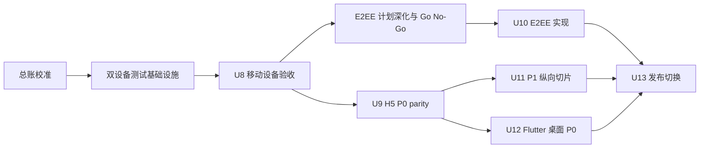

# feat: RedCode IM 2.0 剩余工作执行计划

## Goal Capsule

- **目标：** 从已完成的 Flutter 2.0 P0 页面和双 iOS 私聊联调基线出发，依次关闭 U8 设备验收、U9 H5 parity、U10 E2EE 发布门禁、U11 P1 产品切片、U12 Flutter 桌面体验和 U13 多平台发布。
- **当前起点：** Flutter 静态检查、324 项单测、iOS integration/auth/API contract、Patrol 登录和双 iOS 私聊实时互发均已通过；U8 尚缺系统级和复杂业务场景。
- **执行顺序：** `R0 总账校准 -> R1.0 双设备测试基础设施 -> R1 U8 -> R2 U9`；U10 在 R1 后先完成专项计划深化和 Go/No-Go，再与 U9 并行实现；U11 每项独立计划，U12 只复用稳定业务控制器，U13 等全部发布门禁关闭后执行。
- **发布约束：** U8 未关闭不得宣告 Flutter 移动 P0 完成；U9、U10、U12 未关闭不得切换 2.0 正式发布。朋友圈、扫一扫、附近的人、音视频通话和游戏默认不阻断 2.0 核心首发；只有被单独批准纳入首发范围的 P1 切片才成为 U13 门禁，未交付入口必须保持不可见或明确不可用。
- **证据优先级：** 设备运行时与 API/WebSocket 日志 > 自动化测试 > 当前源码 > 设计源与计划文档。

## Problem Frame

上位计划 `docs/plans/2026-08-02-001-feat-im-2-0-formal-development-plan.md` 已定义 U1-U13。当前 U1-U7 的主要实现已落地，U8 也已证明两台 iOS Simulator 可以同时运行真实账号并完成双向私聊，但现有剩余任务总账早于 2.0 开发，且 U8-U13 的执行粒度不足以直接逐项验收。

本计划不重新定义 2.0 产品范围，而是把剩余阶段拆成可独立提交、可验证、可停止的工作单元，并将 Simulator 可证明能力与必须真机/CI 补验的能力分开。

## Scope

### 包含

- Flutter `app/` 的 U8 设备验收收口。
- `h5-app/` 对 Flutter P0 的页面、状态和 API parity。
- E2EE 专项计划的执行与发布门禁对接。
- 朋友圈、扫一扫、附近的人、游戏、音视频通话等 P1 纵向切片的计划顺序。
- Flutter Windows、macOS、Linux 桌面 shell 和平台能力。
- 2.0 多平台构建、版本、升级、回滚和旧模块处置。
- 任务总账、测试索引、平台交接和验收记录同步。

### 不包含

- 不重新设计已冻结的 `im-ui-html/` 页面。
- 不恢复 SMS 登录、短信重置密码、Google/Apple 登录。
- 不继续把 `ios-app/`、`android-app/`、`desktop/` 建设为并行正式主线。
- 不在本计划中直接发明 E2EE、音视频媒体或游戏协议；对应单元必须先有专项合同。
- 不用 iOS Simulator 结果替代 APNs、真实相机/麦克风、后台通知和签名发布的真机证据。

## Current Evidence

已通过事实以 `docs/reviews/2026-08-02-im-2-0-u8-device-acceptance-review.md` 为准：

- `make app.check`、`make app.test`、`make app.test.scripts` 通过。
- iPhone 17 Pro Simulator 上 integration smoke、真实认证、API contract、Patrol harness 和登录 P0 通过。
- iPhone 17 Pro 与 iPhone 17 Pro Max 上双账号真实 UI 登录、好友私聊 A -> B / B -> A 实时互发通过。
- API 日志证明两个账号完成 protobuf WebSocket 认证并订阅同一房间，两次消息发送均广播给 1 个在线订阅者。
- Xcode 26.6 capability probe 管道死锁已有仓库级窄范围 wrapper，当前不再阻塞 U8。

## Key Decisions

1. **先关闭 U8，再扩 H5。** H5 parity 以已验收的 Flutter 行为为基线，避免复制尚未稳定的设备状态。
2. **自动化与人工验收分账。** Patrol/integration 负责可重复业务流；系统键盘、安全区、权限系统页和真实后台行为采用设备验收清单，不伪造自动化覆盖。
3. **双设备测试先解决构建隔离。** 两个 Patrol 进程除独立 server 端口和唯一 marker 外，还必须使用不会复用 `--dart-define` 的隔离构建产物；A/B 角色必须在运行前后均可验证。
4. **E2EE 先深化再实现，并独立阻断发布。** 现有专项文档尚未冻结协议库、key API、数据模型、最低客户端版本和灰度策略；Go/No-Go 通过前不进入正式消息链路。UI 和普通消息工作可以继续，但 E2EE 全部门禁未关闭前不得发布 2.0。
5. **P1 每项独立纵向交付。** API、权限、生命周期、客户端和运营边界必须在同一子计划中闭环，不建立一个长期半成品大分支。
6. **桌面复用业务层，不拉伸移动壳。** Windows/macOS/Linux 使用桌面导航、分栏、键盘和窗口语义。
7. **发布门禁按批准的首发范围判定。** P1 默认属于可选增强，不阻断核心首发；一旦批准纳入首发，必须记录在任务总账并完成对应子计划。移动 P0、H5 P0、E2EE、桌面构建和升级回滚不可用口头豁免替代。

## Sequencing

## Implementation Units

### R0. 校准 2.0 剩余任务总账

- **Goal:** 让仓库唯一剩余任务入口反映 2.0 当前事实，移除“Flutter 首版尚未实现”等过时表述。
- **Files:** `docs/reports/task-list.md`、`docs/index.md`、`im-ui-html/docs/platform-handoff.md`。
- **Approach:** 以本计划 U8-U13 为主队列；原生客户端任务移动到“暂停/恢复条件”，不删除历史证据。
- **Test Scenarios:** 文档链接存在；当前阶段、下一阶段、延期项和真机项互不矛盾；同一任务没有两个 active 状态。
- **Done:** `docs/reports/task-list.md` 能直接回答“当前做什么、下一步是什么、什么阻断发布”。

### R1.0. 建立可靠的双设备测试基础设施

- **Goal:** 消除 Patrol 进程共享 Flutter/Xcode 增量产物导致 A/B `--dart-define` 角色串用的问题，让双设备结果可重复、可归因。
- **Files:** 新增 `app/scripts/test_patrol_dual_device.sh`、`app/scripts/test_patrol_dual_device_contract_test.sh`；修改 `Makefile`、`app/patrol_test/README.md` 和 `docs/reference/testing/README.md`。
- **Approach:** 由单一脚本生成 marker、校验两个设备、分配独立 Patrol server 端口，并为 A/B 使用隔离的构建目录或预构建产物；B 进入消息等待后再启动 A。脚本必须验证两端实际账号、角色和消息前缀，不能只依赖进程参数。
- **Test Scenarios:** 两台设备缺失；端口占用；A/B 设备相同；角色构建缓存；B 启动失败；A 超时；任一进程失败时清理另一进程；重复执行不读取上一轮 marker 或偏好状态。
- **Verification:** 脚本契约测试加入 `make app.test.scripts`；新增 `make app.test.patrol.dual` 作为唯一推荐入口；连续两次运行生成不同 marker 且两端均通过。
- **Done:** 双设备测试不再依赖手工长命令，不复用角色编译状态，失败时保留双方日志和 xcresult 路径并清理残留进程。

### R1. 关闭 U8 Flutter 移动 P0 设备验收

- **Status:** COMPLETE（2026-08-04）。Simulator 可验证项全部 PASS；相机、真实麦克风采集、APNs/通知投递和系统 Wi-Fi/蜂窝切换作为真机专属项明确 SKIPPED，并保留在设备清单。
- **Goal:** 在 iOS Simulator 上完成所有可验证的移动 P0 系统与业务场景，并单列必须 iPhone 真机补验的能力。
- **Files:** `app/patrol_test/`、`app/integration_test/`、`app/scripts/`、`Makefile`、`docs/reference/testing/README.md`、`docs/reviews/2026-08-02-im-2-0-u8-device-acceptance-review.md`。
- **Existing patterns:** `app/patrol_test/login_smoke_test.dart`、`app/patrol_test/dual_device_chat_test.dart`、`app/scripts/common.sh`。

#### R1.1 系统交互与布局

- 冷启动、真实登录、四 Tab 状态保持、系统返回和多层路由回退。
- 真实系统键盘弹出/收起、输入框遮挡、聊天 composer 和长表单滚动。
- 顶部/底部 SafeArea、横竖屏策略、大字号、长文本和 reduced-motion。
- **Tests:** 扩展 `app/patrol_test/login_smoke_test.dart`；新增 `app/patrol_test/device_layout_test.dart`；补 `app/test/core/screen_adaptation_test.dart`。键盘流程必须通过原生点击聚焦并确认系统键盘可见，禁止使用不会拉起软键盘的 `PatrolTester.enterText()` 作为证据。
- **Scenarios:** 键盘打开时发送按钮可见；返回先收键盘再退路由；长文案不溢出；底栏不覆盖最后一项。
- **Fallback:** 若当前 Patrol/iOS 组合无法稳定查询或驱动系统键盘，则转为人工设备用例，记录设备、系统、步骤、截图和结果；不得把该项记为自动化 PASS。

#### R1.2 权限与平台能力

- 相册、相机、麦克风、通知的首次拒绝、再次触发、系统设置恢复和永久拒绝提示。
- Simulator 可验证权限状态和降级 UI；真实采集质量、APNs token 与后台通知列入 iPhone 真机清单。
- **Tests:** 新增或扩展 `app/test/platform/permission_service_test.dart`、`app/patrol_test/permission_flow_test.dart`。
- **Scenarios:** 拒绝后页面不死锁；永久拒绝出现设置入口；恢复权限后无需重登；不支持能力显示明确状态。
- **Progress:** 2026-08-04 原生 XCTest 已完成照片和麦克风首次拒绝、设置引导与系统设置恢复。照片恢复后 PHPicker 可打开并取消；麦克风开关从 `0` 恢复为 `1` 后无需重登即可重新进入聊天录音面板。真实麦克风采集与音质仍按 Simulator 能力边界转 iPhone 真机。

#### R1.3 聊天、群与状态恢复

- 双设备私聊已通过，继续补群聊互发、已读同步、前后台恢复和 WebSocket 重连。
- 覆盖文本、图片、文件、语音附件的成功、取消、失败、重试和离线待发送。图片附件真实签名、直传、commit、广播和对端下载已于 2026-08-03 通过双 iOS Patrol（marker `1785773518-91298-11190`）；文件与语音附件完整链路及接收端语音播放器启动已于 2026-08-04 通过（marker `1785778188-93063-1916`）。2026-08-04 原生 XCTest 已证明照片首次拒绝、设置恢复、返回原聊天页打开并取消 PHPicker，也已从真实“文件”入口打开并取消系统文件选择器。真实麦克风采集与音质按 Simulator 能力边界转 iPhone 真机。
- 覆盖联系人申请/备注/删除、建群、成员角色、群治理和设置完整可视化巡检。
- **Tests:** 扩展 `app/patrol_test/dual_device_chat_test.dart`；新增 `app/patrol_test/group_chat_test.dart`、`app/patrol_test/group_mute_test.dart`、`app/patrol_test/group_member_removal_test.dart`、`app/patrol_test/image_attachment_test.dart`、`app/patrol_test/rich_attachment_test.dart`、`app/patrol_test/offline_recovery_test.dart`；扩展 `app/integration_test/api_contract_flow_test.dart`；统一通过 R1.0 编排入口运行双设备用例。
- **Scenarios:** A/B 已读状态一致；离线消息不重复；重连后顺序稳定；群成员权限变化后 UI 刷新；附件失败保留可重试状态。
- **Progress:** 2026-08-04 已通过双 iOS API/WebSocket 网络路径真实中断与恢复，marker `1785775688-87809-18168`；A 自动重新认证、恢复订阅并补拉 B 在隔离窗口发送的唯一消息。系统 Wi-Fi/蜂窝切换仍保留真机人工验收。
- **Progress:** 2026-08-04 已通过 iPhone 17 Pro Simulator 真实账号 P0 页面巡检，覆盖联系人、群通知、个人资料、账号安全、聊天设置、隐私、关于和反馈等页面的打开、返回及反馈长页滚动。系统键盘、安全区、大字号、Reduced Motion 和各类数据状态由后续专项用例分别验收。
- **Progress:** 2026-08-04 已通过 iOS Simulator/Android Emulator 跨端私聊实时互发与双向已读（marker `1785778695-15873-13110`），以及 Android 后台恢复、iOS 离线发送和 Android 补拉（marker `1785779441-49039-18587`）。编排器显式记录平台并分别注入 `127.0.0.1` / `10.0.2.2`。
- **Progress:** 2026-08-04 已完成 Simulator 最高系统字号与 Reduced Motion 组合验收。期间发现并修复登录页 182px 横向 overflow；修复后两轮 41 检查点 P0 导航分别通过（`ios_results_1785780497220.xcresult`、`ios_results_1785780881788.xcresult`）。真实横竖屏切换、布局边界和草稿恢复也已通过，证据为 `ios_results_1785783462845.xcresult`。
- **Progress:** 2026-08-04 已通过真实 iPhone 17 Pro Simulator 上下安全区几何门禁，覆盖登录、四 Tab、聊天和设置长页，`xcresult` 为 `ios_results_1785781793361.xcresult`。
- **Progress:** 2026-08-04 新增独立原生 XCTest 设备验收，使用普通 App 的 accessibility tree 真实拉起 iOS 系统软键盘，输入三行文本并比较 composer、发送按钮与键盘实际 frame；同时证明第一次返回只收键盘、第二次退出聊天。正式入口为 `make app.test.ios-device-acceptance`，通过证据为 `ios-device-acceptance-1785786732.xcresult`。
- **Progress:** 2026-08-04 修复 UIScene 模式下 `file_selector_ios` 无法从 `AppDelegate.window` 找到 presenter 的问题，并新增 `make app.test.ios-file-picker-acceptance`。原生 XCTest 已从聊天“文件”入口打开系统“最近项目”选择器、点击 `Cancel`，并验证返回聊天后无失败提示；真实 PDF 上传闭环继续由双设备 Patrol 证明。
- **Progress:** 2026-08-04 `make app.test.ios-device-acceptance` 在卸载 App 后完成进程级冷启动、首次通知拒绝、真实账号登录，并从联系人资料及“我的 -> 设置 -> 关于 RedCode IM”执行三次 iOS 左缘侧滑回退；证据为 `ios-device-acceptance-1785793701.xcresult`。至此 U8 的 Simulator 待验项清零。

#### R1.4 U8 收口门禁

- **Verification:** `make app.check`、`make app.test`、`make app.test.scripts`、iOS integration auth/contract、Patrol P0 与双设备流程全部通过。
- **Done:** U8 审查记录逐项标记 PASS/SKIPPED；SKIPPED 仅限 Simulator 无法证明且已进入真机清单的能力；不存在未解释失败。

### R2. 完成 U9 H5 P0 parity

- **Goal:** 让 H5 与已验收 Flutter P0 在路由、状态、API 和跨端消息行为上等价。
- **Files:** `h5-app/src/router/index.ts`、`h5-app/src/views/`、`h5-app/src/stores/`、`h5-app/src/services/`、`h5-app/src/styles/`、`h5-app/test/`、`h5-app/test/e2e/`。
- **Approach:** 先审计现有 H5 路由、store、service、存储和测试，形成“已有/缺失/行为漂移/平台不适用”矩阵，只实现差异。随后按 R2.1-R2.4 独立闭环推进，保留 Web 存储与权限降级，不复制 Flutter Widget。
- **R2.1 聊天差异:** 会话、聊天、搜索、附件、消息操作和 WebSocket 状态。
- **R2.2 联系人/群差异:** 联系人、好友申请、群目录、成员角色和群治理。
- **R2.3 我的/设置差异:** 资料、账号安全、聊天设置、协议、反馈、关于和版本状态。
- **R2.4 跨端互操作:** Flutter/H5 消息、已读、联系人和群状态同步，以及刷新、多标签页和存储降级。
- **Tests:** 对应 store/service Vitest；路由和状态组件测试；`h5-app/test/e2e/` 真实 API 流程；Flutter/H5 双账号互发测试。
- **Scenarios:** 登录和刷新深链；聊天与搜索定位；好友申请和群治理；资料与设置；OPFS 不可用时降级；多标签页会话；Flutter/H5 消息和已读同步。
- **Verification:** `make h5-app.check`、`make h5-app.test.unit`、`make h5-app.test.live`、`make h5-app.test.e2e`。
- **Done:** P0 能力矩阵不存在“Flutter 有而 H5 无”的未解释项，平台不适用项有明确降级语义。

### R3. 关闭 U10 E2EE 发布门禁

- **Goal:** 先把现有 E2EE 文档深化为可执行专项计划并完成 Go/No-Go，再实现后台开关、服务端强制和客户端密钥生命周期，禁止失败后静默降级明文。
- **Source plan:** `docs/plans/2026-07-31-003-feat-api-ui-capability-parity-plan.md`。
- **Planning gate:** 在正式实现前更新专项计划，明确协议库及许可证、key API、数据库模型、设备身份与撤销、最低客户端版本、灰度/回滚、Push/搜索/举报降级和跨端互操作方案；未形成 Go 结论时停止 R3 实现。
- **Files:** 深化后的专项计划为唯一实现依据，主要涉及 `api/src/`、`admin/src/`、`app/lib/`、`h5-app/src/` 和安全文档。
- **Tests:** API 模式裁决、密钥和设备测试；Flutter/H5 单聊与群聊互操作；数据库、Push 和日志明文泄漏检查；安全审查。
- **Scenarios:** plaintext/e2ee 切换；历史明文共存；新设备加入/撤销；群成员变化与密钥轮换；密钥缺失时硬失败；跨端互发。
- **Done:** 专项计划 DoD 全部满足，后台开关、服务端强制、密钥生命周期、多设备、群聊和跨端互操作均有测试证据；未满足时 U13 保持阻塞。

### R4. 执行 U11 P1 纵向能力切片

- **Goal:** 将设计源已有但合同不完整的能力逐项变为正式产品能力。
- **Order:** 朋友圈 -> 扫一扫 -> 附近的人 -> 音视频通话 -> 游戏。音视频可因产品优先级提前，但必须先完成 RTC 技术与成本决策。
- **Release policy:** 上述切片默认不属于 2.0 核心首发门禁。只有任务总账明确标记为“2.0 首发必需”的切片才进入 R6 依赖；该决策必须在对应子计划开始前完成。
- **Plan rule:** 每项在 `docs/plans/` 建立独立 implementation-ready 子计划，并独立通过 API contract review、客户端测试和设备验收。
- **Files:** 按子计划涉及 `api/src/`、`app/lib/features/`、`h5-app/src/`、`admin/src/` 和 `im-ui-html/docs/platform-handoff.md`。
- **Scenarios:** 朋友圈 0-9 图、权限、点赞评论；扫码权限和结果路由；位置拒绝与隐私；通话呼叫/接听/拒绝/超时/重连/权限/后台；游戏可用、维护和会话恢复。
- **Done:** 每个已启用入口都有真实后端或明确本地能力，未交付入口保持不可见或明确不可用，不保留伪 CTA。

### R5. 完成 U12 Flutter 桌面体验

- **Goal:** 在同一 `app/` 工程交付 Windows、macOS、Linux 桌面 shell。
- **Files:** `app/lib/shell/desktop/`、`app/lib/platform/`、`app/windows/`、`app/macos/`、`app/linux/`、`app/test/shell/`。
- **Dependencies:** R2 完成后可启动桌面 P0，只复用 U1-U9 已稳定的业务控制器；各 P1 桌面入口随对应 R4 子计划补齐，不要求桌面 P0 等待全部 P1。
- **Approach:** 复用稳定 service/controller；实现导航列、会话列、聊天主区、上下文侧栏、窗口状态、快捷键、拖放和桌面通知 adapter。
- **Tests:** `app/test/shell/desktop_app_shell_test.dart`、平台 adapter 单测、宽/中/窄窗口 widget 测试、三平台 debug/release build smoke。
- **Scenarios:** 窗口缩放；键盘导航和搜索快捷键；拖放附件；通知跳转；窗口恢复；与移动/H5 互发；平台能力不可用。
- **Done:** 三平台均有可启动构建证据，桌面端不存在移动底栏拉伸或页面级散落平台判断。

### R6. 执行 U13 多平台发布切换

- **Goal:** 建立可重复的 2.0 构建、版本、签名、下载、升级和回滚链路。
- **Files:** `.github/workflows/release-artifacts.yml`、`app/scripts/`、`Makefile`、`docs/reference/operations/`、`website/` 下载映射和发布文档。
- **Dependencies:** R2、R3、R5 必须关闭；只有任务总账明确批准为首发必需的 R4 切片需要关闭，其余保持未启用或明确不可用。
- **Security boundary:** 平台签名证书、notarization 凭据和 CI secrets 只存于受控 secret store；定义最小权限、环境隔离、轮换、撤销和泄漏响应。依赖与构建工具版本必须锁定，发布产物生成 checksum，并在 CI 中保留可追溯的源码提交、workflow run 和构建环境信息。
- **Tests:** 手工 workflow dispatch；`v2.0.0` tag；Android APK/AAB；iOS unsigned/signed；Windows/macOS/Linux 产物；checksum 与来源追踪；无 secrets 日志泄漏；凭据缺失/撤销时发布失败；失败平台阻断；1.x 升级、缓存迁移和回滚。
- **Done:** CI 全矩阵通过，发布产物和校验完整，测试环境升级/回滚成功；旧客户端保留/归档由独立清理计划执行。

## Verification Matrix

| Gate | Applies to | Done signal |
| --- | --- | --- |
| `git diff --check`、`git diff --cached --check` | 全部 | 无空白错误，仅提交当前闭环 |
| `make app.check`、`make app.test`、`make app.test.scripts` | R1、R3-R6 | Flutter 静态、单测和脚本契约通过 |
| 双设备编排脚本与契约测试 | R1.0、R1、R3、R4 | A/B 构建隔离、角色确定、失败清理和重复执行通过 |
| iOS integration auth/contract 与 Patrol | R1、R3-R4 | 真实 API、系统交互和双设备流程通过 |
| `make api.test` | R3-R4 | Rust 单元与集成测试通过 |
| H5 check/unit/live/E2E | R2-R4 | Web 静态、存储、真实 API 和跨端流程通过 |
| Windows/macOS/Linux build smoke | R5-R6 | 三平台产物可启动 |
| 发布供应链与凭据 | R6 | secrets 不落日志，签名凭据可轮换/撤销，checksum 和构建来源可追溯 |
| `make test.all`、适用时 `make test.live` | 里程碑尾部 | 自包含和真实后端回归通过 |
| 质量与安全审查 | 按改动触发 | 无未处理阻断级发现 |

## Risks and Stop Conditions

- **Patrol 双设备共享构建状态：** R1.0 是 R1 的前置门禁；构建隔离、角色验证和失败清理未通过前，不继续扩展双设备场景。
- **Simulator 能力边界：** 相机/麦克风质量、APNs 和后台通知必须真机补验；不得将 mock 权限状态写成 PASS。
- **H5 状态漂移：** 以 API/WS 行为为事实源，Web 存储只保证可观察语义一致。
- **E2EE 范围膨胀：** 一旦涉及协议或密钥模型变更，返回专项计划，不在 UI 单元临时实现。
- **P1 后端缺失：** API、权限、生命周期或运营边界未冻结时停止客户端正式接入。
- **平台插件不支持：** 先建立 capability adapter 和降级策略；不能在页面内堆叠平台分支。
- **发布矩阵不完整：** 任一必需平台失败时停止发布，不发布部分平台的同版本正式包。

## Definition of Done

- U8 的 Simulator 可验证项全部通过，真机专属项有明确清单、设备、环境和结果。
- H5 P0 与 Flutter P0 的页面、API、状态和跨端互操作矩阵闭合。
- E2EE 专项计划已完整交付，后台开关、服务端约束、密钥、多设备、群聊和跨端互操作门禁全部关闭。
- 每个已启用 P1 入口形成 API/客户端/验收闭环，未完成能力无伪可用入口。
- Flutter 桌面端在 Windows、macOS、Linux 有独立桌面体验和可启动构建。
- 2.0 构建、签名边界、版本、下载、升级和回滚可重复，失败平台会阻断发布。
- `docs/reports/task-list.md`、测试索引、平台交接和验收记录与运行时事实一致。
- 每个独立闭环完成测试、审查、提交和推送，最终工作区干净。
