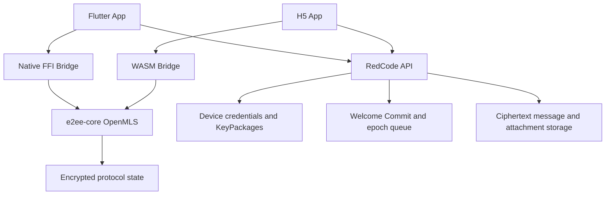

# U10 E2EE 发布门禁实施计划

## Goal Capsule

- **目标：** 在不自制密码协议、不静默降级明文的前提下，交付 Flutter/H5 的单聊、多设备和群聊 E2EE，并让后台开关、服务端约束、设备撤销和发布回滚形成可验证闭环。
- **当前裁决：** OpenMLS 0.8.1 协议候选已通过 U1，可进入 U2 契约设计；生产发布仍为 **No-Go**。U2-U9 未全部关闭前，禁止把 `content_audit_mode` 切到 `e2ee`，禁止接入正式消息发送链。
- **权威顺序：** 运行时与跨端测试 > 当前 API 契约 > 本计划 > `docs/reference/architecture/end-to-end-encryption-design.md`。旧架构文档中的手写 X3DH、Double Ratchet 和 Sender Keys 伪代码不再作为实现依据。
- **首发范围：** API、Flutter `app/`、H5 `h5-app/` 与 Admin。`ios-app/` 和桌面端在共享核心稳定后接入，但不得阻塞 U1 PoC；未支持的客户端版本在 E2EE 模式下必须被服务端拒绝发送。
- **停止条件：** 协议库许可证不兼容、iOS/Android/WASM 任一目标无法稳定构建、跨端状态序列化不兼容、成员移除后仍能读取新消息、或服务端/日志/Push 出现明文时立即维持 No-Go。

---

## Product Contract

### Summary

RedCode IM 已有明文/密文发送端点互斥、密文存储与透传、设备预密钥 API 和 Admin 运行模式配置，但尚无经过验证的客户端协议实现、设备信任、会话恢复和群成员变更语义。
本计划先用共享 Rust 核心验证标准协议，再按 API、客户端和发布门禁逐层接入。

### Problem Frame

现有 `/rooms/{room_id}/messages/encrypted` 只验证调用方提交了 Base64 密文。
现有 `e2ee_identity_keys`、`e2ee_signed_pre_keys` 和 `e2ee_one_time_pre_keys` 按 X3DH 假设设计，但服务端没有验证签名，客户端也没有生成或消费这些材料。
旧设计将 `@signalapp/libsignal-client` 当作浏览器库，并建议手写 Ratchet；上游实际说明 TypeScript 产品是 Node add-on、仓库外使用不受支持，许可证为 AGPL-3.0。

### Requirements

**协议与密钥**

- R1. 密码协议必须来自经过公开审查的标准实现，不允许自行实现 X3DH、Double Ratchet、Sender Keys、MLS 密钥日程或密码原语。
- R2. 每台设备必须有独立身份、凭据和协议状态；私钥不得上传服务端，不得写入普通日志或未加密业务缓存。
- R3. 单聊按两人多设备群处理，群聊按房间成员设备集合处理；协议状态必须支持乱序、重复、离线恢复和进程重启。
- R4. 新设备加入、设备撤销、群成员加入/退出和管理员移除成员必须推进 epoch；被撤销设备或被移除成员不得解密后续消息。
- R5. 身份变化、密钥缺失、状态损坏和版本不支持必须显示可恢复错误，不得自动改发明文。

**服务端与运行模式**

- R6. `plaintext` 模式只接受普通消息端点，`e2ee` 模式只接受加密消息端点；服务端保持最终裁决权。
- R7. `persist + e2ee` 只保存密文和非敏感路由元数据；`relay_only + e2ee` 不保存消息历史或离线 Push 内容。
- R8. E2EE 启用前必须通过最低客户端版本、协议版本和房间设备覆盖预检；Admin 不得用一个立即生效的开关绕过预检。
- R9. 服务端必须提供设备注册、设备撤销、KeyPackage 发布/领取、房间 epoch 控制消息和幂等消费语义。
- R10. 服务端不得伪造客户端身份、解密消息或替客户端生成群密钥；房间成员权限仍由现有 API 事实源裁决。

**产品降级与审计**

- R11. 历史明文与新密文必须共存，消息渲染按消息 envelope 版本判断，不按当前全局模式猜测。
- R12. E2EE 模式下，服务端搜索、内容审核、Push 正文预览、举报正文取证和服务端引用摘要必须禁用或改为端侧显式提交。
- R13. 附件必须使用每个附件独立随机内容密钥加密后上传；对象存储只接收密文，密钥放入消息密文 envelope。
- R14. 日志、数据库、Redis、WebSocket、Push job 和对象存储抽检均不得出现测试明文标记或私钥材料。
- R15. H5 的安全声明必须明确排除已攻陷 Origin、恶意扩展和运行时 XSS；协议状态持久化必须使用 WebCrypto 非导出包装密钥加密，不能把原始私钥写入 localStorage。
- R16. 每个账号必须有可验证的根身份。首台设备建立根身份，新增设备由现有可信设备或独立恢复凭据批准；联系人首次身份采用 TOFU，后续变化必须阻断发送并提供安全码/二维码核验。
- R17. 加密消息端点不得接收或持久化真实 `content_summary`。会话列表、Push 和旧客户端占位只能使用固定的“加密消息”类型标识。

### Key Flows

- F1. **设备初始化：** 客户端生成设备凭据和 KeyPackage，安全保存私有状态，上传公开材料，服务端返回稳定设备标识与协议版本。
- F2. **首次发送：** 发送端领取所有目标设备的 KeyPackage，创建或更新 MLS group，提交 Welcome/Commit 控制消息，再发送 application ciphertext。
- F3. **离线恢复：** 接收端按服务端顺序消费 Welcome、Commit 和 application message；重复事件幂等，epoch 缺口触发控制消息补拉，不回退明文。
- F4. **成员变化：** 现有房间成员变更成功后产生待处理加密成员变更；合法成员设备提交 Commit，服务端绑定房间 membership revision，旧 epoch 不可用于发送新消息。
- F5. **设备撤销：** 用户撤销设备后，服务端停止向该设备分发新控制消息，并要求相关房间推进 epoch；撤销设备只能读取撤销前已持有的历史密钥。
- F6. **模式启用：** Admin 先进入准备状态，查看客户端和 KeyPackage 覆盖率；预检通过后启用 E2EE，失败时保持 plaintext，不产生混合发送窗口。
- F7. **身份验证：** 首次联系记录账号根身份指纹；指纹变化时停止加密发送，用户必须核验安全码或明确接受新身份，且接受动作进入本地安全审计记录。

### Scope Boundaries

- 本轮不承诺对已发送历史明文做原地加密迁移。
- 本轮不实现服务端可搜索密文、同态加密或服务端内容审核。
- 本轮不把 `ios-app/`、desktop 或 Admin 变成消息发送客户端；它们只需正确处理不支持版本和管理状态。
- 本轮不提供密钥托管式“忘记密码恢复”。密钥备份、跨设备验证和恢复短语必须在 U1 后另行选择标准方案。

---

## Planning Contract

### Key Technical Decisions

- KTD1. **首选 OpenMLS 0.8.1。** OpenMLS 实现 RFC 9420，许可证为 MIT，上游 CI 构建 `aarch64-apple-ios`、`aarch64-linux-android` 和 `wasm32-unknown-unknown`。版本必须精确锁定，不跟随 `main` 或 RC。
- KTD2. **单一 Rust 协议核心。** 在 `e2ee-core/` 建立纯协议 crate，输出稳定的 versioned byte envelope。Flutter 通过 `flutter_rust_bridge`/FFI，H5 通过 `wasm-bindgen` 调用同一核心，避免 Dart 与 TypeScript 各自解释协议状态。
- KTD3. **先 PoC，后接入。** U1 只允许测试向量、内存存储和隔离构建产物。不得修改 `MessageService`、正式数据库 schema 或 Admin 开关行为。
- KTD4. **淘汰现有 X3DH schema 假设。** 现有预密钥表保留到兼容审计完成，但 MLS 使用新的设备凭据、KeyPackage、控制消息和 epoch 模型。不得修改已有 migration；新增 timestamp migration。
- KTD5. **服务端是传输与成员事实源。** 服务端验证设备归属、房间成员资格、协议版本、幂等键和 membership revision，但不持有 MLS 私钥。
- KTD6. **消息 envelope 显式版本化。** `encryption_metadata` 只保存 `protocol`、`version`、`epoch`、`sender_device_id`、`content_type` 和控制消息引用。不得保存明文摘要或由服务端可还原的内容密钥。
- KTD7. **H5 使用受限 Web 威胁模型。** WASM 内存中的明文和协议状态无法抵抗同源 XSS。发布前必须启用严格 CSP、依赖锁定和 WebCrypto wrapping；无法满足时 H5 E2EE 保持 No-Go，而不是降低安全声明。
- KTD8. **启用采用 prepare/active 状态机。** 现有 `plaintext|e2ee` 值扩展为发布状态与内容模式的组合语义。切换失败保持旧模式，客户端在 `40902` 后刷新配置并保留草稿。
- KTD9. **附件先加密后上传。** 客户端生成附件密钥与 nonce，流式加密临时文件或 Blob，再走现有 S3 multipart 链；下载后在端侧校验并解密。
- KTD10. **威胁模型不假装隐藏元数据。** E2EE 保护消息与附件内容，抵抗服务端读取和网络窃听。服务端仍可观察账号、房间、设备、时间、大小和成员关系。TOFU 不能抵抗首次联系时的恶意服务端替换，因此安全码核验是高保证身份认证入口。

### Go/No-Go Matrix

| 候选 | 许可证 | Flutter Native | H5 浏览器 | 群聊/多设备 | 裁决 |
| --- | --- | --- | --- | --- | --- |
| Signal `libsignal` | AGPL-3.0；仓库外使用不受支持 | 无官方 Dart binding，需维护 Java/Swift bridge | TypeScript 包是 Node add-on，不支持浏览器 | Signal 私有组合语义，跨端封装成本高 | No-Go |
| `vodozemac` / Matrix crypto | Apache-2.0 | 需自建 Rust FFI | 可构建 WASM | Olm/Megolm 可用，但完整状态机绑定 Matrix event 语义 | 备选，不进入首轮 PoC |
| OpenMLS 0.8.1 | MIT | iOS/Android 可构建，需共享 FFI | WASM 可构建，需 JS bridge | RFC 9420 原生覆盖 group epoch 与多设备 leaf | Go for isolated PoC |
| 自制 X3DH/Ratchet/Sender Keys | 自有 | 可编写 | 可编写 | 容易遗漏协议安全性质 | 禁止 |

生产 Go 必须同时满足：固定版本与 SBOM；四目标构建；同一测试向量跨 Native/WASM 互解；状态重启恢复；重复/乱序；三成员群聊；移除成员后的前向保密；无敏感日志；独立安全审查无阻断项。

### Architecture

### Sequencing

1. U1 必须先通过；失败则维持生产 No-Go，并回到候选库评估。
2. U2 固化协议 envelope 和 API 契约，再执行 U3 数据模型；两者通过前不得改客户端正式发送链。
3. U4 完成 Flutter/H5 安全存储与共享核心绑定，再执行 U5 单聊。
4. U5 通过后执行 U6 多设备与群聊；不得并行调试两套状态机。
5. U7 处理附件和产品降级，U8 才允许启用 Admin prepare/active 发布门禁。
6. U9 完成安全审查、泄漏检查、灰度与回滚后才能关闭 U10。

---

## Implementation Units

### U1. OpenMLS 跨端隔离 PoC

- **Goal:** 证明同一 Rust 核心能在 macOS host、iOS、Android 和 WASM 构建，并通过跨语言状态序列化与安全场景测试。
- **Files:** `e2ee-core/Cargo.toml`、`e2ee-core/src/`、`e2ee-core/tests/`、`e2ee-core/web/`、`e2ee-core/flutter/`、`Makefile`。
- **Patterns:** 使用 versioned binary envelope；测试 fixture 与私钥状态只放测试目录；生产 feature 禁用 `content-debug` 和 `crypto-debug`。
- **Test Scenarios:** Alice/Bob 创建两设备 group 并双向互解；使用 app-owned storage provider 导出状态并在进程重启后继续解密；重复 application message 不重复展示；乱序 Commit 先失败后补齐恢复；三成员群添加与移除；被移除成员无法解密新 epoch；Native 生成状态由 WASM 继续处理，反向亦然。
- **Verification:** `cargo test --manifest-path e2ee-core/Cargo.toml`；四目标 compile check；WASM browser vector test；Flutter FFI smoke。
- **Gate:** 所有场景通过才把 OpenMLS 协议候选改为 Go 并进入 U2；这不等于生产发布 Go。任一平台只能使用不同协议实现即失败。
- **Progress:** 2026-08-04 已完成。OpenMLS 0.8.1 在 host、iOS、Android、WASM 目标构建通过；Native 状态由 Chrome WASM 恢复并推进，推进后的状态再由 Native 恢复并解密后续消息；Flutter 通过 FFI 加载同一核心。双向消息、重启恢复、重复拒绝、乱序 Commit 补齐、三成员增删和移除后新 epoch 拒绝均有自动化测试。证据见 `docs/reviews/2026-08-04-u10-e2ee-u1-openmls-poc.md`。

### U2. 协议 envelope 与 API contract

- **Goal:** 冻结客户端与服务端都能独立验证的协议版本、设备标识、控制消息和 application message 契约。
- **Files:** `docs/reference/api/messages.md`、`docs/reference/architecture/end-to-end-encryption-design.md`、`api/src/models/mod.rs`、`api/src/handlers/e2ee.rs`、`api/src/handlers/message.rs`、`api/tests/`。
- **Patterns:** 延续现有 Axum handler、`AppError::MessageRuntimeConflict` 和 serde model；未知协议版本 fail closed。
- **Test Scenarios:** 有效 envelope 接受；未知版本、空 ciphertext、伪造 sender device、非房间成员、过期 epoch、重复幂等键拒绝；真实 `content_summary` 被拒绝且服务端只生成固定占位；历史明文仍可读取；E2EE 模式普通端点返回 `40902`；plaintext 模式加密端点返回 `40902`。
- **Verification:** `make api.test` 与 API 文档契约审查。

### U3. 设备、KeyPackage 与 epoch 数据模型

- **Goal:** 提供账号根身份、可信设备批准、可撤销设备、一次性领取 KeyPackage、房间 membership revision 和控制消息队列。
- **Files:** `api/sql/migrations/` 新 migration、`api/sql/base.sql`、`api/src/database/`、`api/src/handlers/e2ee.rs`、`api/src/routes.rs`、`api/tests/database_migration_smoke.rs`。
- **Patterns:** 不修改已有 migration；PostgreSQL transaction + `FOR UPDATE SKIP LOCKED`；所有领取和提交操作带幂等键；公开 key 材料设大小上限和速率限制。
- **Test Scenarios:** 首台设备建立根身份；未获批准的新设备不可发布 KeyPackage；现有设备批准与撤销；根身份不可被普通 token 静默覆盖；KeyPackage 并发只消费一次；撤销后不可领取；成员变更 revision 冲突；控制消息分页、幂等和权限；级联删除不误删其他设备。
- **Verification:** `make api.test`、migration smoke、并发合同测试。

### U4. 共享核心绑定与安全存储

- **Goal:** Flutter/H5 使用同一核心，并按平台边界持久化设备身份与 MLS 状态。
- **Files:** `app/pubspec.yaml`、`app/lib/core/e2ee/`、`app/test/core/e2ee/`、`h5-app/package.json`、`h5-app/src/e2ee/`、`h5-app/test/e2ee/`、`e2ee-core/`。
- **Patterns:** Flutter 使用 Keychain/Android Keystore 包装本地状态；H5 使用 WebCrypto non-extractable wrapping key + IndexedDB ciphertext；账号切换和注销调用现有 account cache cleanup 后销毁对应句柄。
- **Test Scenarios:** 首次初始化、重启恢复、错误密码无关的设备状态恢复、换账号隔离、注销清理、损坏状态 fail closed、H5 无 IndexedDB/无 WebCrypto 时明确不可用、私钥不出现在 localStorage/普通 SQLite/日志；TOFU 首次记录、身份变化阻断、安全码一致和明确重新信任。
- **Verification:** `flutter test`、`make h5-app.test.unit`、平台 bridge smoke 和存储抽检。

### U5. Flutter/H5 单聊 E2EE

- **Goal:** 两个用户的所有活跃设备可发送、接收、缓存和恢复文本密文。
- **Files:** `app/lib/core/services/message_service.dart`、`app/lib/core/services/websocket_service.dart`、`app/lib/features/chat/`、`h5-app/src/services/message-service.ts`、`h5-app/src/stores/`、`h5-app/src/views/ChatDetailView.vue` 及对应测试。
- **Patterns:** 加密在 optimistic message 入队前完成；解密失败保留 ciphertext 与可重试状态；模式冲突刷新 runtime 但不自动重发。
- **Test Scenarios:** Flutter -> H5、H5 -> Flutter；双方各两设备；离线补拉；WebSocket 重复；历史明文/新密文混排；身份变化提示；无 KeyPackage、过期 epoch、损坏密文和模式切换；服务端数据库只含测试密文标记。
- **Verification:** Flutter/H5 unit、真实 API live、双客户端 integration 与数据库/Redis/WS 抽检。

### U6. 多设备与群聊 E2EE

- **Goal:** 将现有房间成员与 MLS leaf/epoch 对齐，并关闭成员变化后的访问窗口。
- **Files:** `api/src/handlers/room.rs`、`api/src/handlers/group_management.rs`、`api/src/websocket/`、`app/lib/core/e2ee/`、`h5-app/src/e2ee/` 及跨端测试。
- **Patterns:** 房间 membership revision 与 MLS Commit 绑定；成员 API 成功不代表加密状态已就绪，UI 显示 pending rekey；新 application message 只接受当前 active epoch。
- **Test Scenarios:** 三成员群互发；同用户新增第二设备；普通成员退出、管理员移除、设备撤销；并发成员变化；Commit 丢失后补拉；旧成员持有旧状态仍无法读取新消息；新成员不能读取加入前历史，除非产品明确发送历史密钥。
- **Verification:** 至少三账号四设备自动化；成员变更竞态测试；API/Flutter/H5 跨端验收。

### U7. 附件与受影响功能降级

- **Goal:** 加密附件并让搜索、Push、审核、举报、引用和转发遵循 E2EE 边界。
- **Files:** `app/lib/core/services/message_service.dart`、`h5-app/src/services/message-attachment-upload-service.ts`、`api/src/services/push.rs`、`api/src/handlers/message_search.rs`、`api/src/handlers/report.rs`、相关 UI 与测试。
- **Patterns:** 每附件独立 DEK；AEAD associated data 绑定 room/message/object key；Push 只发 room/message 标识；端侧索引只保存本地解密内容。
- **Test Scenarios:** 图片/文件跨端互解、篡改失败、上传重试不复用 nonce；服务端搜索禁用；Push 无正文；引用/转发重新加密；举报只上传用户明确选择的明文证据；对象存储扫描无 marker。
- **Verification:** 附件 live smoke、Push mock payload、对象存储与数据库泄漏扫描。

### U8. Admin 启用门禁与发布兼容

- **Goal:** 将立即开关改为 prepare -> active 的受控发布流程，并阻止旧客户端进入错误发送状态。
- **Files:** `api/src/services/message_runtime.rs`、`api/src/handlers/settings.rs`、`admin/src/features/settings/pages/general-settings-page.vue`、`admin/src/services/general-settings.ts`、`app/lib/core/services/settings_service.dart`、`h5-app/src/services/settings-service.ts` 及测试。
- **Patterns:** 原子更新 runtime；预检返回最低版本、设备覆盖、KeyPackage 库存和阻断原因；回滚只影响新发送，不尝试解密历史。
- **Test Scenarios:** 覆盖不足无法 active；准备成功后原子切换；旧客户端发送被拒；配置缓存冲突保留草稿；active -> plaintext 回滚；历史密文仍在支持客户端可读；Admin 显示影响范围和不可逆风险。
- **Verification:** `make api.test`、Admin type check/Playwright、Flutter/H5 runtime tests。

### U9. 安全审查、灰度与收口

- **Goal:** 用独立安全审查和可回滚灰度证明 E2EE 可以进入 2.0 发布门禁。
- **Files:** `docs/reviews/`、`docs/solutions/`、`docs/reference/security/`、`docs/reference/testing/README.md`、部署与观测配置。
- **Patterns:** 固定依赖与 SBOM；密钥材料日志 denylist；先测试租户/房间，再小比例用户；回滚不删除密钥或密文。
- **Test Scenarios:** 数据库、Redis、日志、Push、WebSocket、对象存储 marker 扫描；依赖漏洞与许可证检查；旧版本阻断；备份恢复；滚动部署混合 API 版本；灰度回滚后 plaintext 新发与历史密文读取。
- **Verification:** `ce-code-review` 安全/正确性/API/数据完整性专项审查，完整回归与发布 Go/No-Go 记录。

---

## Verification Contract

| 范围 | 命令或证据 | Done signal |
| --- | --- | --- |
| 共享核心 | `cargo test --manifest-path e2ee-core/Cargo.toml` + iOS/Android/WASM compile matrix | 同一 fixture 跨 Native/WASM 互解且恢复一致 |
| API | `make api.test` | 模式、设备、KeyPackage、epoch、权限和 migration 全通过 |
| Flutter | `flutter test` + 双设备 integration | 单聊/群聊/离线/撤销均 fail closed |
| H5 | `make h5-app.check`、`make h5-app.test.unit`、`make h5-app.test.live`、`make h5-app.test.e2e`、`make h5-app.build` | WASM、存储、跨端和构建全通过 |
| Admin | type check、unit、Playwright live backend | prepare/active、阻断原因和回滚可见 |
| 泄漏 | marker 扫描数据库、Redis、日志、Push、WS、S3 | 除端侧解密内存与明确举报证据外零明文 |
| 安全 | 依赖许可证/SBOM、漏洞扫描、独立安全审查 | 无 P0/P1 阻断项，P2 有负责人和期限 |

---

## Definition of Done

- D1. U1 的生产 Go 条件全部有直接测试证据，不以“能够编译”代替协议互操作与成员移除验证。
- D2. 后台不能在客户端覆盖不足时启用 E2EE，服务端对明文/密文端点保持互斥。
- D3. Flutter/H5 在单聊、双方多设备和三成员群聊中互操作，重启、离线、重复和乱序后状态一致。
- D4. 设备撤销和群成员移除后，旧设备或旧成员无法解密后续 epoch 的任何消息或附件。
- D5. 密钥缺失、身份变化、状态损坏、版本冲突均 fail closed，且草稿可恢复，不静默发送明文。
- D6. 数据库、Redis、日志、Push、WebSocket 和对象存储的 marker 扫描无非预期明文或私钥。
- D7. 搜索、审核、举报、引用、转发、Push 和附件均有明确 E2EE 行为与用户可见降级。
- D8. 灰度、最低版本、观测、回滚和历史密文兼容均通过发布演练。
- D9. `docs/reference/architecture/end-to-end-encryption-design.md` 已替换旧伪代码结论，运行手册与故障排查进入 `docs/solutions/`。
- D10. U10 的独立安全审查给出 Go，主计划才可标记 U10 完成。
- D11. 服务端替换账号根身份、未批准设备或 KeyPackage 时，客户端能检测并阻断；身份变化只能由用户核验后解除。

---

## Appendix

### Upstream Evidence

- Signal `libsignal` README：官方产品为 Java、Swift 和 TypeScript wrapper；仓库外使用不受支持；bridge API 可无通知变更。仓库许可证为 AGPL-3.0。核对日期：2026-08-04。
- OpenMLS README：实现 RFC 9420；MIT；0.8.1 发布于 2026-02-13；上游 CI 构建 iOS、Android 和 WASM，但这些目标不属于完整测试平台，因此必须由 U1 自行验证。
- `vodozemac` README：实现 Olm/Megolm；Apache-2.0；有公开安全审计。完整 `matrix-sdk-crypto` 状态机依赖 Matrix sync/to-device 语义，因此只保留为 PoC 失败后的备选。

### Existing Evidence

- `api/src/services/message_runtime.rs` 已实现 `plaintext|e2ee` 发送端点互斥。
- `api/src/handlers/message.rs` 已支持密文 Base64 校验、persist/relay_only 与 WebSocket 透传。
- `api/src/handlers/e2ee.rs` 与 `api/src/database/e2ee_key_store.rs` 已有按设备预密钥存取，但仍属于 X3DH schema，不能直接证明 MLS 适配。
- `app/pubspec.yaml` 只有通用 `crypto`，不存在标准 E2EE 协议依赖；H5 和 iOS 也没有协议核心依赖。
