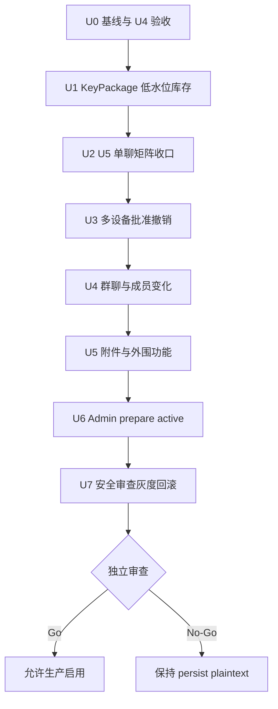

# feat: U10 E2EE 剩余工作执行计划

## Goal Capsule

- **目标：** 从已通过的 Flutter/H5 单房间双向 E2EE 基线（历史基线）出发，客户端主线切换为
  原生双端后，关闭 U4 验收、U5 剩余场景、U6 多设备与群聊、U7 附件与功能降级、U8 Admin
  发布门禁和 U9 安全收口，最终形成可审计的生产 Go/No-Go 结论。
- **当前起点：** U1-U3 已完成；U4 主要实现已落地但缺独立验收记录；U5 已通过
  Flutter/H5 双向真实 API 联调（历史基线，Flutter 客户端已废弃）、WebSocket/历史解密和
  服务端原始历史密文检查，但多会话 KeyPackage 补充、双方各两设备、离线/重复/损坏/切换
  矩阵仍未关闭。
- **权威顺序：** 运行时与跨端验收 > API/数据库/WS 捕获 > 自动化测试 > 本计划 > `docs/plans/2026-08-04-001-feat-u10-e2ee-release-gate-plan.md` > 旧架构说明。
- **执行顺序：** `U0 基线冻结 -> U1 KeyPackage 补充 -> U2 U5 单聊收口 -> U3 多设备 -> U4 群聊 -> U5 附件与降级 -> U6 Admin 门禁 -> U7 安全与发布收口`。
- **停止条件：** 任一客户端出现明文回退、身份变化被静默接受、撤销设备/移除成员仍可解密新 epoch、服务端/日志/Push/S3 出现非预期明文、KeyPackage 并发重复消费，或 Admin 能绕过覆盖率门禁启用 E2EE 时立即维持 No-Go。
- **发布约束：** U0-U7、完整回归和独立安全审查全部通过前，开发 runtime 测试后必须恢复 `persist/plaintext`，Admin 不得在生产启用 E2EE，不得宣称 U10 完成。

---

## Product Contract

### Summary

上游计划已经冻结协议候选、服务端 envelope、设备/epoch 数据模型和客户端安全存储方向。本计划只组织尚未完成的实现与验收，不重新选择协议，不修改已经完成的 U1-U3，也不把当前单房间跨端通过扩大解释为生产可用。

本计划为 U10 唯一活跃执行计划：承接
`docs/plans/2026-08-04-001-feat-u10-e2ee-release-gate-plan.md` 的完整契约
（R1-R17、F1-F5）、Go/No-Go 矩阵与 U1-U3 完成基线；上游计划已标记 superseded
并保留为历史。同时收口 `docs/plans/2026-04-09-admin-rbac-architecture-refactor-plan.md`
Unit 10（message runtime 全链路降级），见 U6/U7。

### Problem Frame

当前 Flutter/H5 可以在两个干净首设备账号之间完成双向密文互解（历史基线；Flutter `app/`
已于 2026-08-04 废弃，正式客户端主线切换为原生双端），但真实联调证明每台设备首次只发布
一个 KeyPackage；该 KeyPackage 被房间 bootstrap 消费后，不会自动补充，第二个新会话会
失败。与此同时，双方各两设备、设备批准/撤销、群成员变化、附件、Push/搜索/举报边界以及
Admin prepare/active 尚未形成完整闭环。原生双端的 E2EE 接入按
`docs/plans/2026-08-04-005-feat-native-client-rebuild-plan.md` 尾部归属由后续专项落地，
本计划保留协议、验收门禁与 Go/No-Go 结论约束。

剩余工作必须按协议依赖推进：先保证一次性 KeyPackage 有可恢复库存，再关闭单聊状态机，之后才能扩展多设备和群聊；附件与外围功能只能建立在稳定 epoch 行为之上；Admin 开关和发布灰度最后接入，不能反向驱动客户端降级。

### Requirements

**基线与单聊**

- R1. U4 的原生双端/H5 安全存储、账号隔离、注销销毁、损坏状态 fail closed、身份 TOFU/变化阻断和跨端安全码必须有独立验收记录（历史 Flutter 证据仅作基线参考）。
- R2. 每个活跃可信设备必须维持可配置的 KeyPackage 低水位库存；领取后自动补充，补充失败可重试且不阻塞已建立房间，未批准或已撤销设备不得发布。
- R3. 原生双端/H5 单聊必须覆盖第二个新会话、重启恢复、离线补拉、WebSocket 重复、历史明文/新密文混排、身份变化、无 KeyPackage、过期 epoch、损坏密文和 runtime 切换，所有失败均不得明文回退。
- R4. live 测试必须按消息 ID 关联发送响应、WebSocket 和历史记录，并对数据库、Redis、日志及 Push queue 执行明文 marker 抽检。

**多设备与群聊**

- R5. 同一账号新增第二设备必须经过现有可信设备明确批准；批准前不可发布 KeyPackage、加入 MLS group 或解密新消息。
- R6. 账号的所有已批准活跃设备都能参与单聊；撤销任一设备后必须推进相关房间 epoch，被撤销设备不能解密后续消息。
- R7. 三成员群聊必须把房间 membership revision 与 MLS Commit 原子关联；邀请、退出、管理员移除和并发成员变化期间禁止旧 epoch application message。
- R8. 新成员默认不能解密加入前历史，被移除成员不能解密移除后的消息或附件；Commit 丢失、重复或乱序时允许补拉恢复但不得跳过验证。

**附件与外围功能**

- R9. 图片、音频、视频和文件使用独立随机 DEK 与 AEAD；associated data 绑定 room、message、part 和 object key，重试不得复用 nonce。
- R10. E2EE 模式下 Push 不含正文，服务端全文搜索和内容审核明确禁用；引用、转发、举报和本地搜索必须有端侧行为或明确不可用状态。
- R11. 对象存储、数据库、Redis、日志、WebSocket 和 Push payload 不得出现附件明文、DEK、协议状态、RCST、私钥或正文 marker。

**启用与发布**

- R12. Admin E2EE 启用流程必须为 `plaintext -> prepare -> active`，prepare 返回最低客户端版本、活跃设备覆盖、KeyPackage 库存和阻断原因；任一条件不满足不得 active。
- R13. active 与回滚必须原子化；切回 plaintext 只影响新发送，支持 E2EE 的客户端仍能读取历史密文，旧客户端发送必须被服务端拒绝。
- R14. 最终发布必须有 SBOM、许可证/漏洞检查、marker 全链扫描、备份恢复、混合版本滚动部署、灰度和回滚演练，以及独立安全审查的明确 Go。
- R15. live 用例产生的随机账号、好友关系和密文数据必须有隔离或可重复清理机制，不能长期污染共享开发环境。

### Key Flows

- F1. KeyPackage 补充
  - **Trigger:** 设备首次注册、客户端进入前台、周期库存检查或库存低于阈值。
  - **Actors:** 原生双端/H5 设备生命周期、E2EE API、PostgreSQL。
  - **Steps:** 查询设备库存；可信设备批量生成并发布；服务端原子领取一次；客户端确认剩余库存并异步补充。
  - **Outcome:** 第二个及后续新会话可建立，重复/并发补充不产生重复可消费记录。
  - **Covered by:** R2、R3、R15。
- F2. 第二设备批准与撤销
  - **Trigger:** 新设备注册或用户撤销已有设备。
  - **Actors:** 新设备、可信设备、设备管理 API、受影响房间。
  - **Steps:** 新设备展示待批准；可信设备核对安全码并签名批准；服务端开放 KeyPackage 发布；撤销时标记设备并触发相关房间 rekey。
  - **Outcome:** 只有已批准设备可接收后续 epoch；撤销设备立即失去新消息能力。
  - **Covered by:** R5、R6。
- F3. 群成员变化
  - **Trigger:** 邀请、退出、移除或设备集合变化。
  - **Actors:** 房间成员 API、MLS 提交者、原生双端/H5 客户端。
  - **Steps:** membership revision 变化；房间进入 `rekey_required`；授权提交者生成 Commit/Welcome；服务端验证并激活新 epoch；客户端恢复发送。
  - **Outcome:** 旧成员/设备不能读取新内容，新成员默认不能读取旧内容。
  - **Covered by:** R7、R8。
- F4. 受控启用与回滚
  - **Trigger:** 管理员准备启用或回滚 E2EE。
  - **Actors:** Admin、API、客户端版本/设备覆盖统计、运维人员。
  - **Steps:** prepare 预检；展示阻断项；满足条件后原子 active；灰度监控；异常时回滚新发送策略并保留密文/密钥。
  - **Outcome:** 不支持客户端不能发送，历史密文保持可读，开关不能绕过发布门禁。
  - **Covered by:** R12-R14。

### Acceptance Examples

- AE1. **Covers R2-R4:** 给同一 H5 设备连续创建两个新私聊，首个房间消费 KeyPackage 后库存自动恢复，第二个原生端联系人仍能建立 MLS group 并双向互解；服务端无明文 marker。
- AE2. **Covers R5-R6:** 第二台原生端设备未批准时发布 KeyPackage 返回拒绝；批准后能读取新消息；撤销并推进 epoch 后，即使持有旧状态也无法解密后续消息。
- AE3. **Covers R7-R8:** 三成员群移除成员 C 后，A/B 在新 epoch 互发成功，C 无法解密；新加入成员 D 不能读取加入前历史。
- AE4. **Covers R9-R11:** H5 上传图片、原生端下载解密成功；篡改 object 或 tag 后失败；S3、DB、Redis、日志和 Push 扫描不含明文或 DEK。
- AE5. **Covers R12-R14:** 客户端覆盖不足时 Admin prepare 显示阻断且不能 active；覆盖满足后灰度启用；回滚后明文新发恢复，支持客户端仍可读取历史密文。

### Scope Boundaries

- 只覆盖原生双端 `android-app/` / `ios-app/`、H5 `h5-app/`、API 和 Admin；Flutter
  `app/` 已废弃（2026-08-04，历史实现仅作协议基线），`desktop/` 不在本轮正式 E2EE
  客户端范围。
- 不自制 X3DH、Double Ratchet、Sender Keys 或替换 OpenMLS。
- 不承诺 H5 抵抗已攻陷 Origin、恶意扩展或运行时 XSS；H5 安全声明继续采用上游计划的受限 Web 威胁模型。
- 不在本计划内实现服务端可搜索密文、密钥托管或管理员解密。
- 不把 live 测试直接修改 runtime 的能力加入默认测试入口；E2EE runtime 仍由显式外层验收流程控制并保证恢复。

---

## Planning Contract

### Key Technical Decisions

- KTD1. **KeyPackage 使用低水位库存，不使用“每设备永久一个”。** 客户端生成私有材料，服务端只保存一次性公有 KeyPackage；客户端在首次初始化、进入前台和受控周期检查时读取自身库存并批量补足。对端领取不会被假设为可靠通知，因此目标库存必须能覆盖设备离线期间的合理新会话数量。该模型直接解除已观察到的第二房间阻断，同时保留一次性领取语义。
- KTD2. **库存补充是设备生命周期能力，不嵌入单个聊天页面。** 原生双端与 H5 的设备
  生命周期模块负责补充和退避（历史 Flutter `E2eeDeviceLifecycle` 仅作协议参考）；页面只
  消费“可用/待批准/不可用”状态，避免每个会话重复实现密钥逻辑。
- KTD3. **U5 先完成单设备多会话，再进入多设备。** KeyPackage 库存、离线恢复和重复处理未稳定前，不并行调试设备批准与群成员状态机。
- KTD4. **设备撤销与成员变化统一通过 epoch 前进关闭访问窗口。** 单纯标记数据库状态不足以满足 R6/R8；受影响房间在新 Commit 激活前保持 `rekey_required` 并拒绝 application message。
- KTD5. **附件密钥只在端侧 envelope 中传递。** S3 保存密文对象，API 保存密文元数据；DEK 不进入上传签名、对象 metadata、Push、日志或服务端搜索索引。
- KTD6. **Admin 只消费可证明的 readiness。** 服务端在认证设备注册或受控心跳时持久化平台、版本、构建号和协议版本，再按服务端维护的最低版本规则计算设备覆盖；不能仅采信一次请求中的“支持 E2EE”布尔值。prepare 结果同时包含设备和库存统计，active 是单一原子状态转换，不能由 UI 分步拼接多个设置。
- KTD7. **验收夹具与生产数据分离。** live 用例使用可识别前缀和 run ID，优先提供测试清理 API/脚本或独立 Compose 数据卷；不得对共享数据库执行无条件范围删除。
- KTD8. **生产 Go 由独立安全审查裁决。** 实现者的自审和测试通过只能进入候选 Go；存在 P0/P1 或无法复现的泄漏扫描时保持 No-Go。

### High-Level Technical Design

### Sequencing

1. U0 只冻结当前事实和补验 U4，不扩展协议行为。
2. U1 是 U2-U4 的硬前置；必须先证明同设备第二个新会话与并发领取。
3. U2 关闭单设备单聊状态机后，U3 才增加同账号第二设备。
4. U3 的设备批准、撤销和 rekey 机制复用于 U4 群聊，避免维护两套成员变化逻辑。
5. U5 依赖稳定的单聊/群聊 epoch；附件完成前不得启用引用、转发或 Push 正文预览。
6. U6 只在客户端和外围功能门禁完成后接入 active；U7 通过前仅允许测试环境 prepare。

### Risks And Dependencies

- OpenMLS 状态更新与 API 操作跨进程，任何“服务端成功、本地状态未保存”路径都必须使用现有 pending operation 可恢复机制。
- 批量 KeyPackage 会增加公有材料存储和生成成本，需要限制单设备库存上限、补充批次与速率，防止滥用。
- 撤销设备可能影响多个房间，rekey 必须可分页、重试和观测，不能在单个 HTTP 请求内无界同步处理。
- H5 IndexedDB、WebCrypto 和 WASM 生命周期与页面刷新相关，后台标签页和多 tab 并发必须有单写者或互斥策略。
- 附件加密改变上传重试、缩略图、播放器和下载缓存，必须避免将解密临时文件误上传、长期残留或纳入普通日志。
- Admin readiness 统计可能随设备在线/库存变化而过期，prepare 结果必须有短 TTL 或 revision，active 时重新校验。

---

## Implementation Units

> 客户端主线说明：U0-U7 中的客户端验收均以原生双端（`android-app/` / `ios-app/`）与
> H5 为准；各单元 Files 中 `app/` 路径为已废弃 Flutter 实现的历史协议参考，原生端
> E2EE 文件路径由后续原生 E2EE 专项（承接 `2026-08-04-005` 尾部归属）补齐。

### U0. 冻结当前基线并关闭 U4 验收

- **Goal:** 形成 U4 独立验收证据，并把当前已完成/未完成边界同步到测试索引和架构文档。
- **Requirements:** R1、R15。
- **Files:** `app/test/core/e2ee_secure_state_storage_test.dart`、`app/test/core/e2ee_identity_trust_test.dart`、`h5-app/test/e2ee-secure-state-storage.test.ts`、`h5-app/test/e2ee-identity-trust.test.ts`、`h5-app/test/e2e/e2ee-core-smoke.spec.ts`、`docs/reviews/`、`docs/reference/testing/README.md`、`docs/reference/architecture/end-to-end-encryption-design.md`。
- **Approach:** 复核已有实现而非重写；补缺失的平台存储抽检、账号切换/注销、损坏状态和跨端安全码证据；记录 H5 威胁模型边界。
- **Test Scenarios:** 原生双端/H5 首次初始化与重启（历史 Flutter 证据保留为基线）；账号 A/B 隔离；注销只清理当前账号；包装密钥缺失/密文篡改 fail closed；localStorage/普通 SQLite/日志无私钥状态；身份首次信任、变化阻断和明确重新信任；跨端安全码一致。
- **Verification:** `make android-app.test`、`make ios-app.test`、`make h5-app.test.unit`、`make h5-app.test.e2e`，以及平台存储与日志抽检。
- **Dependencies:** 无。

### U1. 实现 KeyPackage 低水位补充与测试夹具清理

- **Goal:** 解除同设备第二个新会话的 KeyPackage 耗尽问题，并让 live 数据可隔离清理。
- **Requirements:** R2、R3、R15。
- **Files:** `api/src/handlers/e2ee.rs`、`api/src/database/e2ee_mls_store.rs`、`api/tests/e2ee_mls_api_integration.rs`、`app/lib/core/e2ee/device_lifecycle.dart`、`app/lib/core/e2ee/mls_api_service.dart`、`app/test/core/e2ee_device_lifecycle_test.dart`、`h5-app/src/e2ee/device-lifecycle.ts`、`h5-app/src/e2ee/session.ts`、`h5-app/test/e2ee-device-lifecycle.test.ts`、`h5-app/test/e2ee-live-backend.test.ts`、`tests/`。
- **Approach:** 增加可信设备库存查询与批量发布合同；客户端按低水位异步补充并使用账号级互斥；API 保持 `FOR UPDATE SKIP LOCKED` 一次性领取和库存上限；live fixture 使用 run ID 清理自身数据。
- **Test Scenarios:** 首次发布目标库存；领取一枚后补充；连续创建至少三个新会话；两个领取者并发不重复消费；两个客户端并发补充不超上限；未批准/撤销设备发布失败；离线补充失败后退避恢复；清理只删除当前 run 夹具。
- **Verification:** `make api.test`、`make android-app.test`、`make ios-app.test`、`make h5-app.test.unit`、临时 `persist/e2ee` 下 `make h5-app.test.e2ee.live`，结束后恢复 `persist/plaintext`。
- **Dependencies:** U0。

### U2. 关闭 U5 单聊剩余状态机门禁

- **Goal:** 让原生双端/H5 单聊在恢复、重复、损坏和模式变化下保持一致且 fail closed。
- **Requirements:** R3、R4。
- **Files:** `app/lib/core/e2ee/direct_message_coordinator.dart`、`app/lib/core/services/message_service.dart`、`app/lib/core/services/websocket_service.dart`、`app/test/core/e2ee_direct_message_coordinator_test.dart`、`app/test/core/message_service_runtime_test.dart`、`app/test/e2ee_cross_client_live_test.dart`、`h5-app/src/e2ee/direct-message-coordinator.ts`、`h5-app/src/services/message-service.ts`、`h5-app/src/services/websocket-service.ts`、`h5-app/test/e2ee-direct-message-coordinator.test.ts`、`h5-app/test/e2ee-message-service.test.ts`、`h5-app/test/e2ee-live-backend.test.ts`。
- **Approach:** 复用 pending operation 和按消息 ID 去重；离线/history/WS 都进入同一解密入口；模式冲突只刷新 runtime 并保留草稿，不自动改走明文端点。
- **Test Scenarios:** 原生端 -> H5、H5 -> 原生端 第二个新会话；双方重启后继续互发；离线后 history 补拉；同一 WS 帧两次只展示一次；历史明文与新密文混排；根身份变化阻断；无 KeyPackage、过期 epoch、损坏密文明确失败；`plaintext <-> e2ee` 切换不自动重发；DB/Redis/log/Push marker 为零。
- **Verification:** 原生双端/H5 全量单测、跨端 live、WS 消息 ID 关联、PostgreSQL/Redis/API 日志/Push queue 抽检，并新增 `docs/reviews/` U5 完整验收记录。
- **Dependencies:** U1。

### U3. 实现双方各两设备批准、同步与撤销

- **Goal:** 让同一账号的所有已批准设备参与单聊，并在撤销后关闭后续访问。
- **Requirements:** R5、R6。
- **Files:** `api/src/handlers/e2ee.rs`、`api/src/database/e2ee_key_store.rs`、`api/src/database/e2ee_control_store.rs`、`api/tests/e2ee_mls_api_integration.rs`、`app/lib/core/e2ee/`、`app/lib/features/settings/`、`app/test/core/`、`h5-app/src/e2ee/`、`h5-app/src/views/`、`h5-app/test/`。
- **Approach:** 使用已有 approval public key 和设备状态合同；新增设备保持 pending，可信设备核验后签名批准；每个批准设备作为 MLS leaf；撤销设备触发受影响房间 `rekey_required`，新 epoch 激活前暂停发送。
- **Test Scenarios:** A/B 各两设备；未批准设备不能发布/领取/解密；批准后四设备收到新消息；同账号设备重启恢复；撤销 A2 后 A1/B1/B2 继续互发，A2 无法解密；批准/撤销重复请求幂等；设备离线后补拉 Commit；身份安全码展示一致。
- **Verification:** `make api.test`、原生双端/H5 unit、至少四客户端自动化联调、设备管理 UI 验收、撤销后 marker 密文不可解证明。
- **Dependencies:** U2。

### U4. 实现三成员群聊与成员变化 rekey

- **Goal:** 将群成员目录、设备 leaf、membership revision 和 MLS epoch 绑定成可恢复状态机。
- **Requirements:** R7、R8。
- **Files:** `api/src/handlers/room.rs`、`api/src/handlers/group_management.rs`、`api/src/database/group_management_store.rs`、`api/src/database/e2ee_control_store.rs`、`api/tests/group_invitation_integration.rs`、`app/lib/core/e2ee/`、`app/lib/features/chat/`、`app/test/chat/`、`h5-app/src/e2ee/`、`h5-app/src/stores/`、`h5-app/test/group-*.test.ts`。
- **Approach:** 成员变化先推进 membership revision 并进入 `rekey_required`；授权提交者为所有活跃设备生成 Commit/Welcome；API 验证 revision、设备集合和 epoch 后原子激活；发送端仅接受 active epoch。
- **Test Scenarios:** 三账号至少四设备群互发；邀请新成员；普通成员退出；管理员移除；并发邀请与移除 revision 冲突；Commit 丢失后补拉；重复/乱序控制消息；旧成员/撤销设备不能解密新消息；新成员不能读取加入前历史。
- **Verification:** `make api.test`、原生双端/H5 群聊 unit、三账号四设备跨端 live、API/WS/DB epoch 关联抽检。
- **Dependencies:** U3。

### U5. 加密附件并关闭外围功能边界

- **Goal:** 让附件、Push、搜索、审核、举报、引用和转发符合 E2EE 数据边界。
- **Requirements:** R9-R11。
- **Files:** `app/lib/core/services/message_service.dart`、`app/lib/core/network/direct_upload.dart`、`app/lib/core/storage/attachment_cache.dart`、`app/test/core/message_service_attachment_retry_test.dart`、`h5-app/src/services/message-attachment-upload-service.ts`、`h5-app/src/services/message-service.ts`、`h5-app/test/`、`api/src/services/push.rs`、`api/src/handlers/message_search.rs`、`api/src/handlers/report.rs`、`api/tests/`、`tests/mocks/external/`。
- **Approach:** 端侧生成每附件 DEK/nonce，上传前 AEAD 加密，密钥 envelope 随 E2EE application payload 发送；下载后验证并解密到受控临时缓存；外围功能按“端侧实现或明确禁用”逐项收口。
- **Test Scenarios:** 原生双端/H5 图片、音频、视频、文件互解；密文/tag/object key 篡改失败；上传重试 nonce 不复用；Push 无正文；服务端搜索/审核不可用；本地搜索只索引解密内容；引用/转发重新加密；举报仅上传用户明确选择的证据；S3/DB/Redis/log/WS/Push marker 为零。
- **Verification:** 附件 live、S3 mock payload 与对象扫描、Push queue/mock provider 检查、原生双端/H5 unit/E2E、`make api.test`。
- **Dependencies:** U4。

### U6. 实现 Admin prepare/active 与客户端兼容门禁

- **Goal:** 只有客户端、设备、库存和安全门禁满足时才允许启用 E2EE，并支持原子回滚。
- **Requirements:** R12、R13。
- **Files:** `api/sql/migrations/` 新 migration、`api/sql/base.sql`、`api/src/services/message_runtime.rs`、`api/src/handlers/settings.rs`、`api/src/database/settings_store.rs`、`api/src/database/e2ee_mls_store.rs`、`api/tests/admin_integration.rs`、`admin/src/features/settings/pages/general-settings-page.vue`、`admin/src/services/general-settings.ts`、Admin 对应测试、`app/lib/core/services/settings_service.dart`、`h5-app/src/services/settings-service.ts` 及对应测试。
- **Approach:** 引入设备平台/版本/构建能力记录、prepare/readiness revision 和 active 原子校验；readiness 按服务端最低版本规则聚合活跃设备覆盖、KeyPackage 库存与阻断原因；客户端遇到 runtime 冲突保留草稿并刷新配置。
- **承接 Unit 10:** 收口 `2026-04-09-admin-rbac` Unit 10 的 message runtime
  全链路降级：`api/src/services/message_runtime.rs`、message/history/search/read
  handlers 与原生双端/H5 客户端模式降级统一在本单元验收；Admin 开启、客户端兼容
  与回滚不得绕过该链路。
- **Test Scenarios:** 覆盖不足、库存不足、旧客户端在线、待批准设备和安全审查未通过时 active 拒绝；readiness 过期重新校验；成功 active；旧客户端明文发送拒绝；active -> plaintext 回滚；历史密文仍可读；Admin 清晰显示阻断项和影响范围。
- **Verification:** `make api.test`、Admin type-check/unit/Playwright live、原生双端/H5 runtime tests、并发更新与回滚测试。
- **Dependencies:** U5。

### U7. 完成安全审查、灰度、回滚与发布裁决

- **Goal:** 用独立审查和可重放演练决定生产 E2EE Go/No-Go，并同步长期文档。
- **Requirements:** R14、R15。
- **Files:** `docs/reviews/`、`docs/solutions/`、`docs/reference/security/`、`docs/reference/testing/README.md`、`docs/reference/architecture/end-to-end-encryption-design.md`、部署配置、CI/SBOM 配置。
- **Approach:** 固定依赖与构建来源；执行全链 marker 扫描、备份恢复和混合版本部署；先测试租户/房间，再小比例账号；异常回滚只切换新发送策略，不删除密钥或密文；由独立安全审查出具最终裁决。
- **Test Scenarios:** DB/Redis/log/Push/WS/S3 全链扫描；许可证和漏洞检查；旧版本阻断；备份恢复后继续解密；混合 API 版本滚动部署；灰度 active；故障回滚；回滚后明文新发与历史密文读取；测试夹具清理；密钥/状态日志 denylist。
- **Verification:** `make test.all`、`make test.live`、全平台 E2EE 构建矩阵、SBOM/许可证/漏洞扫描、独立 `ce-code-review` 安全/正确性/API/数据完整性审查，以及最终 `docs/reviews/` Go/No-Go 记录。
- **Dependencies:** U6。

---

## Verification Contract

| 范围 | 适用单元 | 命令或证据 | Done signal |
| --- | --- | --- | --- |
| Git 质量 | U0-U7 | `git diff --check`、`git diff --cached --check` | 无空白错误，只提交当前闭环 |
| 共享核心 | U0、U3-U5、U7 | `cargo test --manifest-path e2ee-core/Cargo.toml`、四目标构建、WASM browser smoke | Native/WASM 状态与协议行为一致 |
| API | U1-U7 | `make api.test` | KeyPackage、设备、epoch、权限、runtime 和 migration 全通过 |
| 原生双端 | U0-U7 | `make android-app.test`、`make ios-app.test`、跨端 live、适用设备 integration | 单聊、多设备、群聊、附件和失败路径均 fail closed |
| H5 | U0-U7 | `make h5-app.check`、`make h5-app.test.unit`、`make h5-app.test.live`、`make h5-app.test.e2e`、`make h5-app.build` | WASM、存储、跨端、页面和生产构建通过 |
| Admin | U6-U7 | type-check、unit、Playwright live | prepare/active、阻断原因、并发和回滚可见且受服务端约束 |
| 泄漏 | U2、U5、U7 | DB、Redis、API 日志、Push queue/provider、WS、S3 marker 扫描 | 除端侧解密内存和明确举报证据外零明文 |
| 全栈 | U7 | `make test.all`、`make test.live` | 自包含回归和真实后端联调均通过 |
| 安全发布 | U7 | SBOM、许可证/漏洞扫描、备份/灰度/回滚、独立审查 | 无 P0/P1；最终审查明确给出 Go |

每次 live E2EE 验收前必须确认 runtime 为显式测试配置；无论测试成功或失败，结束后都要读取 `/settings/general` 证明已恢复 `persist/plaintext`。不得把 runtime 自动切换嵌入普通 unit、build、commit hook 或默认 CI 链。

---

## Definition of Done

- D1. U4 安全存储和身份信任有独立验收记录，原生双端/H5 的协议状态、私钥和包装密钥不进入普通存储或日志（历史 Flutter 证据保留为基线）。
- D2. 同一可信设备可连续建立至少三个新会话，KeyPackage 并发领取只消费一次，低水位补充可重试且受库存/速率上限约束。
- D3. 原生双端/H5 单聊在重启、离线、重复、历史混排、身份变化、损坏密文、过期 epoch 和 runtime 切换后行为一致且不回退明文。
- D4. 双方各两设备完成批准、同步和撤销；未批准或已撤销设备不能解密后续 epoch。
- D5. 三成员至少四设备群聊在加入、退出、移除、并发变化和控制消息乱序后状态一致；旧成员不能读取新内容，新成员不能读取旧内容。
- D6. 图片、音频、视频和文件跨原生双端/H5 互解，篡改失败，上传重试不复用 nonce，S3 和服务端数据面不含明文或 DEK。
- D7. Push、搜索、审核、举报、引用和转发均有明确 E2EE 行为；不支持能力不可伪装为可用。
- D8. Admin 无法绕过 readiness 启用 E2EE；active、最低版本阻断、配置冲突和 plaintext 回滚均由服务端原子裁决。
- D9. DB、Redis、日志、Push、WebSocket、S3、备份和测试夹具扫描无非预期明文、RCST、私钥或 token。
- D10. `make api.test`、原生双端/H5/Admin 全量门禁、`make test.all`、`make test.live`、四目标核心构建、SBOM 和漏洞/许可证检查全部通过。
- D11. 架构、测试、运行手册、故障排查、灰度和回滚文档与运行时一致，废弃伪代码和实验实现不留在生产路径。
- D12. 独立安全审查无 P0/P1 阻断项并明确给出 Go；否则 U10 保持 No-Go，开发和生产默认均维持 `persist/plaintext`。

---

## Appendix

### Sources

- 上游发布门禁：`docs/plans/2026-08-04-001-feat-u10-e2ee-release-gate-plan.md`。
- 当前跨端单聊证据：`docs/reviews/2026-08-04-u10-e2ee-u5-cross-client-live.md`。
- OpenMLS PoC 证据：`docs/reviews/2026-08-04-u10-e2ee-u1-openmls-poc.md`。
- API E2EE 契约：`docs/reference/api/e2ee.md`。
- 运行模式边界：`docs/reference/architecture/message-runtime-modes.md`。
- 测试入口：`docs/reference/testing/README.md`。

### Deferred Implementation Unknowns

- KeyPackage 低水位、批次和最大库存的具体数值在 U1 基于生成耗时、数据库体积和并发测试确定，但不得改变低水位补充与服务端上限原则。
- 设备撤销触发多房间 rekey 的任务载体可在 U3 根据现有基础设施选择数据库 job 或受控同步分页；选择必须支持幂等、重试和可观测，不得使用无界进程内任务。
- 解密附件临时文件的保留时长和平台清理 API 在 U5 按现有附件缓存模式确定，但退出账号、撤销设备和缓存清理必须删除对应明文临时文件。
