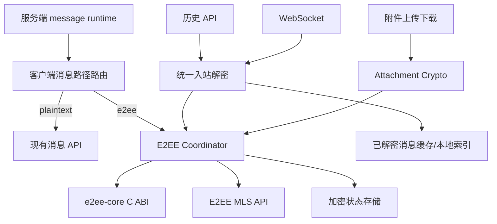

# feat: U10 E2EE 原生客户端主链与验收收口计划

## Current Progress

> 本节是本专项唯一进度快照。实施范围和验收标准以本计划后续章节为准；每完成
> 一个单元，在提交并推送后同步更新本节，不再新建平行计划或进度文档。

| 单元 | 状态 | 当前事实或完成证据 |
| --- | --- | --- |
| C1 Android 应用级装配 | 已完成 | `30940f4e`；登录/前台/注销生命周期、runtime 路由、账号隔离与敏感状态清理已接入；Android `testDebugUnitTest lintDebug` 通过 |
| C2 Android 消息主链 | 已完成 | text 主链 `565d6482`、附件主链 `20672eeb` 已推送；238 项 JVM 单测与 `lintDebug` 通过，密钥材料缺失/篡改 fail closed |
| C3 iOS 应用级装配 | 进行中 | 已确认独立 E2EE 组件齐备，但 `AppDependencies` 尚未构造账号级 graph，登录恢复、前台和注销尚未驱动 E2EE 生命周期 |
| C4 iOS 消息主链 | 待开始 | 依赖 C3 |
| C5 设备/群/epoch 事件 | 待开始 | 依赖 C2、C4 |
| C7 全仓回归门禁 | 待开始 | 依赖 C5，且必须先于 C6 完成 |
| C6 三端 E2EE live | 待开始 | 依赖 C5、C7 |
| C8 证据汇总与重审 | 待开始 | 依赖 C6、C7 |

当前执行顺序保持为：`C1 -> C2 -> C3 -> C4 -> C5 -> C7 -> C6 -> C8`。
当前从 **C3 iOS 应用级装配** 恢复，不重做原计划 N1-N6、C1 或 C2。

### C3 Resume Point

- **已有组件：** `E2eeDeviceLifecycle`、`E2eeSecureStateStore`、
  `E2eeMLSAPIClient` 和 `E2eeDirectMessageCoordinator` 已实现并有模块单测，不重写。
- **当前缺口：** `ios-app/App/RedCodeIOSApp.swift` 的 `AppDependencies` 未构造并持有
  账号级 E2EE graph；`AppRootView` 的登录恢复、认证变化和 `scenePhase` 只驱动
  普通会话/Push，注销也未清理 E2EE 包装密钥、协议状态和 metadata blob。
- **实现边界：** 新增可单测的 iOS session lifecycle，严格校验 message runtime；
  plaintext 不初始化 MLS，E2EE 执行 ensure/top-up，未知配置、待批准、撤销、
  Keychain/状态异常进入 Blocked，禁止消息层自行降级。
- **装配入口：** composition root 创建共享 secure store、MLS API、device lifecycle
  和 session lifecycle；恢复会话/登录、前台、注销分别调用对应入口，账号切换先
  清理旧账号敏感状态。
- **C3 完成信号：** lifecycle/composition 测试覆盖 plaintext/E2EE、恢复、重复前台、
  runtime 冲突、账号切换、注销与存储异常；`swift test` 全绿并独立提交推送。

### Document Roles

为避免 N/C 编号和验收文档互相覆盖，本专项只按以下职责读取文档：

| 文档 | 当前职责 | 是否可作为执行入口 |
| --- | --- | --- |
| 本计划 | C1-C8 唯一执行顺序、当前进度、验收与恢复点 | 是 |
| `docs/plans/2026-08-05-u10-e2ee-native-clients-plan.md` | N1-N7 历史专项范围与 D1-D7 原始定义，状态为 `superseded` | 否 |
| `docs/plans/2026-08-04-002-feat-u10-e2ee-remaining-work-plan.md` | U10 服务端契约和总范围；仅在发现契约缺口时回查 | 否 |
| `docs/reviews/2026-08-05-u10-e2ee-native-clients-n7-acceptance.md` | 已执行验收事实与证据，不承载后续任务排序 | 否 |
| `docs/reviews/2026-08-05-u10-e2ee-u7-security-review.md` | 安全裁决与 P0-1 重审目标 | 否 |

状态只在代码完成、验证通过、提交并推送后从“进行中”改为“已完成”。本地实现或
单测通过但尚未提交时仍标记“进行中”，并在 Resume Point 明确工作区边界。

## Goal Capsule

- **目标：** 在不重复 N1-N6 已有组件能力的前提下，把 Android/iOS E2EE
  协调器、安全存储、设备管理和附件加密接入真实应用主链，完成 Android、iOS、
  H5 三端真实 E2EE live，形成 U7 P0-1 可重放关闭证据。
- **权威依据：** 运行时行为与 API 契约 > 自动化/live 证据 > 当前源码 >
  `docs/reviews/2026-08-05-u10-e2ee-native-clients-n7-acceptance.md` > 本计划 >
  已 superseded 的原生专项计划。
- **执行顺序：** `C1 Android 装配 -> C2 Android 消息链 -> C3 iOS 装配 ->
  C4 iOS 消息链 -> C5 设备/群/附件触发 -> C7 回归门禁 -> C6 三端 live ->
  C8 重审`。每个单元独立验证、提交并推送后再进入下一单元。
- **停止条件：** 出现明文降级、身份变化被静默接受、撤销设备仍可读新 epoch、
  密钥或明文进入普通缓存/日志，或发现必须扩展服务端契约时停止执行并回到
  U10 总计划评估。
- **发布约束：** 生产 E2EE 始终保持 No-Go；测试环境只有在受控验收窗口内
  允许显式启用，结束后必须证明恢复 `persist/plaintext`。

---

## Product Contract

### Summary

N1-N6 已提供双端 FFI、安全状态存储、设备生命周期、直接消息协调、多设备与
群成员变更、附件密码能力，但这些对象尚未完整装配到应用依赖图，普通聊天发送、
历史加载和 WebSocket 入站仍绕过 E2EE。原 N7 因此只能得到平台单测和普通 live，
不能证明真实三端互解。本计划只承接这个实现与验收缺口。

### Current Baseline

| 范围 | 已完成并保留 | 尚未完成 |
| --- | --- | --- |
| N1-N3 | 双端 C ABI、加密状态存储、设备注册与 KeyPackage 补充 | 应用启动/登录/前台/注销触发装配 |
| N4 | 双端 `E2eeDirectMessageCoordinator` 及 mock 单测 | 发送、历史、WS 真实主链与 runtime 路由 |
| N5 | 双端 `E2eeDeviceManager` 与成员变化算法 | 批准/撤销/群成员事件触发和 UI 数据刷新 |
| N6 | 双端附件 AES-GCM/AAD 与外围策略 | 真实上传、下载、缓存、搜索与转发入口接入 |
| N7 | core 四目标、平台单测、marker 与 denylist 证据 | 三端 E2EE live、全仓回归、P0-1 关闭 |

### Requirements

**应用主链**

- R1. Android 和 iOS 必须从服务端 message runtime 决定发送与读取路径；
  `persist/e2ee` 只能走 E2EE 协调器，失败时保留草稿并 fail closed，禁止改发明文。
- R2. 历史加载与 WebSocket 入站必须进入同一个解密入口，以服务端消息 ID 去重；
  明文历史可继续显示，损坏密文、未知 epoch 和身份变化不得显示伪明文。
- R3. 登录、恢复会话、进入前台和注销必须分别触发设备初始化/补充、状态恢复和
  敏感状态清理；未批准或已撤销设备不得发布 KeyPackage、发送或解密。
- R4. 好友单聊、群聊成员增删和设备批准/撤销必须驱动对应 Commit/Welcome、
  rekey 与 epoch 补拉，不能只依赖手工调用测试对象。

**附件与外围边界**

- R5. E2EE 附件必须在签名上传前加密、下载后在受控内存或受控临时缓存解密；
  room/part/object key AAD 不匹配时失败，明文和 DEK 不进入 S3、普通数据库或日志。
- R6. E2EE 模式下 Push 使用固定占位；服务端搜索、直接转发密文和服务端引用摘要
  不可用；本地搜索只能索引已成功解密的内容。

**验收与发布**

- R7. 必须提供 Android、iOS、H5 使用不同 device identity 的真实 API E2EE
  live，覆盖双向互解、第二会话、重启恢复、离线补拉、重复帧、损坏密文、设备
  撤销、群成员变化和附件。
- R8. `make test.all`、`make test.live`、Native/WASM fixture、marker/denylist
  全部通过后才能提交 P0-1 关闭重审；普通 live 和共享核心 fixture 不得冒充三端
  E2EE live。

### Scope Boundaries

- 不重新实现 OpenMLS、RCCQ/RCCR、Keychain/Keystore 或现有 API 客户端。
- 不修改现有 migration；新增持久化字段时只允许追加 Android migration 或 iOS
  GRDB migration。
- 不扩展服务端 E2EE 契约；发现缺口先回到
  `docs/plans/2026-08-04-002-feat-u10-e2ee-remaining-work-plan.md` 评估。
- 不在本计划关闭备份恢复、CI 漏洞/许可证和 H5 CSP 等其他 U7 P0；即使 P0-1
  关闭，生产仍保持 No-Go。
- 不把 Android/iOS 模拟器 UI 点击当作密码协议正确性的唯一证据；协议验收以
  正式客户端代码路径、API 数据和跨端可重放断言为准。

### Acceptance Examples

- **E2EE 发送失败：** runtime 为 `persist/e2ee` 且 KeyPackage 不足时，消息不
  进入普通发送接口，草稿保留并显示可恢复错误。
- **历史混排：** 同一房间旧明文与新密文混排时，旧明文正常显示，新密文由统一
  入口解密；重复 WS 帧不产生第二条消息。
- **设备撤销：** 设备 B 被撤销后触发 rekey；设备 B 可以读旧缓存，但不能解密
  新 epoch，其他设备继续互发。
- **附件篡改：** object key 或 part position 改变后下载解密失败，客户端不写入
  明文缓存，也不提供明文回退下载。

---

## Planning Contract

### Key Technical Decisions

- KTD1. **在 repository/controller 边界接入，不在 View 中调用密码能力。**
  Android 以 `ChatRepository` 实现为主接入点，iOS 以
  `ChatDetailController`/`ChatRealtimeController` 的消息服务边界为接入点；UI
  只消费统一消息状态。
- KTD2. **runtime 路由只有两条显式路径。** `persist/plaintext` 保留当前行为，
  `persist/e2ee` 强制走协调器；未知配置、配置刷新失败或中途冲突均 fail closed。
- KTD3. **入站先解密再写普通消息缓存。** RCML envelope、RCST state 和附件 DEK
  不进入普通消息搜索索引；只有成功解密后的展示模型可以进入既有缓存。
- KTD4. **生命周期使用应用级单例装配。** coordinator、secure store、device
  lifecycle 和 device manager 按账号隔离，由应用容器持有，避免页面重建导致
  MLS state、去重表或补充任务重复初始化。
- KTD5. **三端 live 使用显式外层门禁。** 测试驱动负责 prepare/active 前置核验、
  独立账号/设备夹具和最终 plaintext 恢复；普通 unit、commit hook 与默认构建
  不得自动切换 runtime。
- KTD6. **回归阻断独立提交。** Desktop 下载目录 mock、Admin favicon/静态资源
  404 和 ChromeDriver 版本问题分别修复，不与 E2EE 功能提交混合，避免掩盖
  N7 真实结果。

### High-Level Technical Design

### Sequencing

Android 与 iOS 修改相同语义但不共享应用层代码，按平台串行完成并固定契约；
双端主链稳定后再接设备/群/附件事件，避免 live 驱动建立在未装配组件上。全仓
门禁和互操作工具恢复稳定后再执行三端 live 与重审，任何前序单元失败都不进入
发布证据阶段。

---

## Implementation Units

### C1. Android 应用级 E2EE 装配与 runtime 路由

- **Goal:** 将已有 Android E2EE 对象装配到登录态和应用容器，建立唯一 runtime
  路由与生命周期入口。
- **Requirements:** R1、R3。
- **Files:** `android-app/app/src/main/java/com/redcode/im/androidapp/di/AppContainer.kt`、
  `android-app/app/src/main/java/com/redcode/im/androidapp/RedCodeApp.kt`、
  `android-app/app/src/main/java/com/redcode/im/androidapp/e2ee/`、
  `android-app/app/src/test/java/com/redcode/im/androidapp/di/AppContainerTest.kt`、
  `android-app/app/src/test/java/com/redcode/im/androidapp/e2ee/`。
- **Approach:** 复用 `E2eeCommandClient`、`E2eeSecureStateStore`、
  `E2eeDeviceLifecycle`、`E2eeDeviceManager` 和 HTTP MLS API，按账号建立应用级
  graph；runtime 由 settings 结果映射为明确策略，登录恢复/前台/注销调用对应
  生命周期方法。
- **Test Scenarios:** plaintext 不初始化 MLS；E2EE 登录初始化并补充；重复前台
  不并发补充；未批准/撤销阻断；注销清理敏感状态；runtime 未知或刷新失败不发送。
- **Verification:** JDK 21 下运行 Android E2EE、容器与生命周期定向测试，再运行
  `make android-app.test`。
- **Dependencies:** N1-N6 已提交基线。

### C2. Android 发送、历史、WebSocket 与附件主链

- **Goal:** 让 Android 正式聊天链在 E2EE runtime 下完整使用协调器和附件密码
  边界。
- **Requirements:** R1、R2、R5、R6。
- **Files:** `android-app/app/src/main/java/com/redcode/im/androidapp/data/chat/RemoteChatRepository.kt`、
  `android-app/app/src/main/java/com/redcode/im/androidapp/persistence/CachedRemoteChatRepository.kt`、
  `android-app/app/src/main/java/com/redcode/im/androidapp/realtime/RealtimeEventProcessor.kt`、
  `android-app/app/src/main/java/com/redcode/im/androidapp/feature/chat/ChatDetailViewModel.kt`、
  对应 `android-app/app/src/test/` 下 repository、realtime 与 ViewModel 测试。
- **Approach:** 把发送、历史和 WS 数据转换收敛到同一策略对象；E2EE 发送保留
  pending/idempotency，入站成功解密后才构造 `ChatMessage`；附件在直传前加密，
  下载后解密，搜索只读取解密缓存。
- **Test Scenarios:** 第二会话、重启恢复、离线历史、WS/历史重复、历史混排、损坏
  密文、身份变化、runtime 冲突保留草稿；附件往返、篡改、重试 nonce、搜索与
  转发降级。
- **Verification:** Android repository/realtime/ViewModel 定向测试及
  `make android-app.test`。
- **Dependencies:** C1。

### C3. iOS 应用级 E2EE 装配与 runtime 路由

- **Goal:** 将已有 iOS E2EE 对象装配到 App composition root、登录态和生命周期。
- **Requirements:** R1、R3。
- **Files:** `ios-app/Sources/RedCodeApp/`、`ios-app/Sources/RedCodeCore/`、
  `ios-app/Sources/RedCodeStorage/`、`ios-app/Sources/RedCodeNetworking/`、
  `ios-app/Tests/RedCodeCoreTests/`、`ios-app/Tests/RedCodeStorageTests/`。
- **Approach:** 保持 Core protocol、Networking API、Storage 实现的模块边界，
  composition root 创建账号级 actor；登录恢复/前台/注销驱动 lifecycle，runtime
  映射与 Android 保持相同 fail-closed 语义。
- **Test Scenarios:** plaintext/E2EE 分流、恢复会话、重复前台、Keychain 丢失、
  未批准/撤销、账号切换与注销清理、runtime 配置冲突。
- **Verification:** iOS lifecycle、storage、composition 定向测试及
  `make ios-app.test`。
- **Dependencies:** C2 固定跨平台行为契约。

### C4. iOS 发送、历史、WebSocket 与附件主链

- **Goal:** 让 iOS 正式聊天链在 E2EE runtime 下完整使用协调器和附件密码边界。
- **Requirements:** R1、R2、R5、R6。
- **Files:** `ios-app/Sources/RedCodeFeatures/ChatDetailController.swift`、
  `ios-app/Sources/RedCodeFeatures/ChatRealtimeController.swift`、
  `ios-app/Sources/RedCodeNetworking/ChatAPIClient.swift`、
  `ios-app/Sources/RedCodeStorage/`、对应 `ios-app/Tests/RedCodeFeaturesTests/` 和
  `ios-app/Tests/RedCodeNetworkingTests/` 测试。
- **Approach:** 在 controller/service 边界路由消息；历史与 WS 共享入站解密器；
  成功解密后才写 GRDB message cache/search index；附件上传前和下载后调用已有
  `E2eeAttachmentCrypto`，不让 View 持有 DEK。
- **Test Scenarios:** 与 C2 同矩阵，并增加 actor 并发、App 重启恢复、GRDB async
  读写和 Keychain 缺失路径。
- **Verification:** iOS chat/realtime/attachment 定向测试及 `make ios-app.test`。
- **Dependencies:** C3。

### C5. 双端设备、群成员与 epoch 事件闭环

- **Goal:** 把已有 device manager 和群成员算法接到真实设备及房间事件。
- **Requirements:** R3、R4。
- **Files:** `android-app/app/src/main/java/com/redcode/im/androidapp/e2ee/E2eeDeviceManager.kt`、
  `android-app/app/src/main/java/com/redcode/im/androidapp/realtime/RealtimeEventProcessor.kt`、
  `android-app/app/src/main/java/com/redcode/im/androidapp/data/rooms/`、
  `ios-app/Sources/RedCodeCore/E2eeDeviceManager.swift`、
  `ios-app/Sources/RedCodeFeatures/ChatRealtimeController.swift`、
  `ios-app/Sources/RedCodeFeatures/GroupManagementController.swift` 及对应双端测试；
  不修改 API 契约和已有 migration。
- **Approach:** 批准/撤销和成员增删成功后触发受控 reconcile；WS 收到成员修订时
  补拉 epoch/control messages；重复事件幂等，撤销设备立即停止新 epoch 解密。
- **Test Scenarios:** 同账号第二设备批准/撤销；三成员群加入/退出/移除；Commit/
  Welcome 重复、乱序与缺口；旧成员不可读新内容，新成员不可读加入前历史。
- **Verification:** 双端 device/group/realtime 定向测试，随后分别运行
  `make android-app.test` 和 `make ios-app.test`。
- **Dependencies:** C2、C4。

### C6. Android、iOS、H5 三端 E2EE live 驱动

- **Goal:** 使用三套正式客户端路径和独立 device identity 形成真实跨端证据。
- **Requirements:** R7。
- **Files:** `tests/scripts/` 下新增受控编排脚本、
  `android-app/app/src/test/java/com/redcode/im/androidapp/live/E2eeCrossClientLiveTest.kt`、
  `ios-app/Tests/RedCodeNetworkingTests/E2eeCrossClientLiveTests.swift`、
  `h5-app/test/e2ee-live-backend.test.ts`、`Makefile`、
  `docs/reference/testing/README.md`。
- **Approach:** 外层脚本显式检查并进入测试 runtime，准备独立账号/设备，驱动三端
  发送和历史解密，抽检服务端密文，最终无条件恢复 plaintext 并清理夹具；新增
  独立 `make` 入口，不挂普通 unit 或 commit hook。
- **Test Scenarios:** 三端两两双向文本；第二新会话；重启；离线补拉；重复 WS；
  损坏密文；设备撤销；群成员变化；图片/音频/视频/文件附件；执行失败后的 runtime
  恢复与夹具清理。
- **Verification:** 新三端 E2EE live 入口、`make e2ee-core.test.wasm`、API marker
  scan 和日志 denylist。
- **Dependencies:** C5、C7。

### C7. 清理全仓验收门禁阻断

- **Goal:** 让 N7 使用的现有全仓和普通 live 门禁恢复可信全绿。
- **Requirements:** R8。
- **Files:** `desktop/test/utils/download-settings.test.ts` 及实现 mock 边界、
  `admin/playwright-tests/specs/live-backend-smoke.spec.ts` 与静态资源配置、
  `Makefile` 的 WASM ChromeDriver 配置及对应测试文档。
- **Approach:** 分别复现和修复 Desktop 路径 mock、Admin 登录页 404、
  Chrome/ChromeDriver 版本不匹配；三个问题按模块独立提交，不放宽错误断言。
- **Test Scenarios:** Desktop 保存目录存在/不存在；Admin 登录无 console/page error；
  Native/WASM fixture 正反向验证；工具缺失时给出明确阻断而非假通过。
- **Verification:** Desktop 定向测试、`make admin.test.live`、
  `make e2ee-core.test.wasm`，最终运行 JDK 21 环境下的 `make test.all` 与
  `make test.live`。
- **Dependencies:** C5；必须在 C6 前完成，避免工具链失败污染三端协议验收。

### C8. N7 证据汇总与 U7 P0-1 重审

- **Goal:** 基于可重放结果决定是否关闭客户端 P0-1，不改变其他 P0 裁决。
- **Requirements:** R7、R8。
- **Files:** `docs/reviews/2026-08-05-u10-e2ee-native-clients-n7-acceptance.md`、
  `docs/reviews/2026-08-05-u10-e2ee-u7-security-review.md`、必要的测试参考文档。
- **Approach:** 记录命令、平台、设备 identity、runtime 前后状态、marker 抽检和
  失败恢复证据；只有 D1-D8 全部满足时将 P0-1 标记关闭，其他 P0 和生产 No-Go
  保持不变。
- **Test Scenarios:** 证据与实际命令一致；任一三端场景或恢复检查失败时验收仍为
  partial；不得用普通 live、mock 单测或 fixture 替代真实三端结果。
- **Verification:** `git diff --check`、文档链接检查、独立代码/安全审查及工作区
  清洁检查。
- **Dependencies:** C6、C7。

---

## Verification Contract

| 范围 | 单元 | 命令或证据 | Done signal |
| --- | --- | --- | --- |
| Android | C1、C2、C5 | JDK 21 下 `make android-app.test` | 单测全绿，无明文回退 |
| iOS | C3-C5 | `make ios-app.test` | Swift tests 全绿，live skip 单独记录 |
| H5 | C6 | `make h5-app.check`、`make h5-app.test.unit` | WASM 与 H5 回归全绿 |
| Core | C6、C7 | `make e2ee-core.check`、`make e2ee-core.check.targets`、`make e2ee-core.test.wasm` | 四目标和浏览器互操作通过 |
| 三端 live | C6 | 新增受控 E2EE live 入口 | Android/iOS/H5 正式路径两两互解 |
| 泄漏边界 | C6、C8 | marker scan、denylist、DB/Redis/Push/S3 抽检 | 非预期明文、RCST、DEK 为零 |
| 全仓 | C7 | JDK 21 下 `make test.all`、`make test.live` | 自包含与真实后端回归全绿 |
| Git | C1-C8 | `git diff --check`、`git diff --cached --check`、staged diff | 每单元最小闭环提交并推送 |

每次原生平台单测使用 JDK 21 环境约束；每次 E2EE live 前后读取 runtime，失败
清理必须由 trap/finally 保证执行。模拟器用于 UI smoke，协议 live 可使用平台正式
客户端模块的测试宿主，但必须走真实 API、独立 device identity 和正式存储/协调路径。

---

## Definition of Done

- D1. Android 应用容器实际装配 E2EE 生命周期与 runtime 路由，E2EE 失败不走
  普通发送。
- D2. Android 发送、历史、WS、附件、搜索和缓存使用统一安全边界并通过场景矩阵。
- D3. iOS 应用装配与 Android 语义一致，actor/Keychain/GRDB 失败路径 fail closed。
- D4. iOS 发送、历史、WS、附件、搜索和缓存使用统一安全边界并通过场景矩阵。
- D5. 双端真实设备和群成员事件触发 rekey/Commit/Welcome/epoch 补拉，撤销设备
  与旧成员不能读取新内容。
- D6. Android、iOS、H5 使用不同 device identity 的三端 E2EE live 全部通过，
  runtime 在成功和失败路径后均恢复 plaintext。
- D7. Native/WASM、marker/denylist、`make test.all` 和 `make test.live` 全绿，
  Desktop/Admin/ChromeDriver 阻断均有独立修复证据。
- D8. U7 P0-1 的关闭材料通过独立安全与正确性重审；其余 U7 P0 未关闭前生产
  E2EE 继续 No-Go。
- D9. 所有实验性适配、临时明文日志、废弃 live 夹具和失败方案代码已清理，工作区
  无未解释改动。

---

## Appendix

### Sources

- 原专项计划：`docs/plans/2026-08-05-u10-e2ee-native-clients-plan.md`。
- 当前验收事实：`docs/reviews/2026-08-05-u10-e2ee-native-clients-n7-acceptance.md`。
- U10 总计划：`docs/plans/2026-08-04-002-feat-u10-e2ee-remaining-work-plan.md`。
- U7 安全裁决：`docs/reviews/2026-08-05-u10-e2ee-u7-security-review.md`。
- API 契约：`docs/reference/api/e2ee.md`。
- 测试入口：`docs/reference/testing/README.md`。
