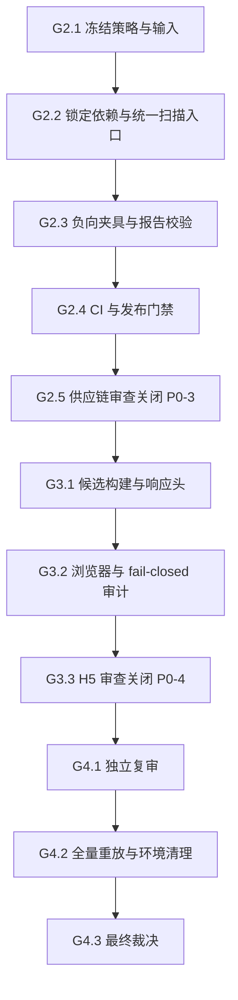

# security: U10 E2EE 发布就绪剩余执行计划

## Goal Capsule

- **目标：** 关闭 U10 E2EE 生产发布剩余两个 P0，完成独立复审，并形成可复现的 Go/No-Go 裁决。
- **唯一入口：** 本文是 U10 E2EE 唯一 active 计划、进度总账和会话恢复点；其他 U10/E2EE 计划均为 `superseded` 或 `complete`，不得继续派发任务。
- **固定顺序：** `G2 供应链门禁 -> G3 H5 发布安全 -> G4 独立复审与裁决`。G1 已完成，只保留证据索引，不再执行。
- **当前 checkpoint：** `G2.2`，补齐 Android resolved dependency lock，并实现六端统一 SBOM、漏洞与许可证扫描入口。
- **停止条件：** 任一 P0 未关闭、任一门禁 fail closed 场景未验证、存在未解决 P0/P1，或证据无法复现时，生产 E2EE 保持 **No-Go**。
- **运行约束：** `content_audit_mode=plaintext`；测试候选环境仅允许受控短时 `active`，结束后必须恢复 `persist/plaintext` 和 `security_review_approved=false`。

---

## Product Contract

### Problem Frame

E2EE core、API、Admin、H5、Android 和 iOS 的功能主链与跨端 live 已完成，但生产发布仍缺少两项独立安全证明：全技术栈供应链门禁，以及 H5 候选构建的发布安全审计。历史计划数量较多且包含已经关闭的实现阶段，继续沿用旧 checkpoint 会导致重复执行、证据漂移和错误裁决。

### Requirements

- R1. U10/E2EE 后续任务只从本文派发；已完成的 U1-U7、N1-N7、C1-C8、R1-R4 和 G1 不得重做。
- R2. G2 必须覆盖 `api/`、`e2ee-core/`、`android-app/`、`ios-app/`、`h5-app/`、`admin/`，以提交入库的 lockfile 或等价解析输入生成机器可读 SBOM，并执行漏洞与许可证核验。
- R3. G2 的本地和 CI 必须调用同一仓库入口；扫描器缺失、版本不符、漏洞数据库不可用、输入未锁定、报告缺失或解析失败均必须阻断。
- R4. G2 必须有明确的严重度阈值和许可证 allow/deny 策略；临时豁免必须绑定依赖或 advisory、责任人、理由和到期时间，过期或字段缺失自动失败。
- R5. G2 报告必须可作为 CI artifact 留存，且不得包含 token、密码、私钥、内部凭据、用户内容或环境敏感值。
- R6. G3 必须对候选 H5 release build 验证 CSP/安全响应头、依赖与 commit 可追溯性、source map 暴露、browser storage、Network、Console、日志和 WebCrypto wrapping key 边界。
- R7. G3 必须证明状态损坏、身份变化、未知 epoch 和解密失败均 fail closed，不回退 plaintext；不得为通过验收而放宽到不受控 `unsafe-inline` 或 `unsafe-eval`。
- R8. G4 必须独立复核 G1-G3 证据并重跑适用门禁；只有全部 P0 关闭、无未解决 P0/P1 且环境清理完成时才能裁决 Go。
- R9. 不扩展 E2EE API 契约，不修改已有 migration，不触碰 `im-test-1` 旧主库，不提交演练凭据或临时取证文件。

### Scope Boundaries

**本计划包含：** 供应链扫描入口与策略、CI release 阻断、H5 候选发布安全审计、最终独立复审、U7 审查和任务总账同步。

**本计划不包含：** 新 E2EE 产品能力、服务端 API 扩展、MLS 协议重构、UI 功能迁移、签名凭据配置、商店发布、Flutter/desktop 恢复，以及 G1 已完成的备份恢复演练。

### Acceptance Examples

- AE1. 给正常 lockfile 集合执行统一入口时，六端均产出 SBOM、漏洞和许可证结果，命令返回 0。
- AE2. 注入已知高危漏洞、拒绝许可证、过期豁免、损坏报告或不可用扫描器时，统一入口非 0 退出，release job 不得继续。
- AE3. H5 候选构建中不存在公开 source map 和敏感日志，严格 CSP 生效，WebCrypto wrapping key 为不可导出；破坏本地 E2EE 状态后消息路径被阻断而非降级明文。
- AE4. G4 从干净基线重放检查后，若任何证据失败则保持 No-Go；只有全部完成条件满足才更新最终裁决。

---

## Planning Contract

### Current Baseline

| 范围 | 状态 | 权威证据 |
| --- | --- | --- |
| E2EE core、API、Admin、H5 主链 U1-U7 | 完成 | `docs/reviews/2026-08-05-u10-e2ee-u7-security-review.md` |
| Android/iOS 原生接入 N1-N7 | 完成 | `docs/reviews/2026-08-05-u10-e2ee-native-clients-n7-acceptance.md` |
| 原生最终验证 R1-R4 | 完成 | `docs/plans/2026-08-05-u10-e2ee-native-clients-final-verification-plan.md` |
| U7 P0-1 三端 E2EE 主链 | 关闭 | Android/iOS/H5 live、附件、恢复、撤销、泄漏扫描 |
| U7 P0-2 备份恢复与灰度回滚 | 关闭 | `docs/reviews/2026-08-05-u10-e2ee-backup-rollout-drill.md` |
| U7 P0-3 供应链门禁 | 未关闭 | `docs/reports/2026-08-05-e2ee-sbom.md` 当前为 `partial` |
| U7 P0-4 H5 发布安全 | 未关闭 | 尚无正式 release security review |

G1 最终候选 API commit 为 `74d1231e`，归档 SHA-256 为 `c972c20118ce7177ad07bf039d990d75dd28fb0c5ec079e170aad6e00d72ea21`。三端 live、独立 PostgreSQL 17 恢复、损坏归档拒绝、灰度、API recreate、rollback、TERM 清理均已通过；候选资源已清理，旧主环境未触碰。

### Inventory at G2.1

| 模块 | 依赖输入 | 当前缺口 |
| --- | --- | --- |
| `api/` | `api/Cargo.lock` | 无统一 SBOM、漏洞、许可证门禁 |
| `e2ee-core/` | `e2ee-core/Cargo.lock` | 无统一 SBOM、漏洞、许可证门禁 |
| `android-app/` | Gradle wrapper + Kotlin build scripts | 缺少 resolved dependency locking 文件 |
| `ios-app/` | `ios-app/Package.resolved` | 未纳入统一扫描与报告 |
| `h5-app/` | `h5-app/bun.lock` | 未纳入统一扫描与报告 |
| `admin/` | `admin/pnpm-lock.yaml` | 未纳入统一扫描；manifest 仍声明仓库已移除的 `MIT` |

当前只有 `.github/workflows/release-artifacts.yml`；API/Android release job 已启用，iOS job 暂停，尚无供应链 job、SBOM artifact 或 release dependency。现有 `docs/reports/2026-08-05-e2ee-sbom.md` 仅覆盖 API/e2ee-core/H5/Admin，不能作为通过证据。

### Key Technical Decisions

- KTD1. **一套入口、分层适配。** 新增 `make supply-chain.check` 作为本地与 CI 唯一入口，内部按生态解析 lockfile，但统一输出 schema、退出语义和 artifact 目录，避免 CI 与开发机使用不同规则。
- KTD2. **固定工具版本。** 扫描工具版本及校验值由仓库配置固定；脚本不得静默使用 PATH 中任意版本，也不得用未固定版本的 `bunx`、`pnpm dlx` 或 `cargo install` 结果作发布证据。
- KTD3. **锁定输入优先。** Android 先生成并提交 Gradle dependency locking；iOS 使用提交入库的 `Package.resolved`。任何模块缺少或漂移锁文件时，在扫描前失败。
- KTD4. **SBOM 使用 CycloneDX JSON。** 每个模块独立产物并生成聚合索引，保留模块、commit、工具版本、输入摘要和生成时间；漏洞与许可证报告引用相同 component identity。
- KTD5. **漏洞策略 fail closed。** `critical`、`high`、`medium` 和严重度未知的有效 advisory 默认阻断；只有 `low` 记录但不阻断。无法获取或验证数据库时不得使用旧成功报告顶替，确需保留的 finding 只能走 KTD7 的限时豁免。
- KTD6. **许可证显式 allow/deny。** 初始 allowlist 为 `0BSD`、`Apache-2.0`、`BSD-2-Clause`、`BSD-3-Clause`、`ISC`、`MIT`、`MIT-0`、`MPL-2.0`、`Unicode-3.0`、`Unicode-DFS-2016`、`Unlicense`、`Zlib`；SPDX `OR` 表达式至少有一个允许分支即可，`AND` 表达式的每一项都必须允许。`AGPL`、`GPL`、`SSPL`、Commons Clause、未知/缺失许可证默认阻断，其他 copyleft 或 source-available 许可证进入人工复核。项目自身 manifest 统一为 `UNLICENSED`，第三方 MIT 依赖不受影响。
- KTD7. **豁免不是跳过扫描。** `config/supply-chain/exceptions.json` 只过滤精确 dependency/advisory/license finding，字段必须包含 `owner`、`reason`、`expires_at`；过期、宽泛匹配、未命中或未知字段均失败。
- KTD8. **CI 先门禁再发布。** PR 使用独立供应链 workflow 尽早反馈；tag/manual release workflow 内保留阻断型 `supply-chain-check` job 并生成 artifact，`api-build`、`android-app-check` 和 `publish-release` 必须依赖它。两处只调用 `make supply-chain.check`，不复制扫描逻辑；被停用的 iOS build job 不影响 iOS lockfile 扫描，iOS 仍属于 G2 必检范围。
- KTD9. **G3 只审候选产物。** H5 安全检查必须针对与 commit/lockfile 对应的 production build 和实际服务响应执行，不能以 dev server 或源码静态判断替代。
- KTD10. **证据优先级。** live runtime 与候选构建结果高于报告摘要；报告高于历史计划。发现冲突时回到最早不确定检查点，不向后继续。

### Sequencing

每个 checkpoint 必须先验证、形成最小可解释 commit 并 push，再更新本文 `current_checkpoint`。不得跨 checkpoint 合并半成品提交。

---

## Implementation Units

### G2.1. 冻结供应链契约与依赖输入（完成）

- **目标：** 将上方 inventory、KTD1-KTD8 和六端覆盖范围作为实现契约，消除工具、阈值、许可证和豁免语义的不确定性。
- **文件：** `docs/plans/2026-08-05-u10-e2ee-release-readiness-execution-plan.md`、`docs/reports/task-list.md`。
- **验证场景：** 所有 U10/E2EE plan 仅本文为 active；任务总账指向 G2；六端各有明确锁文件或补锁动作；G2 不夹带 G3/G4 实现。
- **完成信号：** 本计划已完成 review，随本轮文档闭环 commit、push 后从 G2.2 恢复执行。

### G2.2. 建立六端锁定输入与统一扫描入口

- **目标：** 补齐 Android resolved dependency lock，建立固定版本工具、策略、豁免 schema、六端 CycloneDX SBOM、漏洞和许可证扫描。
- **主要文件：** `Makefile`、`scripts/supply-chain/`、`config/supply-chain/`、`android-app/gradle/`、`android-app/app/`、`admin/package.json`。
- **遵循模式：** shell 入口沿用 `deploy/im-test-1/e2ee-backup-rollout-drill.sh` 的 `set -euo pipefail`、严格临时目录和 cleanup；报告敏感值扫描沿用 `scripts/scan-e2ee-log-denylist.sh` 的 denylist 思路。
- **测试文件：** `tests/scripts/test-supply-chain-check.sh`；fixture 放在 `tests/fixtures/supply-chain/`，不得改写真实 lockfile。
- **测试场景：** 六端正常输入生成六份 SBOM 和聚合索引；缺 lockfile、lock drift、错误工具版本、未知许可证、无效 exception schema 均非 0；Android 测试与 lock 生成固定 JDK21。
- **完成信号：** `make supply-chain.check` 可在干净工作区本地复跑，机器报告完整且不含凭据。

### G2.3. 固化负向门禁与报告完整性

- **目标：** 用隔离 fixture 证明门禁会真实阻断，而非只生成报告。
- **主要文件：** `tests/scripts/test-supply-chain-check.sh`、`tests/fixtures/supply-chain/`、`scripts/supply-chain/`。
- **测试场景：** 已知 high/critical advisory 失败；严重度未知 advisory 失败；拒绝许可证失败；过期、缺 owner、宽泛匹配豁免失败；扫描器缺失、数据库下载失败、离线缓存损坏、JSON 截断、聚合遗漏模块均失败；正常 fixture 通过；报告 denylist 无命中。
- **完成信号：** 所有正负 fixture 结果稳定，失败信息能定位模块和 finding，但不输出凭据或依赖下载 URL 中的认证参数。

### G2.4. 接入 CI 与 release dependency

- **目标：** 让 GitHub Actions 调用与本地相同入口并上传机器可读 artifact，任何供应链失败均阻断构建和发布。
- **主要文件：** `.github/workflows/supply-chain.yml`、`.github/workflows/release-artifacts.yml`、`Makefile`。
- **测试场景：** workflow 语法有效；工具版本固定；artifact 缺失时 job 失败；PR workflow 与 tag/manual release workflow 均调用同一 Make 入口；`api-build`、`android-app-check`、`publish-release` 依赖 release workflow 内的供应链 job；iOS job 即使仍为 `if: false`，`ios-app/Package.resolved` 仍被扫描。
- **完成信号：** CI 正常样本通过并上传 SBOM/漏洞/许可证报告，负向分支证明 release job 被阻断。

### G2.5. 更新供应链证据并关闭 U7 P0-3

- **目标：** 将 partial 清单升级为六端真实结果，形成独立 review，并同步 U7 与任务总账。
- **主要文件：** `docs/reports/2026-08-05-e2ee-sbom.md`、`docs/reviews/2026-08-05-u10-e2ee-supply-chain-review.md`、`docs/reviews/2026-08-05-u10-e2ee-u7-security-review.md`、`docs/reports/task-list.md`、本文。
- **测试场景：** 报告记录 commit、工具版本、lock 摘要、组件计数、findings、exceptions 和 CI run；P0-3 只在 G2.2-G2.4 全部可复现后关闭；生产裁决仍为 No-Go。
- **完成信号：** 文档 commit 并 push，本文 checkpoint 更新为 G3.1。

### G3.1. 固化 H5 候选构建与静态发布边界

- **目标：** 生成可追溯 production build，并对实际候选服务检查 CSP、安全响应头、source map、静态资源完整性和 commit/lockfile 绑定。
- **主要文件：** `h5-app/package.json`、`h5-app/vite.config.ts` 或现有 Vite 配置、H5 部署配置、`scripts/h5-release-security/`、`Makefile`。
- **测试文件：** `h5-app/test/` 下定向 release security 测试及 `tests/scripts/test-h5-release-security.sh`。
- **测试场景：** production build 无公开 `.map`；响应包含预期 CSP、HSTS、`X-Content-Type-Options`、frame/referrer/permissions 策略；CSP 不含不受控 `unsafe-inline`/`unsafe-eval`；静态资源和 metadata 可追溯到当前 commit 与 lockfile。
- **完成信号：** 静态检查可在本地候选服务和 CI 复跑，失败即非 0。

### G3.2. 验证浏览器存储、运行时泄漏与 fail-closed

- **目标：** 在隔离浏览器会话中检查真实 H5 release runtime，不改动产品契约。
- **主要文件：** `h5-app/test/e2e/` 或现有 Playwright 目录、`scripts/h5-release-security/`。
- **遵循模式：** 复用已有 H5 E2EE live fixtures 和同一个浏览器工具链；运行时证据优先于静态源码。
- **测试场景：** WebCrypto wrapping key `extractable=false`；IndexedDB/localStorage/sessionStorage/Cookie 无 MLS 私钥、DEK、明文正文或 token 泄漏；Network/Console/log 无敏感 marker；状态损坏、身份变化、未知 epoch、密文损坏和解密失败均阻断，不发送 plaintext；普通刷新与重启恢复仍可解密合法历史。
- **完成信号：** 正负浏览器场景稳定，临时账号、浏览器 profile、token 和候选服务清理完成。

### G3.3. 形成 H5 发布安全报告并关闭 U7 P0-4

- **目标：** 汇总威胁模型、候选构建、响应头、浏览器运行时和 fail-closed 证据。
- **主要文件：** `docs/reviews/2026-08-05-u10-e2ee-h5-release-security-review.md`、`docs/reviews/2026-08-05-u10-e2ee-u7-security-review.md`、`docs/reports/task-list.md`、本文。
- **测试场景：** 报告明确 H5 不抵抗已攻陷同源 Origin、运行时 XSS 或恶意扩展；不把源码单测当作候选发布证明；P0-4 只在 G3.1/G3.2 全部通过后关闭。
- **完成信号：** 文档 commit 并 push，本文 checkpoint 更新为 G4.1，生产仍保持 No-Go。

### G4.1. 独立 correctness/security/reliability/testing 复审

- **目标：** 由独立上下文复核 G1-G3 的实现、策略、测试和报告，优先发现旁路、误报/漏报、证据漂移及清理缺口。
- **主要文件：** G1-G3 diff、CI、扫描脚本、策略、fixtures 和三份 review。
- **测试场景：** 任一 reviewer 的 P0/P1 finding 必须修复并重审；不得用同一上下文自我确认代替独立复审；CRG 仅在调用链不明确时作为旁路证据。
- **完成信号：** 无未解决 P0/P1，复审结论和剩余风险有明确证据。

### G4.2. 重跑全量门禁并清理环境

- **目标：** 从干净基线重跑 core、API、原生双端、H5、供应链、全量和 live 门禁，并证明环境已恢复。
- **主要文件：** 不预设代码改动；失败修复按模块独立闭环。
- **测试场景：** Android/JVM 固定 JDK21；所有测试绿色；所有 runtime 为 `persist/plaintext`；不存在 token、tunnel、dump、归档、临时容器、volume、浏览器 profile 或候选账号残留；`im-test-1` 旧主健康且未写入。
- **完成信号：** 全量证据绑定最终 commit，可从文档重放。

### G4.3. 更新总账并作出最终裁决

- **目标：** 更新 U7 审查、任务总账和本文，作出唯一最终 Go/No-Go 裁决。
- **主要文件：** `docs/reviews/2026-08-05-u10-e2ee-u7-security-review.md`、`docs/reports/task-list.md`、本文及必要入口文档。
- **测试场景：** G1-G3 全部关闭；无未解决 P0/P1；CI 与 live 证据可复现；环境清理确认；任一条件不满足则明确维持 No-Go 和下一 checkpoint。
- **完成信号：** 最终裁决 commit 并 push；仅在全部 DoD 满足时允许生产 E2EE Go。

---

## Verification Contract

| 范围 | 命令/方式 | 适用单元 | 通过条件 |
| --- | --- | --- | --- |
| 供应链 | `make supply-chain.check` | G2.2-G2.5、G4.2 | 六端扫描通过且报告完整 |
| 供应链负向 | `tests/scripts/test-supply-chain-check.sh` | G2.2-G2.4 | 所有 fail-closed fixture 按预期失败 |
| H5 发布安全 | `make h5-app.check`、新增 release security 入口 | G3、G4.2 | build、静态、浏览器检查全部通过 |
| E2EE core | `make e2ee-core.check && make e2ee-core.check.targets` | 发生 core/依赖改动时、G4.2 | host 与四目标构建通过 |
| API | `make api.test` | 发生 API/依赖改动时、G4.2 | unit/integration 全部通过 |
| Android | `JAVA_HOME=/Users/chen/Library/Java/JavaVirtualMachines/azul-21.0.10/Contents/Home make android-app.test` | Android lock 改动、G4.2 | JVM 单测通过 |
| iOS | `make ios-app.test` | iOS lock 改动、G4.2 | Swift tests 通过，live skip 有说明 |
| 全量 | `JAVA_HOME=/Users/chen/Library/Java/JavaVirtualMachines/azul-21.0.10/Contents/Home make test.all` | G4.2 | 自包含回归通过 |
| live | `JAVA_HOME=/Users/chen/Library/Java/JavaVirtualMachines/azul-21.0.10/Contents/Home make test.live` | G4.2 | 真实后端联调通过并完成清理 |
| Git | `git diff --check`、`git diff --cached --check`、staged diff review | 每个 checkpoint | 无格式错误，仅包含当前闭环文件 |

测试或扫描失败时只修复当前 checkpoint，不允许通过放宽策略、跳过模块、复用陈旧报告或回退 plaintext 继续推进。

---

## Definition of Done

- D1. 本文是唯一 active U10/E2EE 计划，任务总账与 `current_checkpoint` 一致，历史计划不再派发任务。
- D2. 六端依赖均有可重放锁定输入，SBOM、漏洞和许可证检查通过同一固定版本入口执行。
- D3. 已知漏洞、拒绝许可证、过期/无效豁免、工具/数据库/报告故障均被自动阻断，CI release 不存在旁路。
- D4. 供应链机器报告作为 CI artifact 留存且无凭据泄漏，U7 P0-3 有独立 review 关闭证据。
- D5. H5 候选 release build 的 CSP、响应头、source map、WebCrypto、存储、Network、Console、日志和 fail-closed 场景全部通过，U7 P0-4 关闭。
- D6. G1-G3 均完成验证、最小闭环 commit 和 push；G4 独立复审无未解决 P0/P1。
- D7. core、API、Android、iOS、H5、全量和 live 适用门禁从干净基线通过，所有临时资源清理，运行时恢复 `persist/plaintext`。
- D8. 只有 D1-D7 全部满足，最终裁决才允许从 No-Go 改为 Go；否则本文必须保留明确的未关闭 checkpoint。

---

## Appendix

### Historical Plan Index

| 计划族 | 状态 | 用途 |
| --- | --- | --- |
| `docs/plans/2026-08-04-001-feat-u10-e2ee-release-gate-plan.md`、`docs/plans/2026-08-04-002-feat-u10-e2ee-remaining-work-plan.md` | superseded | 产品契约与早期总分解 |
| `docs/plans/2026-08-05-u10-e2ee-u4-group-chat-plan.md` 至 `u7-security-review-plan.md` | superseded | 已完成能力实现设计 |
| `docs/plans/2026-08-05-u10-e2ee-native-clients-plan.md` 及 closure/acceptance 系列 | superseded | 已完成原生接入过程 |
| `docs/plans/2026-08-05-u10-e2ee-native-clients-final-verification-plan.md` | complete | 已完成验收证据，不派发任务 |
| `docs/plans/2026-08-05-u10-e2ee-production-release-closure-plan.md`、`release-readiness-master-plan.md` | superseded | G1-G4 历史恢复入口 |
| 本文 | active | 唯一剩余执行与恢复入口 |

### G1 Evidence Snapshot

- 修复提交：`9ee1285f fix(api): 同步系统托管存储配置`、`74d1231e fix(api): 识别 S3 对象不存在错误`。
- 演练提交：`abaf7a5d test(e2ee): 加固 live 夹具清理`、`b0681588 test(e2ee): 固化备份恢复与灰度演练`、`c54566a1 docs(e2ee): 关闭备份恢复发布门禁`。
- 三端 live run：`g1c-9ee1285f`，6/6 通过；完整演练 run：`g1-full7-9ee1285f`。
- 详细证据：`docs/reviews/2026-08-05-u10-e2ee-backup-rollout-drill.md`。
