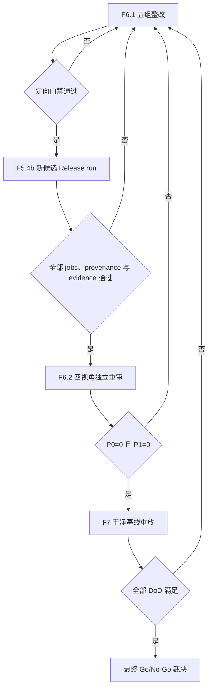

# security: U10 E2EE 最终收口执行计划

## Goal Capsule

- **目标：** 在不重做已验收实现的前提下，关闭真实 Release CI 差异，完成同一候选上的独立复审、干净基线重放和最终 Go/No-Go 裁决。
- **唯一恢复点：** `F6.1-D`。F6.1-A/B/C 已关闭，当前进入 Release 原子性、并发与清理整改。
- **固定顺序：** `F6.1 -> F5.4b -> F6.2 -> F7`。实现、依赖、构建或测试门禁变化后原候选失效，必须重跑 Release workflow 与独立复审。
- **当前裁决：** 生产 E2EE 保持 **No-Go**。
- **环境红线：** `im-test-1` 旧主保持 `persist/plaintext`；禁止停止、升级或写入旧主数据库。
- **状态权威：** 本文 frontmatter、执行看板和恢复快照是唯一 U10 执行状态源；历史计划只用于设计和证据追溯。

---

## Product Contract

### 当前问题

U10 的协议、原生双端、H5、Admin gate、跨端 live 和持久证据主链已实现并验收。剩余风险不再是功能缺失，而是 Release workflow 在真实 GitHub Linux runner 上暴露的平台可复现性差异，以及后续最终审查和发布裁决尚未完成。

首次 run `31061331555` 暴露 H5 repository variables 与 Android Linux host cdylib 缺失；对应修复已完成。第二次 run `31063363938` 暴露 H5 Rust 工具链未固定和 Android artifact workspace 路径错误；对应修复 commit `2495a2df` 已完成。第三次 run `31063965919` 证明 pinned Rust setup 成功，但 Linux 生成的 `h5-app/src/e2ee/core-wasm` 仍与 macOS 提交产物不一致，clean-source gate 正确 fail closed。

### Requirements

- R1. Release workflow 必须在已 push、工作区干净的新候选 HEAD 上完整执行，不得用 rerun 旧失败 run 代替新实现证据。
- R2. H5 tracked WASM 必须具备跨 runner 的可复现策略；不能删除或放宽 clean-source gate 来掩盖平台差异。
- R3. Android、H5、API 和供应链必需 jobs 必须成功；artifact、attestation 和 manifest 必须绑定同一候选 HEAD。
- R4. `publish_release=false` 的验收 run 不得新增或修改 tag/Release，失败路径也必须保持零发布副作用。
- R5. F6 必须以四个独立上下文完成 correctness、security、reliability、testing 复审，且均为 `P0=0/P1=0`。
- R6. F7 必须从干净基线完成全量、live、持久证据和环境清理验证，才能形成最终裁决。
- R7. 全过程不得扩展服务端 E2EE API、修改已有 migration、覆盖远端 `.env` 或触碰 `im-test-1` 旧主数据面。

### Scope Boundaries

- **范围内：** `.github/workflows/release-artifacts.yml`、H5 WASM release 构建链、相关 contract tests、Release artifacts/provenance、最终 review 和任务总账。
- **按发现纳入：** Android 或 API 在当前 run 中出现可稳定复现且属于候选实现的失败时，回到 F5.3b 一并关闭。
- **范围外：** 新 E2EE 产品能力、服务端契约扩展、已有 migration 修改、生产发布动作、旧主部署变更、U11/U13。
- **提交边界：** 实现/测试与 review/状态文档按最小可解释闭环提交；每个 commit 后立即 push。

---

## Planning Contract

### 已完成基线，不重做

| 阶段 | 状态 | 决定性证据 |
| --- | --- | --- |
| N1-N7 / U1-U7 | complete | 原生双端、H5、API、Admin gate、附件边界与跨端验收历史 commits/reviews |
| F1 Restore live 与数据边界 | complete | commit `d385c88b`；run `e1fix20260806g` |
| F2 首轮四视角独立复核 | complete | subject `aa605931`；四视角 `P0=0/P1=0/P2=0` |
| F3 H5 production Chrome 审计 | complete | subject `f6944a70`；run `e3prod20260806f` |
| F4 持久脱敏证据 | complete | commit `a383f788`；离线验证与 13 类负例通过 |
| F5.2 首次 workflow 取证 | complete | run `31061331555` failure；API/供应链通过；tag/Release 零副作用 |
| F5.3a 首轮 CI 修复 | complete | commits `e652aaa1`、`2495a2df`；变量、host cdylib、pinned Rust、APK 路径与 contract tests |

以上阶段仅在后续发现直接关联的 P0/P1 或回归失败时回退，不因文档整理重新执行。

### 当前执行看板

| Unit | Status | Exit condition |
| --- | --- | --- |
| F5.3b Linux WASM 可复现性修复 | complete | run `31063965919` 完整取证；canonical Linux SHA 稳定；修复 `caefedf5` 已 push |
| F5.4 全新候选 Release workflow | complete | run `31065710816` success；artifact/provenance 绑定 `eff9e9fd`；tag/Release 零副作用 |
| F6 首轮四视角重审 | complete/fail | `eff9e9fd` 上 `P0=0/P1=9/P2=3`，不得进入 F7 |
| F6.1 复审整改 | in_progress | 9 个 P1 与同路径 3 个 P2 均关闭，定向回归通过并 push |
| F5.4b 新候选 workflow | pending | 新实现候选全部 jobs、provenance、machine evidence 与零副作用通过 |
| F6.2 四视角重审 | pending | 四个全新独立上下文均 `P0=0/P1=0` |
| F7 干净基线重放与裁决 | pending | Verification Contract 全部通过并形成唯一最终 review |

### Key Technical Decisions

- KTD1. **保留 clean-source fail closed。** Linux 重建改变 tracked WASM 是供应链可复现性问题，不通过忽略 diff、降低检查或 `continue-on-error` 绕过。
- KTD2. **实现候选与证据提交分离。** F5.4 成功后冻结 `implementation_candidate_sha`，F6 审查和 F7 实现验证均绑定该 SHA。后续纯 review/evidence/状态文档 commit 只是证据载体，不改变候选身份；只有实现、构建配置、依赖或测试门禁发生变化时，才生成新候选并回退 F5.4。
- KTD3. **真实 CI 优先于本地推断。** 运行时 workflow、job log 和下载 artifact 优先于本地成功；本地门禁用于复现和防回归，不能替代 GitHub run。
- KTD4. **失败 run 仍需完整收口。** 等待或取消 run 后记录所有已启动 job 的最终状态，并验证 tag/Release 零副作用，再修改实现。
- KTD5. **旧主只读隔离。** 所有状态切换和 live 验收只在隔离 restore/test 上下文执行；旧主只允许只读核对且保持 `persist/plaintext`。

### 顺序与回退



---

## Implementation Units

### F6.1 复审整改

- **Goal:** 关闭首轮 F6 复审的 9 个 P1，并同步关闭位于相同代码路径的 3 个 P2；任何实现、构建配置、依赖或测试门禁变更都会使 `eff9e9fd` 失效。
- **Input:** `docs/reviews/2026-08-06-u10-e2ee-f6-independent-review.md` 是 finding 的唯一事实源，不在本文复制第二套状态计数。
- **Execution order:** 严格按下表小步提交；每组完成对应定向测试、`git diff --check`、commit 和 push 后再进入下一组。

| Batch | Findings | Scope | Required verification | Status |
| --- | --- | --- | --- | --- |
| F6.1-A Evidence 契约与机器证据 | P1-01、P1-02、P2-01 | 统一 restore `isolation` 五项契约；持久化 F5 workflow/jobs/artifacts/digests/provenance/tag/Release 前后摘要与脱敏 SLSA bundle；校验 commit 时间 | `make e2ee.evidence.verify e2ee.evidence.test`，包含错误时间、摘要、字段和 bundle 负例 | complete |
| F6.1-B 发布入口与 Android signing | P1-04、P1-05 | 正式发布仅允许 `main`；tag 必须预存在并指向候选；验收使用 unsigned release candidate；正式发布缺少四项 signing secrets 时 fail closed | workflow contract 执行型正负例；JDK21 Android release 构建与测试 | complete |
| F6.1-C 全资产 provenance 与输入固定 | P1-06 | H5、Android、API 资产均绑定候选 provenance；API base image 固定 digest；最终 Cargo build 使用 `--locked` | `make supply-chain.workflow.test supply-chain.check supply-chain.test` 与 provenance 负例 | complete |
| F6.1-D Release 原子性、并发与清理 | P1-07、P1-08、P1-09、P2-02 | Release immutable create-only；concurrency 绑定 `release_tag`；H5 使用远端原子 lock 与 owner token；API 导出 trap 清理 container | 已有 Release、并发 tag、锁冲突、非 owner cleanup、`docker cp` 失败执行型测试 | in_progress |
| F6.1-E 门禁整合 | P1-03、P2-03 | 将 WASM platform/version、H5 endpoint 和 candidate cleanup 从源码正则升级为执行型 fail-closed 测试，并纳入 `make test.all` | 专项测试、`make test.all`，确认错误分支真实执行且返回非零 | pending |

- **Exit:** 12 个 finding 均有代码、测试或持久证据闭环；五组定向回归通过；最后一个整改 commit 已 push；随后进入 F5.4b，不直接进入 F6.2 或 F7。

### F5.4b 整改后新候选 Release workflow

- **Goal:** 在 F6.1 最终实现 HEAD 上重新执行真实 Release workflow，生成新的 `implementation_candidate_sha`，替代已失效的 `eff9e9fd`。
- **Precondition:** F6.1-A 至 F6.1-E 全部 complete，工作区干净且 `HEAD == origin/main`。
- **Approach:** 冻结 tag/Release 前态，以 `publish_release=false` 触发全新 run；验证所有必需 jobs、三类资产 provenance、持久 machine evidence、attestation bundle 和零发布副作用。
- **Exit:** run success；离线 evidence verifier 从干净 checkout 通过；新的候选 SHA 和 run ID 写入本文恢复快照并 push；随后只进入 F6.2。

### F6.2 整改后四视角重审

- **Goal:** 使用 correctness、security、reliability、testing 四个全新独立上下文审查 F5.4b 冻结的新候选。
- **Scope:** F6.1 全部整改 diff、F5.4b machine evidence、F1-F5 历史证据及当前源码；不得复用首轮 F6 的上下文结论代替新审查。
- **Exit:** 四个视角分别为 `P0=0/P1=0`，统一 review 已提交并 push；否则回到最早受影响的 F6.1 batch，并使当前候选失效。

### F5.3b Linux WASM 可复现性修复

- **Goal:** 关闭 run `31063965919` 暴露的 Linux/macOS WASM tracked-source 差异，并用 contract test 锁定最终策略。
- **Requirements:** R2、R4、R7。
- **Files:** `.github/workflows/release-artifacts.yml`、`Makefile`、`e2ee-core/build-wasm.sh`、`h5-app/src/e2ee/core-wasm/`、`tests/scripts/test-supply-chain-workflows.ts`；最终文件集合以根因取证为准。
- **Approach:** 先保存失败 job 的实际 diff/metadata 和完整 run 结果，再判断差异来自 `wasm-pack`、`wasm-bindgen`、`wasm-opt`、生成元数据或平台相关字节。选择可在 Linux runner 与开发机构建中稳定复现的单一产物策略，并让 workflow 明确执行该策略。
- **Test Scenarios:** Linux 重建后 tracked source 无 diff；错误 Rust/wasm-pack 版本 fail closed；缺失 WASM 或 manifest fail closed；构建结果仍绑定候选 SHA；Android/API 若有新失败则同 checkpoint 归因。
- **Verification:** `make supply-chain.workflow.test`、`make h5-app.check h5-app.release.test`、干净 checkout 的 H5 candidate build；涉及 Android/API 时分别执行 JDK21 `make android-app.test`、`make api.test`。
- **Exit:** run `31063965919` 的完整归因和零副作用已记录；回归门禁通过；最小修复 commit 已 push；`HEAD == origin/main` 且工作区干净。

### F5.4 全新候选 Release workflow

- **Goal:** 在 F5.3b 后的新 HEAD 上证明 Release 依赖、产物和 provenance 契约真实成立。
- **Requirements:** R1-R4、R7。
- **Files:** `.github/workflows/release-artifacts.yml`、`docs/reviews/` 下新增的 Release CI 验收记录和脱敏 evidence。
- **Approach:** 冻结候选 HEAD 与 tag/Release 前态，以 `publish_release=false` 触发全新 run；成功后将 workflow subject 固定为 `implementation_candidate_sha`，并保存 jobs、artifacts、attestations、manifest 和前后集合摘要。
- **Test Scenarios:** 必需 jobs 全部成功；供应链 gate 不可绕过；H5/Android/API 产物存在；attestation subject 匹配；Publish 正确跳过；tag/Release 差集为空。
- **Verification:** GitHub run conclusion、artifact/attestation 下载验证、tag/Release 前后 diff、`git diff --check`。
- **Exit:** 新 run 为 success，持久 evidence 可离线验证，零发布副作用；`implementation_candidate_sha` 已记录，证据 commit 已 push 且不改变候选身份。

### F6 最终四视角重审

- **Goal:** 在 F5.4 冻结的 `implementation_candidate_sha` 上独立审查全部整改和发布证据。
- **Requirements:** R5、R7。
- **Files:** 当前候选 diff、F1-F5 reviews/evidence、`docs/reviews/` 下新增最终复核记录。
- **Approach:** correctness、security、reliability、testing 使用四个独立上下文；每个 finding 记录严重级别、文件/证据和最早回退单元，不合并上下文或降级隐藏。
- **Test Scenarios:** R1-R7 可追溯；证据 subject 一致；失败清理有效；旧主仍 plaintext；任一 P0/P1 阻断 F7。
- **Verification:** 四份独立结果及统一汇总；review 明确记录 `implementation_candidate_sha` 和自身 evidence commit。
- **Exit:** 四视角均 `P0=0/P1=0`，review commit 已 push；否则回到最早受影响单元。

### F7 干净基线重放与最终裁决

- **Goal:** 从干净 checkout 完成全量、本地 live、远端只读终验和唯一 Go/No-Go 记录。
- **Requirements:** R6、R7。
- **Files:** `docs/reviews/` 最终裁决、本文、`docs/reports/task-list.md`。
- **Approach:** 所有实现验证绑定 F5.4 冻结且经 F6 审查的 `implementation_candidate_sha`；纯文档 commit 不改变该身份。任一失败记录最早 checkpoint 并保持 No-Go，不降低门禁换取成功。
- **Test Scenarios:** 六端供应链、API、core、Android、iOS、H5、`test.all`、`test.live`、持久 evidence、临时资源清零、旧主未触碰。
- **Verification:** 执行完整 Verification Contract，并对 run-scoped container、volume、network、端口和 artifact 做清理核对。
- **Exit:** Definition of Done 全部满足并形成最终裁决；否则记录剩余阻断并保持 **No-Go**。

---

## Verification Contract

| Gate | Command / evidence | Pass condition |
| --- | --- | --- |
| Workflow contract | `make supply-chain.workflow.test` | Release 依赖、路径、版本和负向阻断通过 |
| Supply chain | `make supply-chain.check supply-chain.test` | 六模块报告完整、fail closed |
| H5 | `make h5-app.check h5-app.release.test` | type-check、unit、build、candidate security 通过且 tracked source 无 diff |
| Android | JDK21 执行 `make android-app.test` | JVM tests、lint 与构建门禁通过 |
| iOS | `make ios-app.test` | Swift tests 通过，live skip 单独解释 |
| API | `make api.test` | Compose unit/integration 通过 |
| Core | `make e2ee-core.check && make e2ee-core.check.targets` | host 与移动目标构建通过 |
| Evidence | `make e2ee.evidence.verify e2ee.evidence.test` | schema、摘要、敏感扫描与负例通过 |
| Full | JDK21 执行 `make test.all` | 自包含全量回归通过 |
| Live | JDK21 执行 `make test.live` | 原生双端、H5、API、Admin live 通过 |
| GitHub | 全新 workflow run + artifact/attestation + tag/Release 差分 | 必需 jobs 成功、subject 一致、零发布副作用 |
| Environment | 远端只读核对与 run-scoped cleanup | 临时资源清零；旧主 `persist/plaintext` 且未停止、升级或写入 |
| Git | `git diff --check`、`git diff --cached --check`、staged diff | 只提交本单元文件，commit 后已 push |

Android JVM/Gradle 命令固定使用：

```bash
JAVA_HOME=/Users/chen/Library/Java/JavaVirtualMachines/azul-21.0.10/Contents/Home
```

---

## Definition of Done

- D1. 本文是唯一 active U10 E2EE 计划；索引和任务总账指向本文及同一 checkpoint。
- D2. run `31063965919` 的最终状态、Linux WASM 根因和 tag/Release 零副作用有持久证据。
- D3. H5 跨平台 WASM 策略可复现，且未降低 clean-source、供应链或 Release 门禁。
- D4. 修复后全新 Release workflow 成功，artifact/attestation 与候选 HEAD 一致且无 tag/Release 副作用。
- D5. 最终四视角独立复审为 `P0=0/P1=0`。
- D6. 干净基线全量、live、持久证据与环境终验全部通过。
- D7. 临时 container、volume、network、端口和 artifact 清零；废弃尝试代码不残留。
- D8. `im-test-1` 旧主始终保持 `persist/plaintext`，未被停止、升级或写入。
- D9. 只有 D1-D8 全部满足，最终 review 才允许给出生产 E2EE Go；否则保持 **No-Go**。

---

## Appendix

### 恢复快照

| Field | Value |
| --- | --- |
| Active unit | F6 |
| Active checkpoint | F6.1-D Release 原子性、并发与清理 |
| F6.1-A | complete；G1 isolation 五项契约、F5 machine evidence/SLSA bundle、Git commit 时间校验与执行型负例均通过 |
| F6.1-B | complete；正式发布仅限 main 且 tag 预存在并绑定候选；Android unsigned/signed release 双路径与四 secrets fail-closed 已验证 |
| F6.1-C | complete；H5/Android/API provenance 全覆盖；API 双 base image digest、Rust 1.94.0 与 Cargo `--locked` 已固定，pinned image 实际构建通过 |
| Previous candidate | `eff9e9fd10e1fb7b2b7615571ab8f5f993f72a68`；F6 首轮 fail，已失效 |
| F6 review | `docs/reviews/2026-08-06-u10-e2ee-f6-independent-review.md`；去重后 `P0=0/P1=9/P2=3` |
| F5.3b implementation | `caefedf5dc9f346b7253574020ff04773bba892f`，已 push；canonical Linux WASM SHA-256 `5a6bdfd021fce5dcd49be7df907f4a09b158129d410dd400d2033efb2e71507c` |
| First run | `31061331555`，failure；H5 variables 与 Android host cdylib 缺失；零发布副作用 |
| Second run | `31063363938`，cancelled；H5 Rust 未固定、Android artifact 路径错误；零发布副作用 |
| Third run | `31063965919`，cancelled，subject `2495a2df`；H5 clean-source 失败；Android、API tests、API arm64 成功；Publish 未发布 |
| F5.3b review | `docs/reviews/2026-08-06-u10-e2ee-release-ci-reproducibility-review.md` |
| F5.4 run | `31065710816`，success；五个 artifacts；H5 SLSA provenance 与 source commit 均绑定 `eff9e9fd` |
| Frozen before-state | tags SHA-256 `e023f4b370a568468175d424a832b14e99a2052f6eebc630a1df065961f08cb8`；Releases SHA-256 `b9b1303f61ac70002c80585c3b55fa3ab1d0e1c6f463b13b39f6233f52a8fe4f` |
| Old primary | `persist/plaintext`，禁止停止、升级或写入 |
| Immediate action | 执行 F6.1-D：Release create-only、release tag concurrency、H5 owner lock 与 API trap cleanup |

### 历史计划定位

- `docs/plans/2026-08-04-002-feat-u10-e2ee-remaining-work-plan.md`：产品契约，不承载当前进度。
- `docs/plans/2026-08-05-u10-e2ee-native-clients-plan.md`：N1-N7 原生双端专项历史设计与验收依据。
- `docs/plans/2026-08-06-u10-e2ee-g4-remediation-closure-plan.md`：G4 整改完整设计历史。
- `docs/plans/2026-08-06-u10-e2ee-remaining-closure-execution-plan.md`：F1-F5 的详细执行历史，已 superseded。
- 本文：唯一任务派发、会话恢复和最终收口入口。
