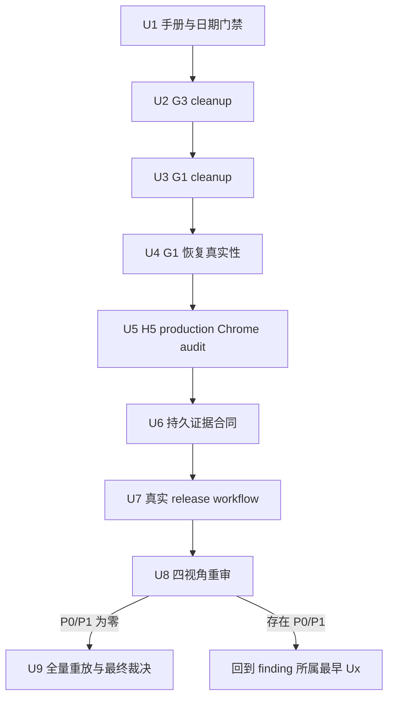

# security: U10 E2EE G4 复审整改与最终收口计划

## Goal Capsule

- **目标：** 收敛 G4.1 四视角独立复审发现，补齐 G1-G3 的可靠性、真实性和证据耐久性缺口，在无未关闭 P0/P1 后重放全量与 live 门禁并作出最终 Go/No-Go 裁决。
- **唯一恢复点：** 从 `U4.1` 开始，执行顺序固定为 `U4 -> U5 -> U6 -> U7 -> U8 -> U9`。
- **当前裁决：** 生产 E2EE 保持 **No-Go**；测试环境保持 `persist/plaintext` 和 `security_review_approved=false`。
- **已完成边界：** N1-N7、U7 P0-1、G1-G3 的既有实现和成功证据不重做；只对 G4.1 重新打开的合同与证据缺口做最小整改。
- **禁止事项：** 不扩展 E2EE API，不修改已有 migration，不触碰 `im-test-1` 旧主数据库，不把本地模拟、源码推断或短期 artifact 冒充生产候选证据。

---

## Execution Console

> 本节是后续会话的唯一进度恢复入口。执行状态只在本节和文末
> `Progress Ledger` 维护；Implementation Units 定义工作合同，不重复记录流水进度。

### 当前状态

| Unit | Status | Closed evidence / Exit gate |
| --- | --- | --- |
| U1.1 恢复手册 | complete | `da3cead2`；stdin archive、隔离 PostgreSQL 17、RCML 合同与真实客户端解密判据已修正 |
| U1.2 日期门禁 | complete | `10f0f724`；32/32 正负测试、workflow 测试与六端扫描通过 |
| U2 G3 cleanup | complete | `22a728f9`；17/17 cleanup/recover 场景、H5 release 21/21、shellcheck 通过 |
| U3 G1 cleanup | complete | `a644fa0f`；25 个 success/failure/signal/recover 场景、硬超时、run lock 与实际状态终验通过 |
| U4 恢复真实性 | **in progress** | 当前唯一 checkpoint 为 `U4.1`；隔离 restore API 上完成 Android/iOS/H5 真实恢复 live 与关键数据 digest |
| U5 H5 Chrome audit | blocked by U4 | production bundle 真实安全存储路径、篡改 fail closed、明文 marker 为零 |
| U6 持久证据 | blocked by U5 | G1/G3 脱敏证据可在干净 checkout 离线校验 |
| U7 Release workflow | blocked by U6 | 当前候选 commit 的真实 workflow 成功，且无 tag/release 副作用 |
| U8 四视角重审 | blocked by U7 | correctness/security/reliability/testing 均为 `P0=0、P1=0` |
| U9 最终重放 | blocked by U8 | 全量、live、环境清理全部通过后才允许最终裁决 |

### U4.1 唯一立即动作

- **先冻结恢复边界：** 设计独立 restore Compose project、数据库 marker、候选 API
  `127.0.0.1:18010` 与 SSH tunnel，不连接旧主 PostgreSQL/Redis。
- **统一 live 入口：** 扩展 `run-e2ee-cross-client-live.sh`，仅在 restore marker、
  container inspect 和数据库身份一致时允许隔离 URL，并实际编排 Android、iOS、H5。
- **真实性场景：** 恢复前历史密文、恢复后新消息三端互解、撤销设备不可读新
  epoch、attachment grant/下载授权，以及关键 E2EE 表 digest 一致。
- **退出断言：** restore API/PostgreSQL/Redis、SSH tunnel 和临时资源全部删除；源库
  连接计数与数据版本不变；主 runtime 仍为 `persist/plaintext`。
- **本单元验证：** 隔离 G1 full drill、三端定向 live、恢复前后 digest、U3 cleanup
  回归及独立 correctness/security/reliability/testing 复核。

### 执行与恢复规则

1. 严格按 `U4 -> U5 -> U6 -> U7 -> U8 -> U9` 串行推进，不并行打开后续单元。
2. 每个单元形成独立最小闭环：实现、定向验证、独立复核、更新本文与任务总账、commit、push。
3. 新发现若属于已完成单元，回到最早受影响单元并更新 `current_unit/current_checkpoint`；禁止另建平行 active 计划。
4. 会话恢复时只读取本文、`docs/reports/task-list.md`、当前单元相关源码和最近提交；历史计划仅在核对原始合同时查阅。
5. 任一失败均保持 **No-Go**；测试环境收尾状态固定为 `persist/plaintext` 和 `security_review_approved=false`。

---

## Product Contract

### Problem Frame

G3 完成后，G4.1 correctness、security、reliability、testing 四个独立视角均判定 `P0=0` 但存在 P1，当前不能进入全量重放。
既有计划把 G1-G3 标记为关闭，但独立复审证明部分关闭结论强于实际证据，且清理脚本、恢复手册和供应链例外门禁存在可复现缺口。
本计划以最早失败 checkpoint 为原则重新打开相关门禁，并把所有剩余工作归并为单一执行链。

### Requirements

- R1. 正式备份恢复手册必须与已验证脚本、当前 schema 和 runtime 配置一致，可由操作人员逐步执行且默认 fail closed。
- R2. G1 演练必须基于远端真实状态清理外部副作用，覆盖 failure、`INT`、`TERM` 和重复清理，并证明不会遗留审批、容器、volume 或停机状态。
- R3. G1 恢复实例必须证明关键 E2EE 数据完整，并按原始 G1 合同验证真实 API/客户端行为；历史密文、新消息、撤销设备和附件授权均不得用源库行为替代。
- R4. G3 候选窗口 cleanup 必须有限重试、best-effort 累计错误、幂等恢复，并在结束前逐项复核 Caddy、候选资源、Admin 和 runtime。
- R5. H5 Chrome 审计必须执行 production bundle 的真实 `E2eeSecureStateStorage` 路径，覆盖真实数据库、AAD、不可导出 wrapping key、密文落盘和 marker 泄漏边界。
- R6. 供应链临时豁免必须严格校验 UTC 日历日期并拒绝非法、不可解析或超出政策允许期限的日期。
- R7. G1/G3 关键机器证据必须形成脱敏、可移交、可校验的持久证据合同，并记录 commit、摘要、工具版本、获取方式和重放入口。
- R8. 真实 `Build Release Artifacts` workflow 必须在当前候选 commit 上运行成功，证明 release job 实际依赖供应链门禁且产物身份绑定正确。
- R9. 只有整改后四视角复审 `P0=0、P1=0`，才允许进入干净基线全量与 live 重放。
- R10. 任一整改、复审、全量、live、CI 或环境清理失败都保持 **No-Go**，不得降低门禁或扩大豁免换取通过。

### Scope Boundaries

- **范围内：** G1-G3 复审缺口、对应脚本和测试、正式安全手册、脱敏证据、真实 release workflow 运行、G4 重审与最终裁决。
- **范围外：** N1-N7 功能重写、新 E2EE API、协议或 migration 变更、U11 可选功能、U13 多平台正式发布。
- **P2 处理：** G1 关键表 digest 覆盖不足并入 R3，不单独阻断当前最小修复提交，但必须在 G1 重新关闭前完成。

### Acceptance Examples

- AE1. cleanup 过程中首次 SSH 失败，脚本有限重试并继续其他清理；最终状态全部干净时成功，否则汇总失败并保持可重入。
- AE2. G1 演练在审批写入、API stop、restore volume 创建等副作用边界收到信号，二次 cleanup 后审批为 false、API 恢复、临时资源为零。
- AE3. 恢复实例连接隔离 API 后，三端可读恢复前历史密文并互发新消息，已撤销设备不能读取新 epoch，附件授权仍按恢复时点生效。
- AE4. production H5 在真实 Chrome 中保存协议状态后，IndexedDB 仅出现密文；wrapping key 不可导出，篡改和 AAD 不匹配 fail closed。
- AE5. `2027-02-31`、`9999-99-99`、过期日期和超政策期限日期均使供应链门禁失败。
- AE6. 新环境可从受控持久位置取得脱敏证据，校验摘要并关联到准确 commit，无需依赖原执行机器的 `.artifacts/`。
- AE7. `Build Release Artifacts` 的真实 CI run 成功，`supply-chain-check` 为实际前置依赖，所有报告与产物绑定同一 commit。

---

## Planning Contract

### Key Technical Decisions

- KTD1. **先修确定缺口，再裁决争议项。** 恢复手册、日期校验、两类 cleanup 和证据耐久性是明确有效缺口；G1 恢复 live 与 G3 production storage 经原始 G1/G3 合同核对后确认属于未满足要求，因此纳入整改，不再沿用“组合证据足够”的旧结论。
- KTD2. **外部状态优先于进程内 flag。** 清理逻辑通过远端实际状态探测决定补偿动作，flag 只作优化，不能成为唯一恢复依据。
- KTD3. **恢复行为在隔离实例验证。** 恢复 API、客户端和存储访问只能指向独立恢复栈；禁止切换或升级旧主数据库。
- KTD4. **真实应用路径优先于能力替身。** Chrome audit 必须调用 production bundle 暴露的受控审计入口或等价真实模块路径，不再自行实现一套 AES/IndexedDB 流程。
- KTD5. **证据内容脱敏但结论可复算。** 持久证据保留断言、计数、摘要、版本和身份绑定，删除 token、私钥、DEK、nonce、消息正文及可复用凭据。
- KTD6. **整改完成后重新执行整个 G4.1。** 旧 reviewer 结论不被局部测试替代；四视角必须从新 HEAD 独立复审。

### Sequence

---

## Implementation Units

### U1. R1 + R6 手册与供应链日期门禁

- **Goal:** 关闭两个可独立验证、无环境副作用的确定缺口；`U1.1` 修复 R1 恢复手册，`U1.2` 修复 R6 日期门禁。
- **Files:** `docs/reference/security/e2ee-backup-recovery.md`、`scripts/supply-chain/evaluate.ts`、`tests/scripts/test-supply-chain-check.sh`。
- **Patterns:** 恢复命令对齐 `deploy/im-test-1/e2ee-backup-rollout-drill.sh`；日期采用严格 UTC 解析、输入往返一致性和政策上限校验。
- **Test Scenarios:** dump 列表校验使用真实文件路径；runtime/audit 查询匹配当前 schema；RCML magic bytes 不触发 UTF-8 转换；合法闰日通过，非法月日、非闰日、过期和超期限日期失败。
- **Verification:** `make supply-chain.test`、`make supply-chain.workflow.test`、文档命令静态核对、`git diff --check`。

### U2. R4 G3 候选窗口幂等清理

- **Goal:** 任何单点 SSH/远端命令失败都不会跳过后续清理，且可显式重入恢复。
- **Files:** `scripts/h5-release-candidate-window.sh`、新增 `tests/scripts/test-h5-release-candidate-window.sh`、`Makefile`。
- **Patterns:** 有界重试、逐项执行并累计失败、远端状态探测、显式 `cleanup`/`recover` 模式、最终状态断言。
- **Test Scenarios:** 首次 SSH 失败后重试成功；某一删除失败但其余动作继续；半完成部署二次恢复；Caddy route/目录/backup/local checksum 任一残留均非零退出；全部清理后重复执行成功。
- **Verification:** 新增 `make h5-app.release.candidate.test`，并执行 `bash -n scripts/h5-release-candidate-window.sh`、`make h5-app.release.test`。

### U3. R2 G1 外部副作用恢复

- **Goal:** 消除进程内 flag 与真实远端状态之间的信号窗口。
- **Files:** `deploy/im-test-1/e2ee-backup-rollout-drill.sh`、新增 `tests/scripts/test-e2ee-backup-rollout-drill.sh`、`Makefile`。
- **Patterns:** 副作用前记录补偿意图，cleanup 按远端状态探测，清理失败不吞错，退出前验证审批、API、容器和 volume。
- **Test Scenarios:** API stop、审批切换、volume 创建和恢复容器创建前后分别注入 failure/`INT`/`TERM`；cleanup 自身部分失败；重复 cleanup；最终审批 false、API 状态正确、临时资源为零。
- **Verification:** 新增 `make e2ee.backup-drill.test`，并执行 `bash -n deploy/im-test-1/e2ee-backup-rollout-drill.sh`、隔离 preflight。

### U4. R3 G1 恢复实例真实性与完整性

- **Goal:** 在独立恢复栈上关闭原始 G1 合同，不复用源库三端 live 结论。
- **Files:** `deploy/im-test-1/e2ee-backup-rollout-drill.sh`、新增 `deploy/im-test-1/docker-compose.e2ee-restore.yml`、`tests/scripts/run-e2ee-cross-client-live.sh`、`tests/scripts/test-e2ee-backup-rollout-drill.sh`、`docs/reviews/2026-08-05-u10-e2ee-backup-rollout-drill.md`。
- **Patterns:** 在远端独立 Compose project/network 中启动 restore PostgreSQL、临时 Redis 和候选 API；候选 API 的 `DATABASE_URL`/Redis 只能指向 restore project，RustFS 沿用同一私有桶以验证恢复后的 attachment grant，远端 API 仅绑定 `127.0.0.1:18010`。本机使用固定 SSH tunnel 映射到 `127.0.0.1:18010`，并通过 live fixture coordination 把恢复 API URL 传给 Android `AndroidE2eeCrossClientLiveTest`、iOS `IOSE2eeCrossClientLiveTests` 和 H5 E2EE live。修改 `run-e2ee-cross-client-live.sh` 的本机 dev-only 守卫：只有 `E2EE_LIVE_ISOLATED_RESTORE=1` 且 restore marker、容器 inspect 和数据库身份三项一致时才允许 `127.0.0.1:18010`，其他非 8010 URL 继续拒绝。该脚本必须实际编排 Android Gradle 定向 live、iOS `swift test --filter IOSE2eeCrossClientLiveTests` 和 H5，而不是只运行 H5。启动后通过容器 inspect、数据库唯一 marker 和源库连接计数自动断言候选 API 未连接源 PostgreSQL/Redis；端口冲突时先停止占用进程，不改用其他端口。
- **Test Scenarios:** 历史密文读取；新消息三端互解；撤销设备不能读取新 epoch；attachment grant/下载授权保持；identity/control receipt/message part 内容摘要一致；损坏 dump 和关键字段漂移 fail closed；结束后恢复栈完全删除。
- **Verification:** 隔离 G1 full 演练、三端 live、恢复前后 digest、资源清理报告；旧主数据库版本和数据不变。

### U5. R5 H5 production 安全存储 Chrome 审计

- **Goal:** 真实候选页面在 Chrome 中执行 production `E2eeSecureStateStorage`，补足浏览器集成证据。
- **Files:** `h5-app/src/e2ee/secure-state-storage.ts`、`h5-app/src/e2ee/direct-message-coordinator.ts`、`h5-app/src/e2ee/session.ts`、`h5-app/scripts/release-browser-audit.ts`、`h5-app/test/e2ee-secure-state-storage.test.ts`、`tests/scripts/test-h5-release-security.ts`。
- **Patterns:** 不新增 production 审计后门、构建开关或替代 AES 实现。复用 U4 隔离 restore project，并在同一受控 Caddy 窗口新增临时 `/h5-candidate-api/*` 与 `/h5-candidate-ws` matcher，分别反代到 restore API HTTP/WS；candidate build 使用同源 HTTPS URL，因此不放宽 CSP/CORS。`security_review_approved=true` 与 `plaintext -> prepare -> active` 只写入 restore 数据库，浏览器验收完成后先恢复该库 `persist/plaintext` 和审批 false，再删除 Caddy matcher 与整个 restore project；旧主 API runtime 前后均须为 `persist/plaintext`，源 PostgreSQL/Redis 连接计数保持零。Chrome audit 使用测试账号通过候选页面的真实登录、E2EE 会话和消息操作触发 production `E2eeSecureStateStorage`，随后检查真实 `redcode-h5-e2ee-state`；篡改场景直接修改该 store 的候选密文并重新加载真实应用验证 fail closed。
- **Test Scenarios:** 真实 `redcode-h5-e2ee-state` 往返；CryptoKey structured clone 后仍不可导出；AAD/密文篡改失败；IndexedDB/local/session/cache/OPFS 无明文 marker；构建产物不存在额外 audit 控制面或固定密钥；Console/Network 无敏感输出。
- **Verification:** `make h5-app.check`、H5 定向 unit、release 正负测试、真实 Caddy/Chrome 候选审计和失败清理。

### U6. R7 持久机器证据合同

- **Goal:** 使 G1/G3 结论能在另一台机器和 artifact 过期后独立核验。
- **Files:** 新增 `docs/reviews/evidence/u10-e2ee/g1-backup-rollout.json`、`docs/reviews/evidence/u10-e2ee/g3-h5-release.json`、`scripts/e2ee-evidence/schema-v1.json`、`scripts/e2ee-evidence/sanitize.ts`、`scripts/e2ee-evidence/verify.ts`、`tests/scripts/test-e2ee-evidence.ts`，并更新 G1/G3 review。
- **Patterns:** 原始报告只写 `.artifacts/`，随后由 `sanitize.ts` 按 `schema-v1.json` 白名单生成两份可提交证据；仓库 Git 历史是长期 retention 合同，不依赖 GitHub artifact 保留期。证据文件记录 `subject_commit`（被验收候选），对应 review 在证据提交完成后的独立文档 commit 中记录 `evidence_commit`，避免文件自引用 commit。证据仅保留断言、计数、摘要、工具版本和时间，不保留 token、账号凭据、私钥、DEK、nonce、正文、主机密钥或可复用 URL。`verify.ts` 在全新 checkout 中离线验证 schema、敏感 marker、`subject_commit` 可达性和文件 SHA-256；G1/G3 报告直接引用仓库相对路径、摘要和 `evidence_commit`。
- **Test Scenarios:** 敏感 marker 扫描为零；证据 schema 校验通过；任一字段篡改导致摘要失败；全新 checkout 可取得并校验证据；缺失证据时门禁失败。
- **Verification:** G1/G3 证据生成与校验测试、敏感信息扫描、从干净临时目录重放校验。

### U7. R8 真实 release workflow 证明

- **Goal:** 证明 release pipeline 运行时无法绕过供应链门禁，且产物绑定当前候选 commit。
- **Files:** `.github/workflows/release-artifacts.yml`、`tests/scripts/test-supply-chain-workflows.ts`、`docs/reviews/2026-08-06-u10-e2ee-supply-chain-review.md`；仅在真实运行暴露问题时修改 workflow。
- **Patterns:** 固定从干净且已 push、`HEAD_SHA == origin/main` 的候选执行 `gh workflow run release-artifacts.yml --ref main -f publish_release=false`，等待对应 run 完成后校验 `headSha == HEAD_SHA`、event 为 `workflow_dispatch`、`supply-chain-check` 与所有构建 job 成功；执行前后断言没有新增 tag 或 GitHub Release。保存 run id、job 依赖结果和 artifact 摘要。
- **Test Scenarios:** `supply-chain-check` 成功后 release jobs 执行；门禁失败的静态/fixture 合同阻断下游；所有 artifact provenance 指向同一 commit；不发布 release、不上传凭据。
- **Verification:** `make supply-chain.workflow.test`、`gh run watch <run-id> --exit-status`、`gh run view <run-id> --json headSha,event,jobs,conclusion`、artifact 身份与摘要核对、tag/release 差集为空。

### U8. G4.1 四视角重新复审

- **Goal:** 从整改后的同一 HEAD 独立复审 correctness、security、reliability、testing。
- **Files:** `docs/reviews/` 新增 G4.1 复审记录、本文进度字段、`docs/reports/task-list.md`。
- **Test Scenarios:** 每个 R1-R8 均有文件、测试、运行时或 CI 证据；四份结论可定位到相同 commit；重复 finding 去重但不降级；任一 P0/P1 重新打开所属最早单元。
- **Verification:** 四视角均为 `P0=0、P1=0`，工作区干净，runtime 为 `persist/plaintext`，否则禁止 U9。

### U9. 全量重放与最终裁决

- **Goal:** 在干净基线完成全量、本地 live、远端状态和 CI 终验，形成唯一最终裁决。
- **Files:** 本计划、U7 review、最终 G4 review、`docs/reports/task-list.md`。
- **Test Scenarios:** 六端供应链、API、core 四目标、Android、iOS、H5、`test.all`、`test.live` 全部通过；临时账号、容器、volume、浏览器 profile、候选目录和凭据全部清理；旧主数据库未触碰。
- **Verification:** 按 Verification Contract 执行；仅所有 DoD 满足才允许 Go，否则记录唯一失败 checkpoint 并保持 No-Go。

---

## Verification Contract

| Gate | Command / Evidence | Applies to | Pass condition |
| --- | --- | --- | --- |
| Supply chain | `make supply-chain.check && make supply-chain.test && make supply-chain.workflow.test` | U1, U7, U9 | 六端门禁、负向场景和 workflow 依赖全部通过 |
| G3 release | `make h5-app.release.test` + 真实 Caddy/Chrome 候选审计 | U2, U5, U6 | production storage、响应头、泄漏和 cleanup 全部通过 |
| G1 recovery | 隔离 full drill + failure/`INT`/`TERM` tests | U3, U4, U6 | 恢复行为正确，副作用和资源清零 |
| API | `make api.test` | U9 | Compose 测试通过 |
| Core | `make e2ee-core.check && make e2ee-core.check.targets` | U9 | host 与四目标构建通过 |
| Android | `JAVA_HOME=/Users/chen/Library/Java/JavaVirtualMachines/azul-21.0.10/Contents/Home make android-app.test` | U4, U9 | JDK21 测试通过 |
| iOS | `make ios-app.test` | U4, U9 | Swift tests 通过，live skip 单独记录 |
| H5 | `make h5-app.check` | U5, U9 | type-check、unit 与构建通过 |
| Full | `JAVA_HOME=/Users/chen/Library/Java/JavaVirtualMachines/azul-21.0.10/Contents/Home make test.all` | U9 | 自包含全量回归通过 |
| Live | `JAVA_HOME=/Users/chen/Library/Java/JavaVirtualMachines/azul-21.0.10/Contents/Home make test.live` | U9 | 原生双端、H5、API 和 Admin live 通过 |
| Environment | runtime、Caddy、Admin、候选资源、restore 资源和旧主库核对 | U2-U9 | `persist/plaintext`、审批 false、无临时资源、旧主库未触碰 |

每个 implementation unit 必须形成最小可解释闭环，先执行 `git status --short`、对应测试、`git diff --check`、`git diff --cached --check` 和 staged diff 审查，再独立 commit 并立即 push。

---

## Definition of Done

- D1. 本文是唯一 active U10 E2EE 计划，旧计划和任务总账只指向本文。
- D2. 正式恢复手册可执行，供应链非法日期全部 fail closed。
- D3. G1/G3 cleanup 覆盖失败与信号边界，可幂等恢复且无外部副作用残留。
- D4. 独立恢复实例上的数据完整性、三端行为、撤销设备和附件授权全部通过。
- D5. 真实 production H5 安全存储在 Chrome 候选环境中通过，明文和密钥 marker 为零。
- D6. G1/G3 脱敏机器证据可跨机器取得、校验和关联到准确 commit。
- D7. 真实 `Build Release Artifacts` workflow 在候选 commit 上成功且未绕过供应链门禁。
- D8. 整改后 G4.1 四视角复审为 `P0=0、P1=0`。
- D9. 干净基线全量与 live 门禁通过，临时资源和凭据已清理，runtime 保持 `persist/plaintext`，旧主数据库未触碰。
- D10. 所有单元均按最小闭环提交并 push；仅 D1-D9 全部满足才允许生产 E2EE Go。

---

## Appendix

### Progress Ledger

| Phase | Status | Evidence / Next checkpoint |
| --- | --- | --- |
| N1-N7 / U7 P0-1 | complete | 原生双端、H5 和跨端 live 历史证据保持有效 |
| G1 / U7 P0-2 | reopened | G4.1 发现恢复实例 live、cleanup 和持久证据缺口 |
| G2 / U7 P0-3 | reopened-partial | 扫描门禁有效；日期校验和真实 release workflow 待关闭 |
| G3 / U7 P0-4 | reopened | G4.1 发现 production storage Chrome audit、cleanup 和持久证据缺口 |
| G4.1 | failed | 四视角均存在 P1，当前不可进入原 G4.2 |
| U1 | complete | `da3cead2` 修复恢复手册；`10f0f724` 严格限制豁免日期；32 个正负场景、workflow 与六端扫描通过 |
| U2 | complete | `22a728f9` 增加有限重试、硬超时、显式 recover、状态验证与 17 个 cleanup/recover 场景 |
| U3 | complete | `a644fa0f`：实际状态驱动 cleanup、持久审批补偿、硬超时、并发锁及 25 个边界场景通过 |
| Current | active | `U4.1`：G1 隔离恢复实例真实性与完整性 |

### Supersession Map

| Document | Status | Purpose |
| --- | --- | --- |
| `docs/plans/2026-08-04-002-feat-u10-e2ee-remaining-work-plan.md` | superseded | 产品契约与服务端边界来源 |
| `docs/plans/2026-08-05-u10-e2ee-native-clients-plan.md` 及其收口计划 | complete/superseded | N1-N7 历史实现与验收 |
| `docs/plans/2026-08-06-u10-e2ee-release-gate-final-plan.md` | superseded | G2/G3 设计与完成历史 |
| `docs/plans/2026-08-06-u10-e2ee-g3-g4-closure-plan.md` | superseded | G3 完成与首次 G4.1 复审入口 |
| 本文 | active | 唯一整改、重审、全量重放与裁决入口 |
