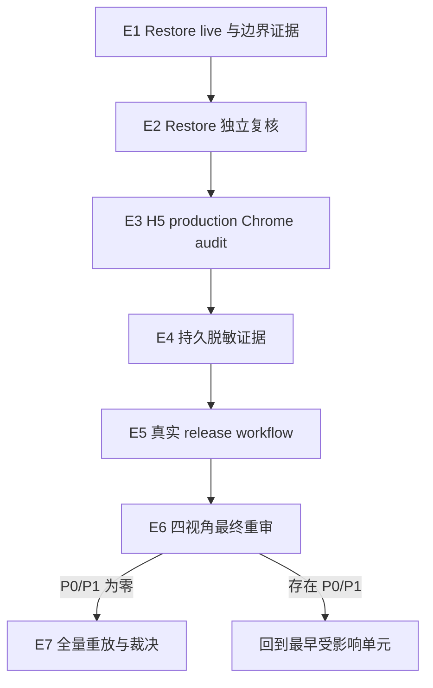

# security: U10 E2EE 剩余收口执行计划

## Goal Capsule

- **目标：** 从已验证的 G4 整改基线继续完成恢复真实性、H5 production 安全存储、持久证据、真实 release workflow、独立复审和最终重放。
- **唯一恢复点：** `E5.1`，冻结已 push 的候选 HEAD、tag/Release 前态和 workflow 输入，手工触发 `Build Release Artifacts` 且 `publish_release=false`。
- **固定顺序：** `E1 -> E2 -> E3 -> E4 -> E5 -> E6 -> E7`，不得并行打开后续单元。
- **当前裁决：** 生产 E2EE 保持 **No-Go**；`im-test-1` 旧主必须保持 `persist/plaintext` 和 `security_review_approved=false`。
- **权威层级：** 当前源码与 live 运行结果 > 本文进度快照 > 历史 review > 历史计划。产品范围仍以 `docs/plans/2026-08-04-002-feat-u10-e2ee-remaining-work-plan.md` 为准。
- **尾部责任：** 每个单元完成实现、验证、review、最小 commit 和 push 后，才推进本文 checkpoint。

---

## Product Contract

### Problem Frame

原生 N1-N7 与首轮 G1-G3 已实现，但 G4.1 独立复审重新打开了恢复实例真实性、H5 production 安全存储、证据耐久性和真实 release workflow 证明。历史计划数量较多且编号重叠，容易把“功能测试通过”“整改代码在制”和“门禁完整关闭”混为一谈。本文只管理尚未关闭的发布门禁，并把历史设计文档降级为参考资料。

### Requirements

- R1. 独立 restore 栈必须证明备份前后关键 E2EE 数据一致，并在 restore API 上完成 Android、iOS、H5、撤销设备、群 epoch 和加密附件 live 验收。
- R2. DB、Redis、API log、Push 和 RustFS 的边界证据必须来自同一 live run；明文 marker 不得落入持久化边界，缺失观测不得伪装为通过。
- R3. H5 候选页面必须通过 production `E2eeSecureStateStorage` 真实路径验证，不得使用替代 AES/IndexedDB 实现冒充应用行为。
- R4. G1/G3 机器证据必须脱敏、可提交、可离线校验，并绑定准确的 subject commit 与摘要。
- R5. `Build Release Artifacts` 必须在已 push 的候选 commit 上真实运行成功，供应链门禁不能被绕过，且不得创建 tag 或 Release。
- R6. 整改后的同一 HEAD 必须由 correctness、security、reliability、testing 四个独立上下文复审，`P0=0、P1=0` 才能进入最终重放。
- R7. 最终全量、live、环境清理和证据核对全部通过后才能重新裁决；任何失败都保持 **No-Go**。

### Scope Boundaries

- **范围内：** 原 G4 整改计划的 U4.3-U9，以及对应脚本、测试、review 和脱敏证据。
- **已完成且不重做：** 原生 N1-N7、U7 P0-1、U1 手册与日期门禁、U2 G3 cleanup、U3 G1 cleanup、U4.1 隔离基础设施、U4.2 candidate 到 restore 切换。
- **范围外：** 新 E2EE API、协议扩展、已有 migration 修改、U11 可选功能、U13 多平台正式发布。
- **环境红线：** 不升级、不停止、不写入 `im-test-1` 旧主数据库；不覆盖远端 `.env`；不对旧主 Compose 执行 `stop`、`down` 或 `update`。

### Acceptance Examples

- AE1. candidate 与 restore snapshot 的计数和 digest 完全一致；任一关键表漂移立即 fail closed。
- AE2. 三端 live 功能场景通过，但 Redis MONITOR 没有 evidence room 流量时，整个 E1 仍失败且统一 cleanup。
- AE3. H5 production store 的密文或 AAD 被篡改后，真实应用恢复失败且不降级读取明文。
- AE4. 从干净 checkout 可离线验证持久证据；篡改任一摘要或缺失必需字段均失败。
- AE5. 四视角任一复审发现 P0/P1，恢复到 finding 所属最早单元，不进入最终重放。

---

## Planning Contract

### Current Verified Baseline

| 范围 | 状态 | 已推送证据 |
| --- | --- | --- |
| U1 恢复手册与日期门禁 | complete | `da3cead2`、`10f0f724` |
| U2 G3 cleanup | complete | `22a728f9` |
| U3 G1 cleanup | complete | `a644fa0f` |
| U4.1 隔离 restore 基础设施 | complete | `31b13d37`、`fe954a77`、`df85231b` |
| U4.2 恢复窗口切换 | complete | `3f83bdc9`；run `u4restore3f83bdc9` |
| 进度文档同步 | complete | `1f2f7bb8` |
| E1.1 首轮 restore 实现与重放 | implemented, review-reopened | `d420aa51`；run `e1full20260806h` |
| E2 首轮四视角复核 | failed | P0=0；存在去重后 9 项 P1/P2 finding，已退回 E1.2 |
| E1.2 finding 整改与重放 | complete | `cab9cbd6`；run `e1fix20260806b` |
| E2 第二轮四视角复核 | failed | `6d3afaac` HEAD；P0=0，去重后 5 项 P1，已退回 E1.3 |
| E1.3 第二轮 finding 整改 | complete | `d385c88b`；最终 run `e1fix20260806g`；预审 P0/P1/P2=0 |
| E2 第三轮四视角复核 | complete | subject `aa605931`；四视角均 P0/P1/P2=0 |

### Status And Resume Rules

- 本文是 U10 E2EE 唯一 `active` 执行计划；其他 U10 E2EE plan 仅用于追溯产品
  合同、历史设计和已完成证据，不得承载新的 checkpoint。
- 恢复执行时只读取 frontmatter、Execution Console、当前 Implementation Unit 和
  Resume Snapshot；历史 finding 仅在回归失败或审计追溯时读取。
- `current_unit` 与 `current_checkpoint` 是唯一恢复游标。单元完成测试、review、
  commit、push 且 `HEAD == origin/main` 后，才能更新到下一个 checkpoint。
- review 文档记录事实，`docs/reports/task-list.md` 只做项目级索引；二者不得反向
  覆盖本文状态。
- 当前恢复命令：先执行 `git status --short`，确认无未解释改动，再从 `E5.1`
  开始；禁止重做 E1/E2。

### Execution Console

本文是 U10 E2EE 剩余工作的唯一状态入口。历史 plan、review 和 task list 不得用
旧 checkpoint 覆盖本表。

| Unit | Status | Exit / rollback condition |
| --- | --- | --- |
| E1.1 首轮 restore 数据边界 | review-reopened | 实现和 live run 已推送，但 E2 finding 未清零，不能视为 closed |
| E1.2 复核 finding 整改 | complete | `cab9cbd6`；本地门禁与 run `e1fix20260806b` 通过，已 push |
| E1.3 第二轮 finding 整改 | complete | `d385c88b` 已验证并 push；run `e1fix20260806g` 与环境终验通过 |
| E2 Restore 独立复核 | complete | subject `aa605931`；correctness/security/reliability/testing 均 P0/P1/P2=0 |
| E3 H5 production Chrome 审计 | complete | subject `f6944a70`；run `e3prod20260806f`、browser evidence 与环境终验通过 |
| E4 持久脱敏证据 | complete | evidence commit `a383f788`；两份证据、13 类负向测试和干净 detached worktree 离线复验通过 |
| E5 真实 release workflow | in_progress | E5.1 冻结候选 HEAD 与 GitHub 前态，使用 `publish_release=false` 触发真实 workflow |
| E6 最终四视角重审 | pending | E5 通过后开始 |
| E7 全量重放与最终裁决 | pending | E6 为 P0=0、P1=0 后开始 |

### E1.1 Verified But Reopened Evidence

E1.1 已完成实现、定向测试和真实 restore full-suite 重放，涉及：

- `scripts/e2ee-restore-live-window.sh`
- `deploy/im-test-1/e2ee-restore-control.sh`
- `deploy/im-test-1/e2ee-restore-window-control.sh`
- `deploy/im-test-1/e2ee-restore-boundary-scan.sh`
- `deploy/im-test-1/e2ee-restore-snapshot.sql`
- `tests/scripts/test-e2ee-restore-control.sh`
- `tests/scripts/test-e2ee-restore-live-window.sh`
- `tests/scripts/test-e2ee-restore-window-control.sh`
- `tests/scripts/test-e2ee-restore-boundary-scan.sh`
- `Makefile`

最终 run `e1full20260806h` 证明 candidate/restore snapshot 完全一致，restore full
suite 为 `6 passed | 1 skipped`，Android/iOS/H5 两两互解、附件、重启恢复、连续
会话、群成员变化和第二设备撤销场景通过。DB/Redis/API log/RustFS 均为
ciphertext/marker-free；Push 明确记录 `not-observed-live`。结束后 container、volume、
owner、artifact、MONITOR、tunnel 和 `18010` 全部清零，旧主保持
`persist/plaintext`。详细证据见
`docs/reviews/2026-08-05-u10-e2ee-backup-rollout-drill.md`。

这些结果证明首轮功能链和清理链可运行，但不关闭 E1。E2 首轮独立复核发现证据
归属、扫描覆盖与观测时序仍不足，因此 E1 状态为 `review-reopened`。

### E2 First Review Findings

四视角首轮结果：correctness `P0=0/P1=3`、security `P0=0/P1=2`、
reliability `P0=0/P1=2`、testing `P0=0/P1=3/P2=1`。去重后的整改合同为：

1. snapshot digest 必须覆盖关键表完整持久行，不能遗漏身份、状态、有效期、回执时间或附件租约字段。
2. Redis MONITOR 与 API log 观测必须覆盖恢复连续性阶段，不得在关键流量之后才启动。
3. evidence 必须逐条绑定 scenario、room、message、marker 和 attachment object，禁止拼接无关实体。
4. control envelope 必须扫描原始 `bytea`，不能先 hex 后用 ASCII marker 搜索。
5. `messages.encrypted_content` 必须按原始 `bytea` 扫描明文 marker。
6. Redis 必须证明精确 `PUBLISH room:<uuid>`，SUBSCRIBE 或普通 payload 中出现 room id 不得冒充发布证据。
7. 每个 marker 必须有对应 message/object 的逐实体 proof，并验证 message-room、object-message-room 归属。
8. 顶层必须校验 boundary report 的 run id，Push 结果只允许合同枚举值。
9. source isolation 不能只依赖瞬时连接快照；在 E1.2 评估并补充覆盖完整窗口的证据或明确可验证替代门禁。

### E1.2 Closure Evidence

整改提交 `cab9cbd6` 已推送，完成：

- `h5-app/test/e2ee-live-backend.test.ts`：evidence 改为逐消息 `message_proofs`，增加 `restore-continuity` scenario。
- `scripts/e2ee-restore-live-window.sh`：提前启动 MONITOR，合并四个 scenario，增加 boundary run id 与 Push 枚举校验。
- `deploy/im-test-1/e2ee-restore-snapshot.sql`：关键表改为完整行摘要。

本地 restore 六项门禁与 H5 type-check 通过。真实 run `e1fix20260806b` 的
candidate/restore 完整行 digest 同为 `e9c04e4739ec8d9a961e998b6d2470ad`，full
suite `6 passed | 1 skipped`，36 次 source isolation 采样均为零连接；DB、Redis、
API log、RustFS 通过，Push 为 `not-observed-live`。退出后临时 container、volume、
MONITOR、artifact、state、tunnel 和端口均清零，旧主保持 `persist/plaintext`、审批
false。该 run 是 E1.2 的有效历史基线，但第二轮 E2 已再次发现证明缺口，不能继续
作为 E1 最终关闭证据。

### E2 Second Review Findings And E1.3 Contract

第二轮 E2 使用四个全新独立上下文复核 `6d3afaac`，四个视角均未通过。P0 为零，
去重后的 5 项 P1 必须全部在 E1.3 关闭：

1. 附件 proof 必须同时证明 message-room、object-room 和 object-message，不允许同房间内对象与无关消息拼接。
2. proof 必须把 message id、marker、ciphertext digest、kind 与 object key 绑定到同一不可替换认证值；仅格式合法的 marker 不构成归属证据。
3. source isolation 必须由完整窗口内不可达的网络拓扑保证，不能以 3-5 秒离散连接采样证明没有短连接。
4. 所有关联 Push 记录必须逐条满足占位合同，不能因其中一行包含占位文本而让混合结果整体通过。
5. Redis MONITOR 必须在扫描时仍存活；提前退出时禁止复用旧日志形成通过结果。

另有 1 项 P2 留待 E1.3 评估：candidate 恢复前消息是否需要纳入独立 Redis/API log
观测窗口。若不纳入，必须在 review 中说明其证据归属和不削弱 R2 的理由。

E1.3 已按以下方向完成实现、验证、预审、commit 和 push：

- 逐消息 proof 增加 ciphertext SHA-256 与 run-scoped HMAC，scanner 使用同 run 的 `0600` key 文件验签，并和 PostgreSQL 原始密文摘要精确比对。
- 附件由可信 H5 `sendAttachment` runtime 产生 message/object/ciphertext tuple，临时 HMAC 防止合并与传输阶段替换；scanner 分别验证 DB message/ciphertext/room 和 commit/object/room。`SendEncryptedMessagePayload` 只持久化占位 text part，object key 位于 MLS 密文内，不虚构 `message_parts` 关联或扩展服务端契约。
- Push 改为逐行校验固定 `content` / `preview` 占位；Redis scan 前强制检查 MONITOR 进程存活。
- source API 不再接入 `im-test-1-network`；每个 run 使用 internal storage network、internal restore network 和独立 ingress bridge。旧主 RustFS 仅临时加入 storage network，cleanup 按 ownership label 回收两个 run-scoped network。

E1.3 固定执行切片：

1. **E1.3a 合同测试同步：** 完成 compose/control fixture 对 storage + ingress 双网络、精确 network keys、ownership 拒删和双网络 cleanup 的覆盖。
2. **E1.3b 本地门禁：** 运行 restore 六项脚本测试、cross-client isolated test、H5 type-check；修复任何网络验证和 fail-closed 回归。
3. **E1.3c 真实重放：** 使用固定镜像 `redcode-im-api:g1-74d1231e`、新 run id 与 JDK21 执行 full-suite；不得复用 `e1fix20260806b` 作为新实现证据。
4. **E1.3d 环境终验：** API network 不含 `im-test-1-network`；storage/ingress/restore network、HMAC key、container、volume、MONITOR、tunnel 和 `18010` 全部清零；旧主仍为 `persist/plaintext`、审批 false。
5. **E1.3e 文档与交付：** 更新 restore review、本文和任务总账，执行 diff 门禁，形成最小 commit 并 push；只有 `HEAD == origin/main` 后才允许启动全新 E2 reviewer。

E1.3 最终证据：

- 实现提交 `d385c88b` 已推送；两位独立预审复核为 `P0=0、P1=0、P2=0`，但不计入 E2。
- 本地 restore 六项目标、H5 type-check、Bash syntax 与 diff check 通过；control 9 个网络/cleanup 场景、boundary 22 个 proof/Push/MONITOR 场景通过。
- 最终真实 run `e1fix20260806g`：candidate/restore digest 均为 `2c34ac950bee5a780988321a518d589d`，full suite `6 passed | 1 skipped`，post-live digest `7ddaf28817c8a97e7648a08e8a4d6e26`。
- DB/Redis/API log/RustFS 均通过；Push 为 `not-observed-live`；RustFS SHA-256 为 `98a5247b56dcf90bcc8acbb9f491f82a2974aa570e8d0e305813d37c1846d206`。
- run-scoped container、volume、network、state、HMAC key、MONITOR、tunnel 与 `18010` 全部清零；旧主保持 `persist/plaintext` 且未升级、停止或写入。

第二轮 P2 的处置边界：candidate 恢复前消息以持久密文进入同 run candidate
snapshot，并在 restore snapshot、恢复后 history 解密和 restore DB marker 扫描中再次
验证。Redis MONITOR 与 API log 窗口从 restore API 启动后覆盖恢复连续性后半段和
full suite，不声称倒推覆盖已停止 candidate 的瞬时流量。R2 的同 run 持久边界与
restore 运行边界均有直接证据，因此不扩展为第二套 candidate MONITOR。

### Key Technical Decisions

- KTD1. **新编号只表示剩余执行链。** E1-E7 映射原 U4.3-U9，避免与历史 N/U/G 编号冲突；产品合同不变。
- KTD2. **功能成功不等于门禁关闭。** 单元只有在行为、边界证据、失败清理、定向测试、review、commit 和 push 全部完成后才关闭。
- KTD3. **同一 run 形成证据闭环。** snapshot、live、Redis MONITOR、DB/log/Push/RustFS 扫描必须共享 run id 与 evidence rooms，禁止拼接不同运行结果。
- KTD4. **外部状态优先。** cleanup 和最终验收以远端实际 container、volume、owner、端口、runtime 和连接状态为准，不依赖进程内 flag。
- KTD5. **独立复审不可内联替代。** E2 与 E6 的四视角复核必须来自独立上下文；当前执行上下文的自审只能作为预审。
- KTD6. **No-Go 是默认状态。** 只有 E7 全部 DoD 成立后才允许重新讨论 Go；测试成功不自动改变生产裁决。

### Sequence



---

## Implementation Units

### E1. Restore 三端 live 与数据边界（原 U4.3）

- **Goal:** 关闭独立恢复实例的数据完整性、真实客户端行为和外围泄漏边界。
- **Requirements:** R1、R2；覆盖 AE1、AE2。
- **Files:** 当前 worktree 中的 9 个 E1.3 脚本与测试文件；完成后更新 `docs/reviews/2026-08-05-u10-e2ee-backup-rollout-drill.md`。
- **Approach:** E1.1/E1.2 保留为已验证历史基线；E1.3 按第二轮 finding 增加认证绑定、完整附件归属、逐行 Push、MONITOR 活性门禁和网络级 source isolation。随后使用固定候选镜像 `redcode-im-api:g1-74d1231e`、新 run id 与 JDK21 重跑同一隔离窗口。scanner 必须验证 DB ciphertext-only、精确 Redis PUBLISH、API log marker-free、Push 明确枚举结果，以及 RustFS object ciphertext-only、实体归属与 SHA-256。
- **Test Scenarios:** 四个 scenario 与逐消息 proof；message-room/object-room 错配；重复 ID/room/marker；control envelope 与 encrypted_content marker；仅 SUBSCRIBE/普通 payload 含 room id；MONITOR ready 但无精确 PUBLISH；snapshot 漂移；boundary run id/Push 非法；任一失败和信号路径资源清零。
- **Verification:** `make e2ee.restore-compose.test e2ee.restore-control.test e2ee.restore-window.test e2ee.restore-boundary.test e2ee.restore-live.test e2ee.cross-client.isolated.test`；`cd h5-app && bun run type-check`；真实 full-suite run；远端旧主与临时资源终验。
- **Exit:** boundary report 完整通过、review 更新、最小 commit 已 push，checkpoint 才能进入 E2。

### E2. Restore 整改独立复核（原 U4.4）

- **Goal:** 由独立上下文确认 E1 没有用测试编排掩盖真实性、权限、可靠性或覆盖缺口。
- **Requirements:** R1、R2、R6。
- **Files:** E1 diff、E1 review、`docs/reviews/` 下新增 restore 复核记录。
- **Approach:** 首轮复核退回 E1.2，第二轮复核又退回 E1.3。E1.3 闭环推送后，必须再次新建四个独立上下文分别执行 correctness、security、reliability、testing 审查；前两轮 reviewer 结论和当前实现上下文不得复用为通过证据。发现 P0/P1 再次回到最早受影响单元。
- **Test Scenarios:** cleanup 中断、错误 source、伪造 marker、空 evidence、重复帧、损坏 snapshot、敏感值进入报告。
- **Verification:** 四份结论均为 `P0=0、P1=0`，工作区和远端环境干净。

### E3. H5 Production 安全存储 Chrome 审计（原 U5）

- **Goal:** 在真实候选页面验证 production `E2eeSecureStateStorage` 和浏览器存储边界。
- **Requirements:** R3；覆盖 AE3。
- **Files:** `h5-app/src/e2ee/secure-state-storage.ts`、`h5-app/src/e2ee/direct-message-coordinator.ts`、`h5-app/src/e2ee/session.ts`、`h5-app/scripts/release-browser-audit.ts`、相关 H5/release tests 与 review。
- **Approach:** 复用隔离 restore 栈和受控 Caddy 窗口，通过真实登录、会话和消息路径触发 production store；不增加 production 审计后门或替代加密实现。
- **Test Scenarios:** 密文往返、不可导出 wrapping key、AAD/密文篡改 fail closed、IndexedDB/local/session/cache/OPFS marker 为零、Console/Network 无敏感输出、失败清理。
- **Verification:** `make h5-app.check`、`make h5-app.release.test`、真实 headed Chrome 候选审计、环境终验。

#### E3 Checkpoints

| Checkpoint | Status | Evidence / exit condition |
| --- | --- | --- |
| E3.1 production 路径与审计合同 | complete | `596a9b0a`、`f5ab4bbe`、`3faccae6` 已推送；H5 `48 passed / 4 skipped`、`266 passed / 13 skipped`，release security 21 场景、browser audit 20 个 mutation、cleanup 17 场景、restore control 13 场景、restore live 8 场景、isolated guard 3 场景、Chrome SIGTERM 退出 143，`vue-tsc --noEmit` 与 Bash syntax 通过；两路独立预审均为 `P0=0/P1=0/P2=0` |
| E3.2 隔离 runtime 与真实 Chrome run | complete | `1306da0c`、`e6711f3a`、`ea03a917`、`f6944a70` 已推送；run `e3prod20260806f` 完整通过 |
| E3.3 review 与状态交付 | complete | `docs/reviews/2026-08-06-u10-e2ee-h5-production-secure-state-review.md` 记录 evidence、失败闭环和环境终验；E4.1 后续已承接并关闭 |

#### E3.2 Failure History And Closure

- run `e3prod20260806a` 在创建资源前失败：脚本误用 `/srv/redcode-im/deploy/im-test-1/.env`，远端实际仓库位于 `/root/redcode-im`；已由 `3faccae6` 修复。
- run `e3prod20260806b` 已创建隔离 PG/Redis/API、执行 migration，并通过 SQL 设置 `persist/e2ee`、gate `active`、approval true；API force recreate 后 `verify` 返回“restore API runtime 不是 persist/e2ee”。cleanup 已执行，未进入 Caddy/Chrome 阶段。
- 恢复执行前先核对该 run 的 container、volume、network 已清零，并确认旧主 `/settings/general` 仍为 `persist/plaintext`；若不满足，先只做 run-scoped cleanup 和只读核验。
- 调查顺序固定为：首次 API migration 后查询 DB -> SQL update 后查询 DB -> API force recreate 后再次查询 DB -> 请求 restore `/settings/general`。一次只改变一个阶段，判断是启动同步覆盖、读取路径/缓存还是环境默认值造成漂移。
- 若 API 启动会合法地同步配置，调整隔离 `prepare-empty` 的启动环境或执行顺序；不得扩展服务端契约、修改已有 migration、删除 runtime verify，或写入旧主数据库。
- 修复必须增加覆盖“API restart 后 runtime 保持 `persist/e2ee`”的 `prepare-empty` 回归测试。测试、review、commit、push 后使用新 run id 从新 HEAD 重建 release candidate，不复用失败 run 或旧构建作为通过证据。
- 成功退出要求：production store 双 BrowserContext 往返、不可导出 key、AAD tamper fail closed、浏览器与传输边界扫描、WS frame 观测、signal cleanup 全部通过；candidate/Caddy/run-scoped 远端资源和 `18010` 清零；旧主 schema digest 不变、gate table 仍 absent、runtime 仍为 `persist/plaintext`。

### E4. 持久脱敏证据合同（原 U6）

- **Goal:** 让 G1/G3 结论在新机器和 artifact 过期后仍可验证。
- **Requirements:** R4；覆盖 AE4。
- **Files:** `docs/reviews/evidence/u10-e2ee/`、`scripts/e2ee-evidence/`、`tests/scripts/test-e2ee-evidence.ts` 及 G1/G3 review。
- **Approach:** 原始报告留在 `.artifacts/`；白名单生成可提交 JSON，只保留断言、计数、摘要、工具版本和 commit 身份。
- **Test Scenarios:** schema 错误、敏感 marker、摘要篡改、subject commit 不可达、证据缺失、干净 checkout 离线验证。
- **Verification:** 证据测试与敏感信息扫描通过，干净临时 checkout 可复验。

#### E4 Closure Evidence

- evidence commit `a383f788ee310211c60b137d16a4d75858520785` 已推送，G1/G3 subject 分别绑定真实运行代码 `d385c88b` 与 `f6944a70`。
- `make e2ee.evidence.verify e2ee.evidence.test` 在主工作区与 detached clean worktree 均通过；验证不读取 `.artifacts/` 或远端服务。
- 13 类生成/篡改/敏感/schema/缺失/不可达/语义负例均 fail closed；原始实体 ID、marker、HMAC、object key、URL 和日志未进入 committed evidence。
- review：`docs/reviews/2026-08-06-u10-e2ee-persistent-evidence-review.md`。

### E5. 真实 Release Workflow 证明（原 U7）

- **Goal:** 证明发布流水线实际依赖供应链门禁且产物绑定候选 commit。
- **Requirements:** R5；覆盖 AE5 的前置条件。
- **Files:** `.github/workflows/release-artifacts.yml`、`tests/scripts/test-supply-chain-workflows.ts`、`docs/reviews/2026-08-06-u10-e2ee-supply-chain-review.md`；只有真实 run 暴露问题时才修改 workflow。
- **Approach:** 从干净且已 push、`HEAD == origin/main` 的 commit 手工触发 `publish_release=false`，核对 head SHA、event、job dependencies、artifact identity，以及执行前后 tag/Release 差集。
- **Test Scenarios:** 供应链门禁成功后下游运行；fixture 中门禁失败阻断下游；无 tag/Release 副作用；产物身份一致。
- **Verification:** `make supply-chain.workflow.test` 和真实 GitHub Actions run 成功。

### E6. G4 四视角最终重审（原 U8）

- **Goal:** 在同一候选 HEAD 上独立复审全部整改和发布证据。
- **Requirements:** R6；覆盖 AE5。
- **Files:** `docs/reviews/` 新增最终 G4 复审记录、本文和 `docs/reports/task-list.md`。
- **Approach:** correctness、security、reliability、testing 使用独立上下文；finding 按最早所属单元回退，不降级、不合并隐藏。
- **Test Scenarios:** R1-R5 逐项可追溯；四份结论绑定同一 commit；环境保持 plaintext；任一 P0/P1 阻断 E7。
- **Verification:** 四视角均为 `P0=0、P1=0`。

### E7. 干净基线重放与最终裁决（原 U9）

- **Goal:** 完成全量、本地 live、远端环境与 CI 终验，形成唯一 Go/No-Go 记录。
- **Requirements:** R7。
- **Files:** 最终 G4/U7 review、本文、`docs/reports/task-list.md`。
- **Approach:** 从干净 checkout 重放全部门禁；任何失败记录唯一 checkpoint 并保持 No-Go，不通过降低门禁换取成功。
- **Test Scenarios:** 六端供应链、API、core、Android、iOS、H5、`test.all`、`test.live`、临时资源清理和旧主未触碰。
- **Verification:** 执行下方 Verification Contract；所有证据绑定同一候选 commit。

---

## Verification Contract

| Gate | Command / Evidence | Unit | Pass condition |
| --- | --- | --- | --- |
| Restore scripts | `make e2ee.restore-compose.test e2ee.restore-control.test e2ee.restore-window.test e2ee.restore-boundary.test e2ee.restore-live.test e2ee.cross-client.isolated.test` | E1 | 正负场景、snapshot、scanner 和 cleanup 全部通过 |
| Android | 指定 JDK21 执行 `make android-app.test` | E1、E7 | JVM tests 通过，live 使用不同 device identity |
| iOS | `make ios-app.test` | E1、E7 | Swift tests 通过，live skip 单独解释 |
| H5 | `make h5-app.check` | E3、E7 | type-check、unit、build 通过 |
| H5 candidate | `make h5-app.release.test` + headed Chrome audit | E3 | production store、篡改、泄漏和 cleanup 通过 |
| Evidence | 证据 schema、摘要、敏感扫描、干净 checkout 离线复验 | E4 | 可移交且不含敏感值 |
| Supply chain | `make supply-chain.check supply-chain.test supply-chain.workflow.test` + 真实 workflow run | E5、E7 | 六端门禁与 CI 依赖通过 |
| API | `make api.test` | E7 | Compose unit/integration 通过 |
| Core | `make e2ee-core.check && make e2ee-core.check.targets` | E7 | host 与移动目标构建通过 |
| Full | 指定 JDK21 执行 `make test.all` | E7 | 自包含全量回归通过 |
| Live | 指定 JDK21 执行 `make test.live` | E7 | 原生双端、H5、API、Admin live 通过 |
| Environment | container、volume、owner、端口、Caddy、runtime、审批、连接数核对 | E1-E7 | 临时资源清零，旧主 `persist/plaintext` 且未触碰 |
| Git | `git diff --check`、`git diff --cached --check`、staged diff、push 后同步检查 | E1-E7 | 最小闭环提交已推送，无混入改动 |

Android 所有 Gradle/JVM 命令固定使用：

```bash
JAVA_HOME=/Users/chen/Library/Java/JavaVirtualMachines/azul-21.0.10/Contents/Home
```

---

## Definition of Done

- D1. 本文是唯一 active U10 E2EE 执行计划，旧计划和任务总账只指向本文。
- D2. E1-E7 严格串行；每个单元均完成实现、验证、独立复核（适用时）、commit 和 push。
- D3. Restore snapshot、三端 live、撤销/rekey、附件和五类外围边界形成同一 run 的完整证据。
- D4. H5 production 安全存储在真实 Chrome 候选环境中通过，明文和密钥 marker 为零。
- D5. G1/G3 脱敏证据可跨机器离线校验并绑定准确 commit。
- D6. 真实 release workflow 成功，供应链门禁不可绕过，且无 tag/Release 副作用。
- D7. 最终四视角复审为 `P0=0、P1=0`，全量与 live 从干净基线通过。
- D8. abandoned/实验代码和临时 artifact 不进入提交；远端临时资源清零。
- D9. `im-test-1` 旧主始终保持 `persist/plaintext`、审批 false 且数据库未被升级或写入。
- D10. 只有 D1-D9 全部满足，最终 review 才允许给出生产 E2EE Go；否则保持 **No-Go**。

---

## Appendix

### Resume Snapshot

| Field | Value |
| --- | --- |
| Active unit | E5 |
| Active checkpoint | E5.1 真实 release workflow 前态冻结与触发 |
| Git baseline | evidence commit `a383f788ee310211c60b137d16a4d75858520785` 已推送；E4 文档提交后以新 HEAD 为 workflow subject |
| Worktree | E4 evidence 实现已提交推送；当前仅有 E4 review、历史 review、计划和任务总账文档改动 |
| Latest full run | `e1fix20260806g` |
| Functional result | `6 passed | 1 skipped` |
| Snapshot result | candidate/restore 完整行 digest `2c34ac950bee5a780988321a518d589d` 一致 |
| Boundary result | DB/Redis/log/RustFS 通过；Push `not-observed-live`；proof/Push/MONITOR 22 个合同场景通过 |
| Cleanup result | candidate、restore、container、volume、network、state、HMAC key、MONITOR、tunnel、18010 已清零 |
| Old primary | `persist/plaintext`，禁止触碰 |
| Candidate image | `redcode-im-api:g1-74d1231e` |
| Latest E3 run | `e3prod20260806f` 完整通过；browser evidence SHA-256 `f55474d82afc9ba39ffa02904eb8b8f15e4c479b95f642065f82e0f433ba70` |
| Next action | 提交并推送 E4 文档闭环，确认 HEAD 与 origin/main 一致；记录 tag/Release 前态后，以 `publish_release=false` 触发真实 `release-artifacts.yml` |

### Historical Mapping

| New unit | Historical unit | Historical design source |
| --- | --- | --- |
| E1 | U4.3 | `docs/plans/2026-08-06-u10-e2ee-g4-remediation-closure-plan.md` |
| E2 | U4.4 | 同上 |
| E3 | U5 | 同上 |
| E4 | U6 | 同上 |
| E5 | U7 | 同上 |
| E6 | U8 | 同上 |
| E7 | U9 | 同上 |
